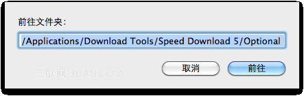

　　快捷键：Shift + Command + G没错!通过这个快捷键你可以调出一个如图所示的小面板，把你在操作步骤里看到的路径地址复制粘贴进去，然后就可以轻松的定位到想要的目录了。 注意第一层目录“应用程序”、“资源库”等用英文，如：/Applications/实用工具/ 附 Finder 中其它常用目录定位快捷键：

　　Shift + Command + A：定位到应用程序(Applications)

　　Shift + Command + C：定位的计算机(Computer)

　　Shift + Command + D：定位到桌面(Desktop)

　　Shift + Command + I： 定位到 iDisk

　　Shift + Command + K：定位到网络(Network)

　　Shift + Command + T：添加当前目录到 Dock 最喜爱部分

　　Shift + Command + U：定位到实用工具(Utilities)