# 5分钟上手Mac效率神器Alfred以及Alfred常用操作


## 前言

- Alfred，想必大家就算没用过也耳闻过。Alfred是一个让你可以丢掉鼠标的神器。很多读者可能之前认为Alfred的学习成本高，或者感觉它太复杂，而望之却步。其实Alfred并非高不可攀，本文以**Alfred3.0**为基础，一步步进行Alfred的常用操作，带领大家进入Alfred的高效世界！
- 从界面上分，Alfred分为**设置界面**和**操作界面**；从功能上分，Alfred分为基本**搜索和快速启动**的功能，以及工使用**自定义插件**的工作流功能。
- **本文为本人对Alfred的操作积累，会持续不定时更新。**

## 如何获取Alfred

- 正途：从[Alfred官网](https://www.alfredapp.com/)中下载Alfred并安装使用即可。

  1. 注意，免费用户只能使用其Features中的功能(即**基本搜索和快速启动应用等功能，其实这已满足非重度使用者日常需求**)；
  2. 若要使用Workflows(即自定义插件的工作流)，则需要购买Powerpack才能激活此功能。

  

  ​

  Alfred官网

- 歪路：本人还是强烈建议读者使用正版。若要**试用**，请自行搜索破解版，如果怕有毒也可以留言找我要...

------

- 购买Powerpack后，可以在设置界面的Powerpack子界面中看到下图，表明可以使用Alfred的所有功能，包括工作流。

  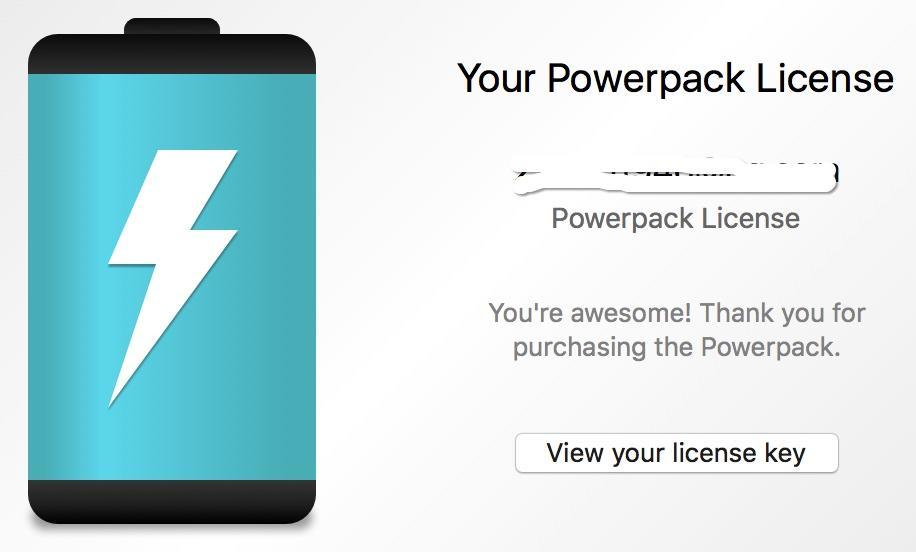

  ​

  购买Powerpack后

## 如何打开Alfred

### 打开设置界面

- Alfred启动后，在Mac上方菜单栏上会有其图标，左键点击后选择`Preferences...`即可打开Alfred的设置界面。

  ​

  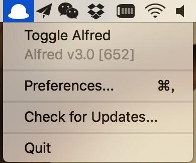

  Alfred菜单图标

  ​

  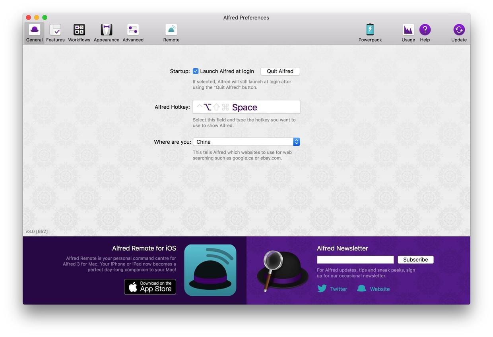

  Alfred设置界面

- 可以看到Alfred的设置界面主要分为以下几个部分：

  1. General：通用；
  2. Features：特性；
  3. Workflows：工作流；
  4. Appearance：外观；
  5. Powerpack：查看是否购买Powerpack以及其许可证。

### 打开操作界面

- 调出Alfred操作界面的默认热键为`Alt + 空格`。

  

  ​

  操作界面

## General（通用界面）


General

- General界面主要是以下三个功能
  1. Startup：是否在系统启动时自启动Alfred。神器，默认勾上，不解释。
  2. Alfred Hotkey：调出Alfred操作界面的热键。默认为**Alt + 空格**。
  3. Where are you：你在哪个国家。Alfred内置了常用网站搜索功能，在搜索时打开对应国家的网站。

## Features（特性界面）

- Alfred几乎所有搜索功能都在这个界面设置。免费用户(没有购买Powerpack开启Workflows)重点关注的地方了。

- Features包含的所有功能，本文不打算讲解所有的功能，只讲解最常用的。如：Default Results、File Search、Web Search、Calculator等。

  ​

  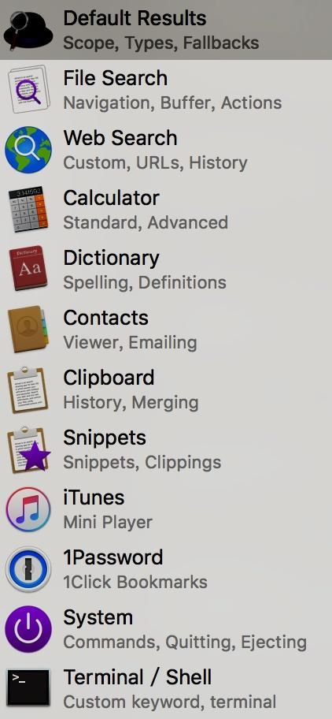

  Features功能集

### Default Results（默认结果）

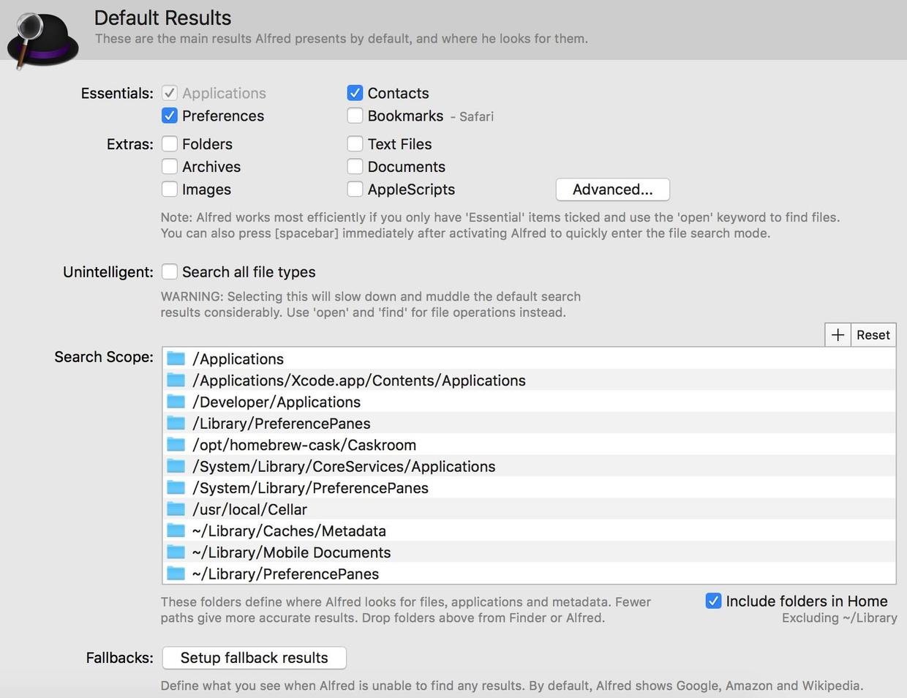

Default Results界面

1. Essentials：可设置搜索“应用程序”、“联系人”、“设置”、“Safari书签”。

2. Extras：可设置搜索“文件夹”、“文本文件”、“压缩文件”、“个人文档目录”、“图片”、“AppleScript”等其他文件。

3. Unintelligent：`Search all file types`搜索所有文件类型。若勾选此项不但影响巡查速度，还混淆默认搜索结果。**Alfred建议用户使用Find+空格+文件名来查询文件或文件夹；使用Open+空格+文件名也可以。**

4. 打开文件或者文件夹强烈建议用Find+空格+文件名来查询文件或文件夹

   ​

   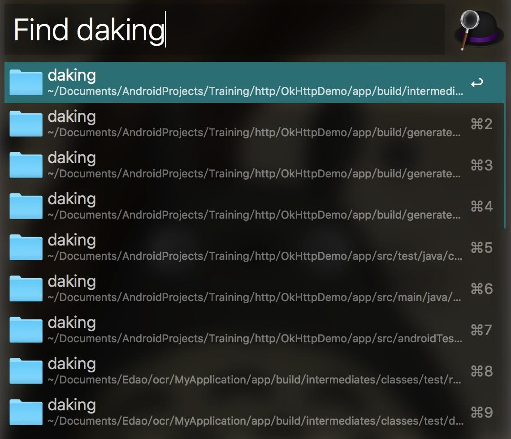

   Find

5. Search Scope：设置Alfred查询时会**搜索的文件夹范围**，可自己添加和删除。

6. Fallbacks：若上面的查询搜索不到结果时，就会调用这里设置的网站或搜索引擎来进行进一步的查询。默认反馈结果为Google、Amazon、Wikipedia网页搜索。

   ​

   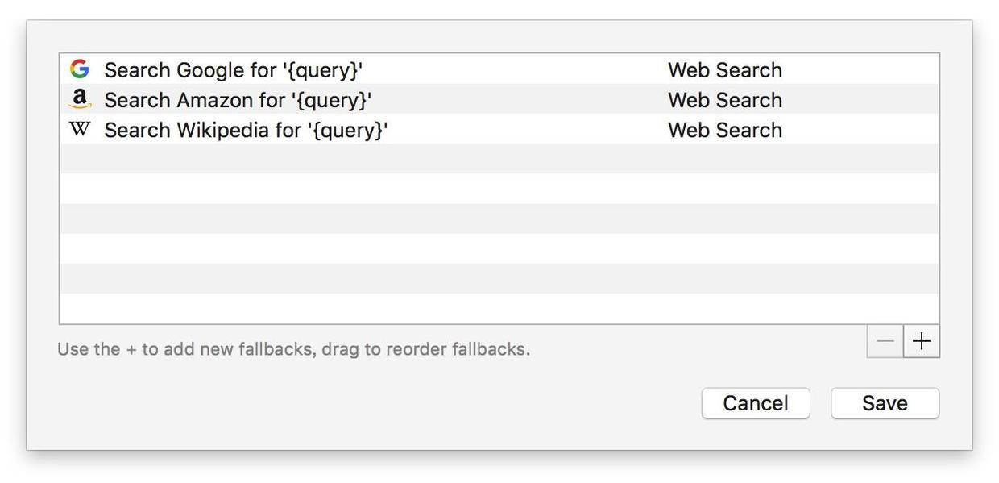

   Fallbacks

   - 可点击界面右下角的`+`来添加更多的搜索引擎。

------

- 检索Chrome书签：目前Alfred只可检索Safari的书签，若你想检索Chrome的书签。则需要将Chrome书签导入到Safari中。导入步骤为：**打开Safari -> 菜单【文件】 -> 【导入自】 -> 谷歌Chrome导入书签数据**。
- 检索外置硬盘：添加外置硬盘的根目录或拖动其根目录到**Search Scope**中。

### Web Search（网页搜索）

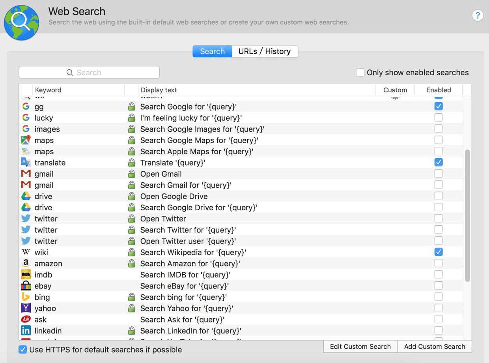

网页搜索

- Keyword为Alfred命令/关键字；DisplayText为此搜索功能的标题；Custom有图标表示这个为用户自定义；Enabled为是否启用。

- Alfred网站搜索的设置，这是本人使用最频繁的功能。在图中可看到Alfred默认设置了很多搜索网站，但几乎都是国外网站，因为天朝特色，很多都是我们用不上，因此需要添加自定义的搜索设置。

  1. 点击右下角的`Add Custom Search`。

  2. 根据下面的示意图在弹出界面中输入对应信息，其中网站图标可忽略，然后保存即可。

     ​

     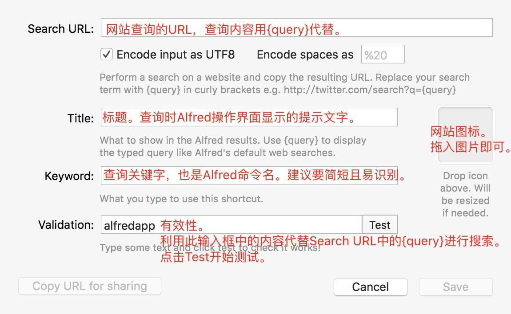

     添加网页搜索

  3. 比如我自定义的百度搜索，信息如下：

     ​

     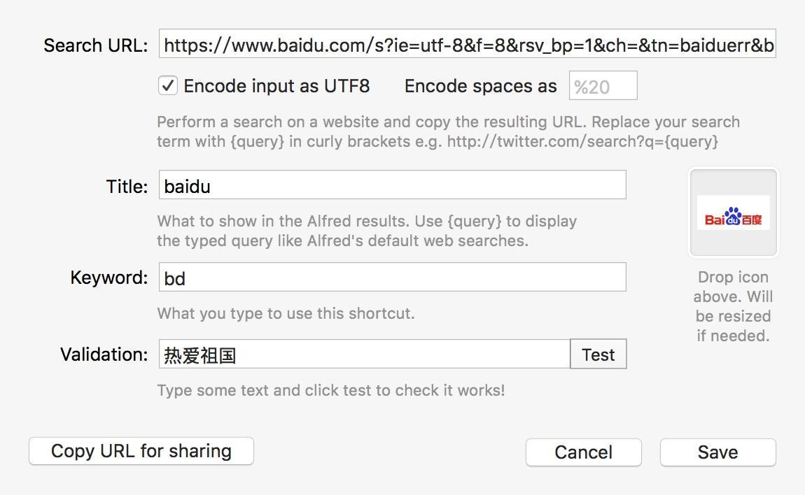

     ​

     1. Search URL为

        ```
        https://www.baidu.com/s?ie=utf-8&f=8&rsv_bp=1&ch=&tn=baiduerr&bar=&wd={query}

        ```

     2. Title为`baidu`。

     3. Keyword为`bd`。

     4. Validation为`热爱祖国`，此项可随意。

  4. 在Alfred上使用刚自定义的百度搜索，输入`bd+空格+查询内容`，回车即自动打开百度进行搜索。

     

     

     ​

     ​

     ​

     ​

- 只要在对应的网站上搜索一次，记下当时的网址，并把具体的搜索内容改为`{query}`就可以找到我们自定义搜索设置中所需要的`Search URL`信息了。于是，本人提供我常用的一些自定义搜索配置。

  - 百度：`https://www.baidu.com/s?ie=utf-8&f=8&wd={query}`
  - 简书：`http://www.jianshu.com/search?utf8=%E2%9C%93&q={query}`
  - 淘宝：`http://s.taobao.com/search?oe=utf-8&f=8&q={query}`
  - 京东：`http://search.360buy.com/Search?keyword={query}&enc=utf-8&area=15`
  - 微信文章：`http://weixin.sogou.com/weixin?type=2&query={query}`
  - stackoverflow：`http://www.stackoverflow.com/search?q={query}`
  - github：`https://github.com/search?utf8=%E2%9C%93&q={query}`
  - maven：`http://mvnrepository.com/search?q={query}`
  - Android API Search：`https://developer.android.com/reference/classes.html#q={query}`

### Calculator（计算器）

1. 直接在操作界面上输入简单的运算。

   ​

   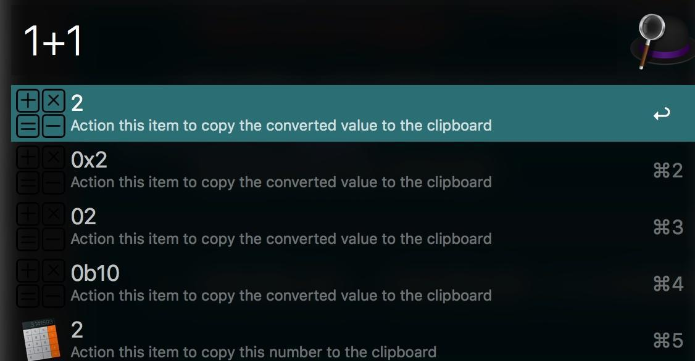

   简单运算

2. 在操作界面上输入`=`来进行复杂运算，Alfred支持很多高级的数学函数。

   ​

   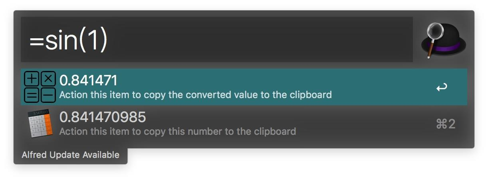

   复杂运算

### Clipboard（剪切板）

- 开启Alfred的剪切板功能。

  ​

  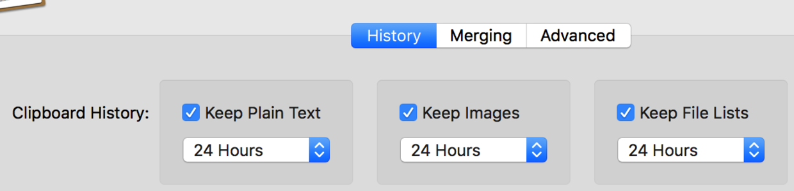

  开启剪切板历史-w632

- 查看Alfred剪切板历史记录。默认热键为`Command + Alt + C`。

  ​

  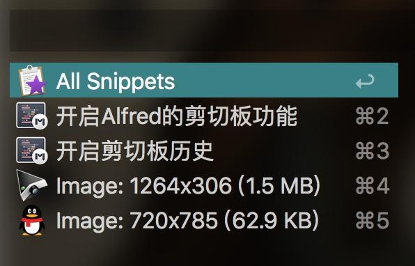

  剪切板历史-w298

- 清空Alfred剪切板。在Alfred**操作界面**中输入clear。


## Workflows(工作流界面)

### 指定文件夹搜索

操作如下:

选择 "Dynamic File Search"添加此工作流

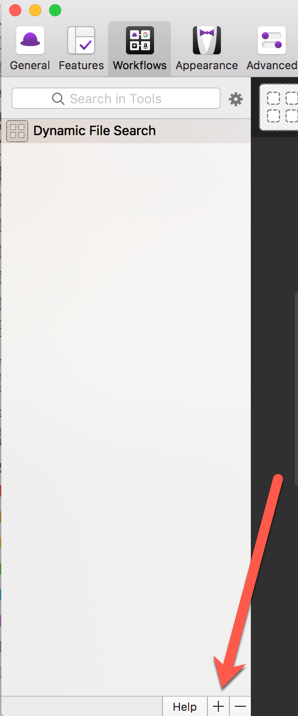

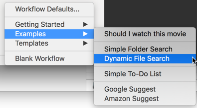

Alfred搜索框中键入ff,然后选择文件夹,再搜索.


## 最后

- **本文为本人对Alfred的操作积累，会持续不定时更新**。
- Workflows部分，请阅读[Mac效率神器Alfred以及常用Workflow](http://www.jianshu.com/p/0e78168da7ab)


http://www.jianshu.com/p/e9f3352c785f