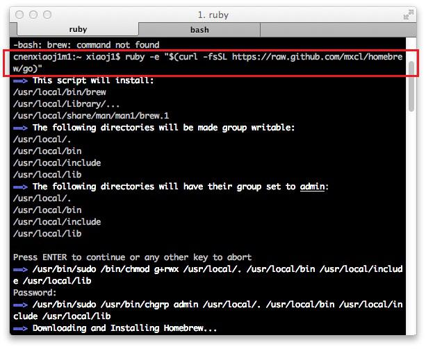
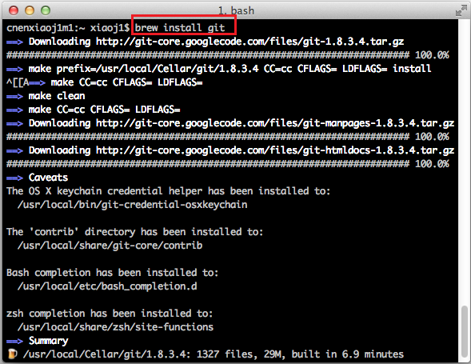
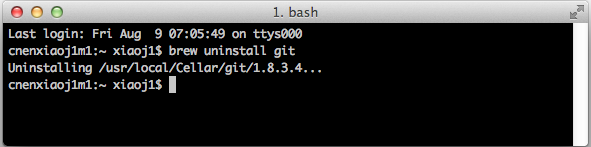
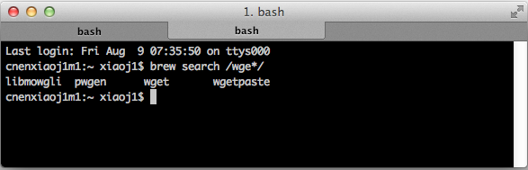
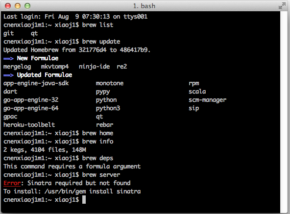

# [Mac入门（三）使用brew安装软件](http://www.cnblogs.com/TankXiao/p/3247113.html)

brew 又叫Homebrew，是Mac OSX上的软件包管理工具，能在Mac中方便的安装软件或者卸载软件， 只需要一个命令， 非常方便

brew类似ubuntu系统下的apt-get的功能

 

阅读目录

1. [安装brew](http://www.cnblogs.com/TankXiao/p/3247113.html#installbrew)
2. [使用brew安装软件](http://www.cnblogs.com/TankXiao/p/3247113.html#brewinstall)
3. [使用brew卸载软件](http://www.cnblogs.com/TankXiao/p/3247113.html#brewuninstall)
4. [使用brew查询软件](http://www.cnblogs.com/TankXiao/p/3247113.html#brewsearch)
5. [其他brew命令](http://www.cnblogs.com/TankXiao/p/3247113.html#brewother)

 

# 安装brew

brew 的官方网站： http://brew.sh/   在官方网站对brew的用法进行了详细的描述

安装方法：  在Mac中打开Termal:  输入命令：

```
ruby -e "$(curl -fsSL https://raw.githubusercontent.com/Homebrew/install/master/install)"
```



 不知道为什么， 在国内经常被屏蔽

 

# 使用brew安装软件

一个命令就搞定了， 比如安装git

```
brew install git
```



比如安装wget

```
brew install wget
```

 

# 使用brew卸载软件

卸载更方便了

```
brew uninstall wget
```

 

# 使用brew查询软件

有时候，你不知道你安装的软件的名字， 那么你需要先搜索下, 查到包的名字。

比如我要安装

```
brew search /wge*/
```

/wge*/是个正则表达式， 需要包含在/中

 

 

# 其他brew命令

brew list           列出已安装的软件

brew update     更新brew

brew home       用浏览器打开brew的官方网站

brew info         显示软件信息

brew deps        显示包依赖

 

 

 

 附： Mac技巧 系列教程， (连载中, 敬请期待）[Mac入门 (一) 基本用法](http://www.cnblogs.com/TankXiao/archive/2013/01/05/2845413.html)[Mac入门 (二) 使用VMware Fusion虚拟机](http://www.cnblogs.com/TankXiao/p/3267796.html)[Mac入门（三）使用brew安装软件](http://www.cnblogs.com/TankXiao/p/3247113.html)
http://www.cnblogs.com/TankXiao/p/3247113.html