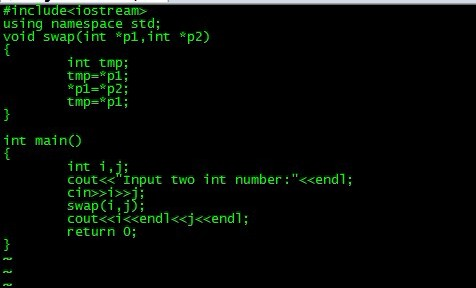
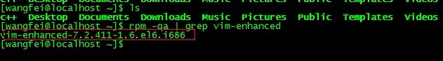
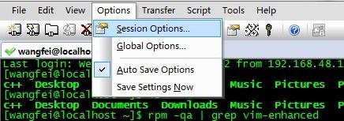
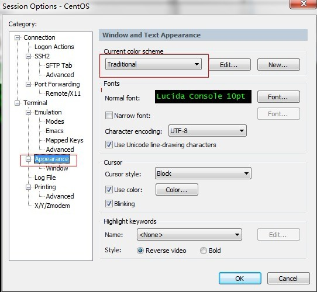

# SecureCRT连接linux，vim颜色显示问题

 为什么使用VIM？因为具有颜色显示的功能，并且还支持许多程序语法，VIM可以帮助你直接进行程序除错。但是在SecureCRT连接Linux后显示就是黑白，感觉很不爽！！

怎么办？

vim编写程序也很不方便，颜色纠错功能没有了。

解决方法：

1.确认安装了vim-enhanced

rpm -qa | grep vim-enhanced

2.optins>session options

Terminal>emulation

xterm再勾选ASNI color，use color scheme

Apperence>current color scheme

选择Monochrome主题

单击OK

最后，disconnet然后重新连接登陆就可以了

显示效果如下：

vim编程程序效果如下

 

http://blog.csdn.net/wfdtxz/article/details/7354566