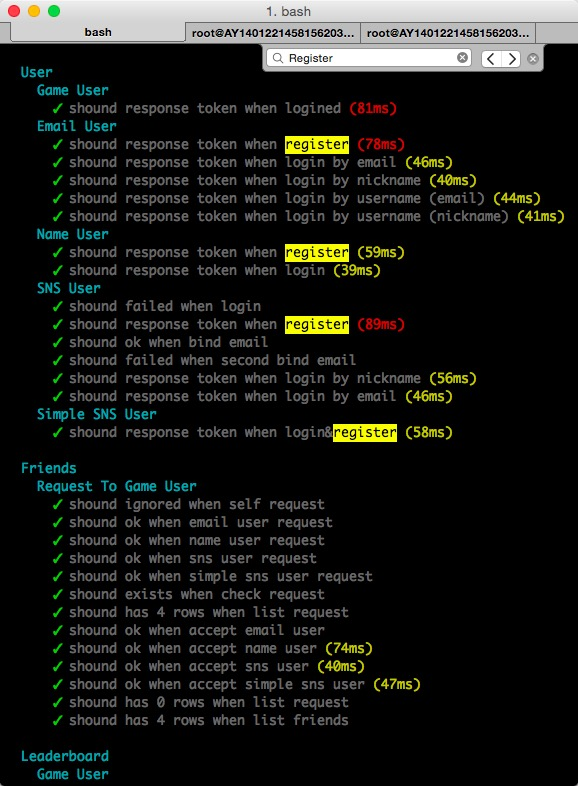
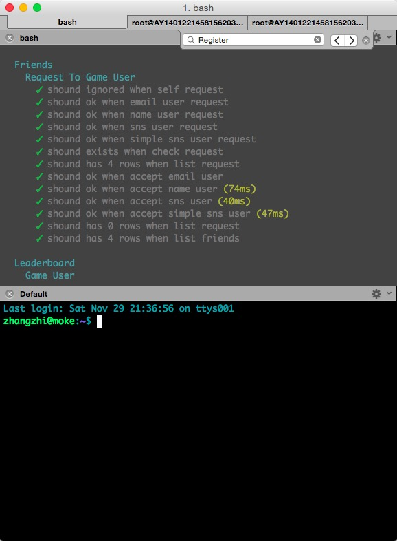
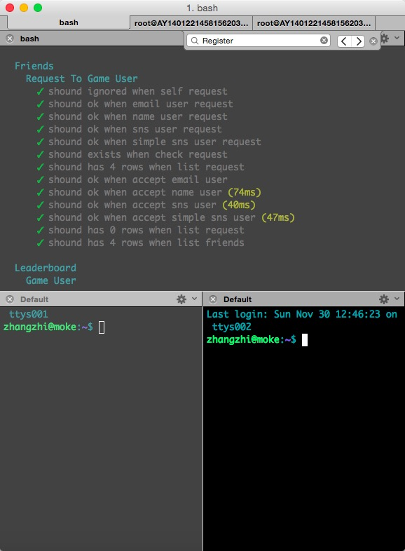
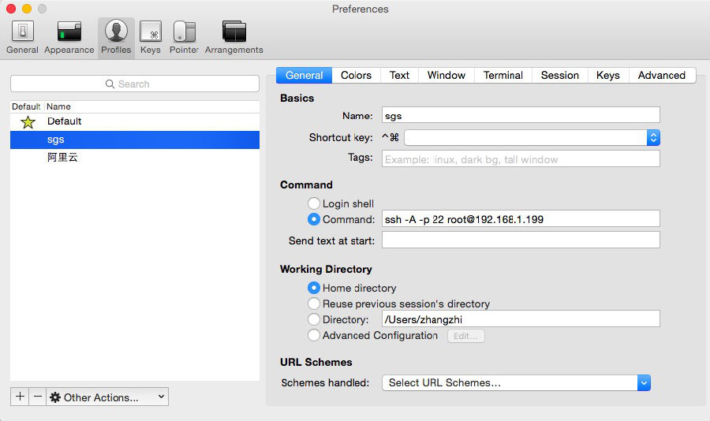
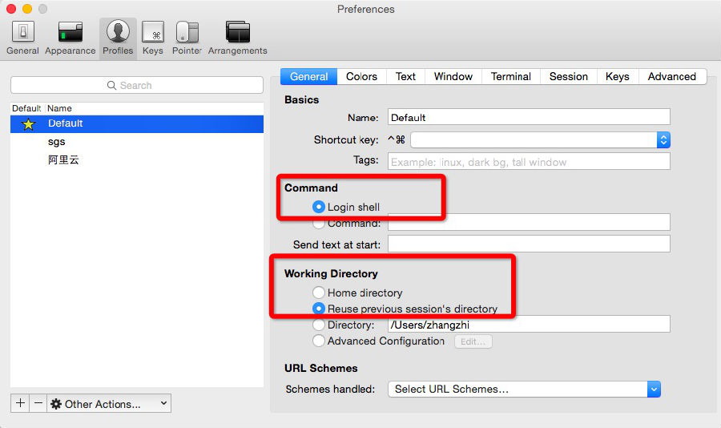
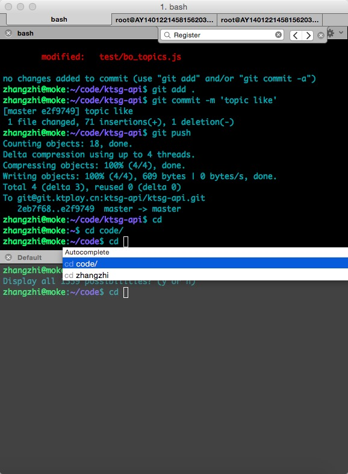
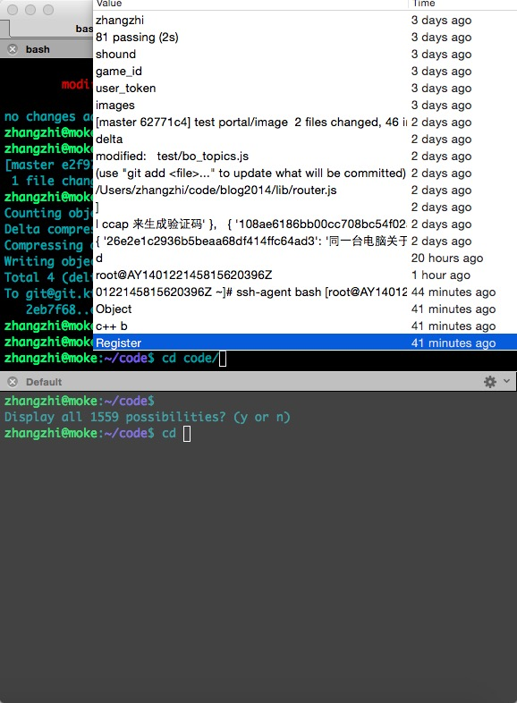
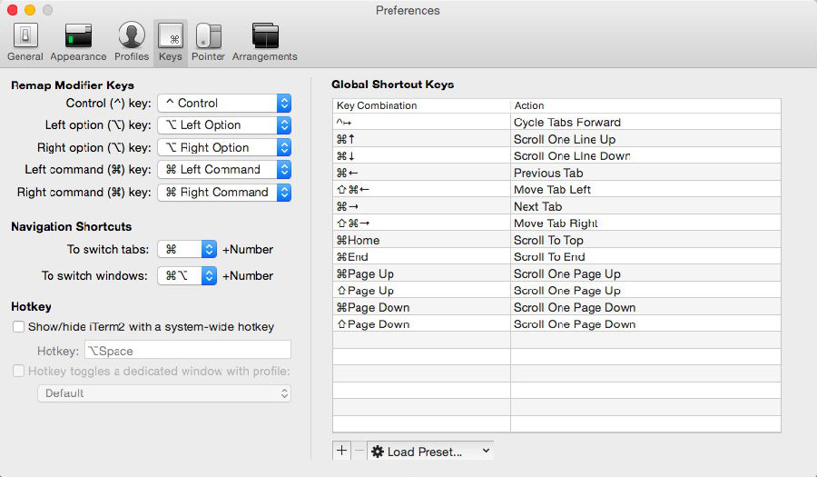

# mac下非常好用的命令行工具 iTerm2

今天要说的 iTerm2 应该是mac系统中不可多得的命令行工具之一.简单列出几点给我们带来方便快捷的功能点.

## 1.选中即复制

   我们之前用过的命令行要么是不能使用常规复制快键键来复制操作,要么是选中后再按键复制,iTerm2很特殊,选中就自动复制成功.

   去你需要粘贴的地方按下 command + v 即可粘贴成功. [更多mac相关快键键](http://yijiebuyi.com/blog/8597d1870ed8f9e969232fe27c483096.html)

## 2.全文查找功能,

就和我们在文本编辑器中编辑文字一样,只需要command + f 输入要查找的内容,即可在当前命令行页面查找并高亮显示,如图所示:

  

   搜索 register 在界面查找并全部高亮显示,点击搜索框右侧箭头可以循环逐个定位

## 3.分隔屏幕显示,

水平分隔 command +shift +d

   水平分隔界面后,黑色的为当前激活窗口,灰色是未激活窗口,我们现在还可以在当前激活窗口再进行垂直分隔,按下快键键:

    垂直分隔 command+d
   

## 4.保存ssh远程登录指令

,如图左侧是本地ssh 登录服务器地址 和[ 阿里云](http://www.aliyun.com/)服务器登录地址

   

## 5.保存上一次tab按键所在的目录,打开新窗口自动定位到使用tab键所在的目录.

   上图右侧是iTerm2 的另外一个新功能,保存上一次tab按键所在的目录,打开新窗口自动定位到使用tab键所在的目录.

   比如下图中我使用tab键定位到 ~/code 目录 ,接着水平分屏新建了一个窗口,默认自动定位到了 ~/code 目录下.需要如下设置

   

## 6.按下 command + ;  自动补全命令

   

## 7.记录历史输入命令, 

command + shift +h 全部显示出来

   

## 8.定义你自己的专属快键键 

   