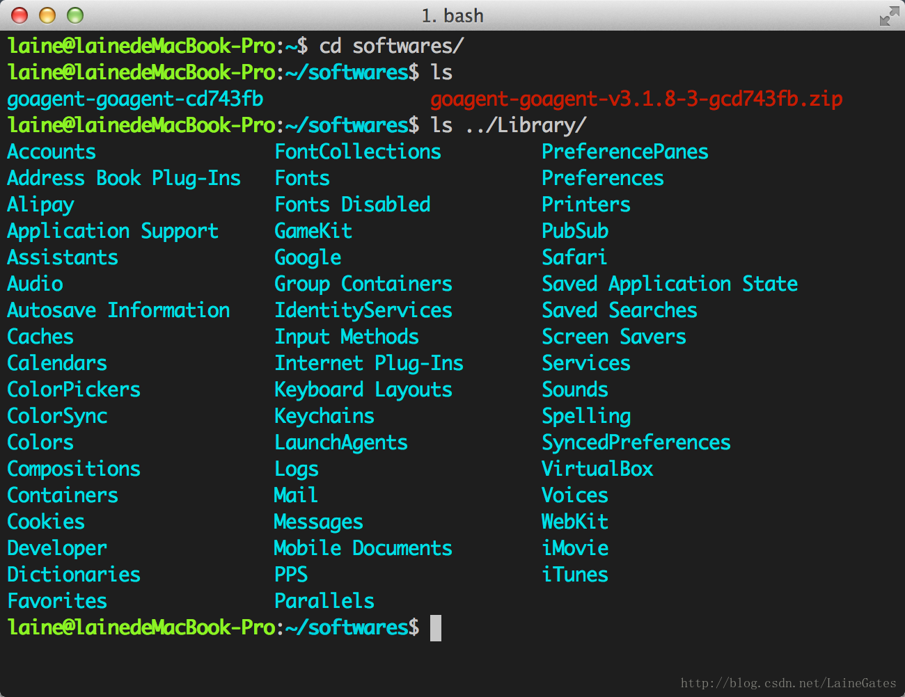
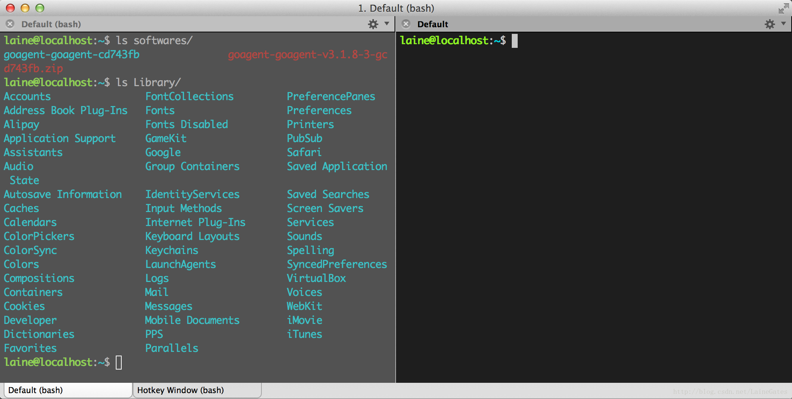

item2是mac下非常好用的一款终端。但默认的配色实在不好用，经过一翻搜索终于找到了比较满意的。

# 配色

1.先要修改~/.bash_profile.代码如下

```
# iTerm2配置
#enables colorin the terminal bash shell export  
export CLICOLOR=1  
  
#sets up thecolor scheme for list export  
export LSCOLORS=gxfxcxdxbxegedabagacad  
  
#sets up theprompt color (currently a green similar to linux terminal)  
# export PS1='\033[01;32m\u@\h\033[00m:\033[01;36m\w\033[00m\$'  
  
#enables colorfor iTerm  
export TERM=xterm-256color
```

每个代码都有注释，第二三行设置终端名，也就是当前用户名、目录，并且变色处理，方便认别。

2.选择喜欢的配色方案。

 在Preferences->Profiles->Colors的load presets可以选择某个配色方案。也可以自己下载。在网站http://iterm2colorschemes.com/，几乎可以找到所有可用的配色方案。大家自己选择吧

我的配色：




# 大小写敏感

对于目录中经常有大写字母的情况，使用tab变得很麻烦。google之后找到了解决办法，取消大小写敏感。代码如下：

```
echo "set completion-ignore-case On" >> ~/.inputrc  
```

  

# 快捷揵

这大概是item吸引用户的魅力所在了。

1.⌘ +数字在各 tab标签直接来回切换

2.选择即复制 + 鼠标中键粘贴，这个很实用

3.⌘ + f所查找的内容会被自动复制

4.⌘ + d 横着分屏 / ⌘ + shift + d 竖着分屏

5.⌘ + r = clear，而且只是换到新一屏，不会想 clear一样创建一个空屏

6.ctrl + u 清空当前行，无论光标在什么位置

7.输入开头命令后 按⌘ + ;会自动列出输入过的命令

8.⌘ + shift + h 会列出剪切板历史

9.可以在 Preferences > keys设置全局快捷键调出 iterm，这个也可以用过 Alfred实现

10.⌘← / ⌘→ 到一行命令最左边/最右边 ，这个功能同 C+a / C+e

11.⌥← /⌥→按单词前移/后移，相当与 C+f / C+b，其实这个功能在Iterm中已经预定义好了，⌥f /⌥b，看个人习惯了

再来些[Linux](http://lib.csdn.net/base/linux)上也通用的快捷键：

C+a / C+e 这个几乎在哪都可以使用

C+p / !! 上一条命令

C+k 从光标处删至命令行尾 (本来 C+u是删至命令行首，但iterm中是删掉整行)

C+w A+d 从光标处删至字首/尾

C+h C+d 删掉光标前后的自负

C+y 粘贴至光标后

C+r 搜索命令历史，这个较常用

窗口说明

iterm2的窗口分为3个等级：window , tab , pane。请看下图。




此图下侧的是tab， 图中分左右的是pane。用上这两项，iterm2才真得是好用。

默认的话，新建pan是有快捷键的Cmd+d,切换pane有默认设置 Cmd+[ 和 Cmd+] .但是新建tab是没有默认快捷键的，这个用户可以自己设置，在Preferences->Keys。

笔者设新建tab的快捷键是Cmd+t 。