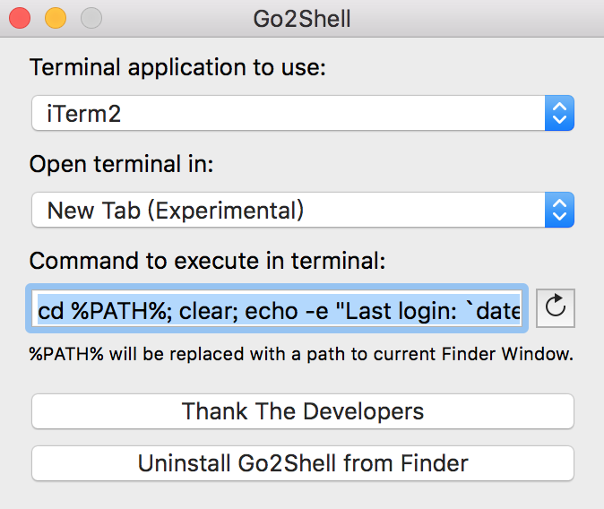
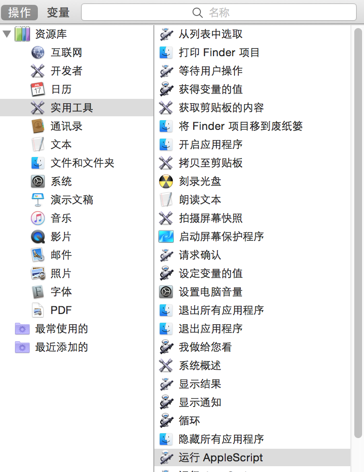
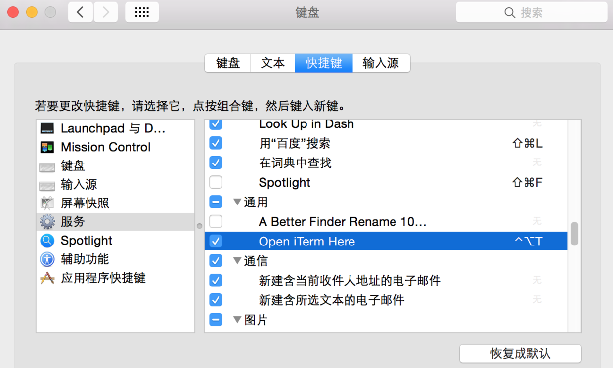

# 说明

这是给Finder加上一个打开当前路径的终端的功能有两种实现
Go2Shell App 和 AppleScript

# Go2Shell.app

## 使用方法

- Go2Shell官方安装 <http://zipzapmac.com/Go2Shell>
- 苹果应用商店安装[Go2Shell](https://itunes.apple.com/cn/app/go2shell/id445770608?mt=12)
- 直接拖拽到 Finder 里即可. `10.10` 以后需要按着 `command` 进行拖拽


Paste_Image.png

进入 Preferences 的方式

```
# 新老版本都可以通过命令行打开
open -a Go2Shell --args config
# v2.3 直接在应用文件中打开 Go2Shell 就行
```

- 优点：Find直接点Go2Shell按钮就可以在当前目录打开终端了
- 缺点：iTerm2 APPStore 版本每次都是在新的终端窗口中打开，而不是在新的终端标签中打开

## 更新 Go2Shell 经过测试 2.3 版本可以在 MacOS 10.11 使用



image.png

填写内容为

```
cd %PATH%; clear; echo -e "Last login: `date`"; pwd
```

使用方法，按图内的设置，点击 `Install Go2Shell from Finder`

Finder 出现图标


image.png

点击右边这个`>_<`图标，就可以在 iterm2 中以新窗口的模式打开一个 terminal

> 删除这个功能，或者图标显示错误很好处理，按住 `cmd` 键，鼠标拖拽这个图标到外面释放图标，就可以删除这个功能了

# 配置Automator方法-推荐

- 打开`Automator`，选择`新建`，选择`服务`


- 服务接受设为`没有输入`，位置设为`Finder`


Paste_Image.png

- 从左侧的资源库中找出 `运行AppleScript`，拖到右侧，然后保存为`Open iTerm Here`



Paste_Image.png

- 在刚刚创建的`AppleScript`的输入框中输入如下代码

```
on run {input, parameters}


    tell application "Finder"

        set pathList to (quoted form of POSIX path of (folder of the front window as alias))

        set command to "clear; cd " & pathList

    end tell


    tell application "System Events"

        -- some versions might identify as "iTerm2" instead of "iTerm"

        set isRunning to (exists (processes where name is "iTerm")) or (exists (processes where name is "iTerm2"))

    end tell


    tell application "iTerm"

        activate

        set hasNoWindows to ((count of windows) is 0)

        if isRunning and hasNoWindows then

            create window with default profile

        end if

        select first window


        tell the first window

            if isRunning and hasNoWindows is false then

                create tab with default profile

            end if

            tell current session to write text command

        end tell

    end tell


end run
```

[代码参考](https://github.com/LeEnno/alfred-terminalfinder/blob/master/src/fi.scpt.txt)

代码意思是将当前最前面的Finder地址如果获取不到，则返回桌面地址

然后通知iTerm的第一个窗口新建标签并跳到这个目录去

- 为了避免每次都要去点菜单，再去键盘设置里改一下快捷键，然后就可以快速在Finder中通过iTerm打开当前目录了



Paste_Image.png