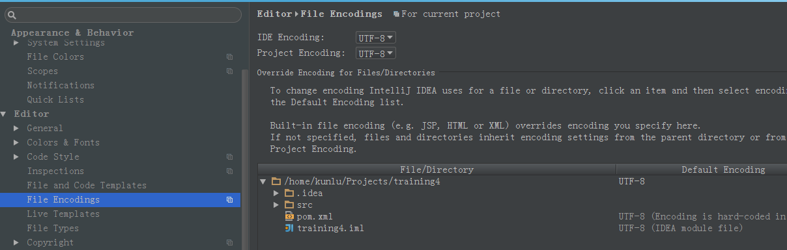
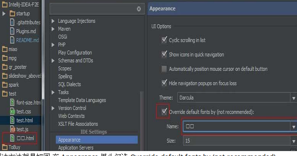
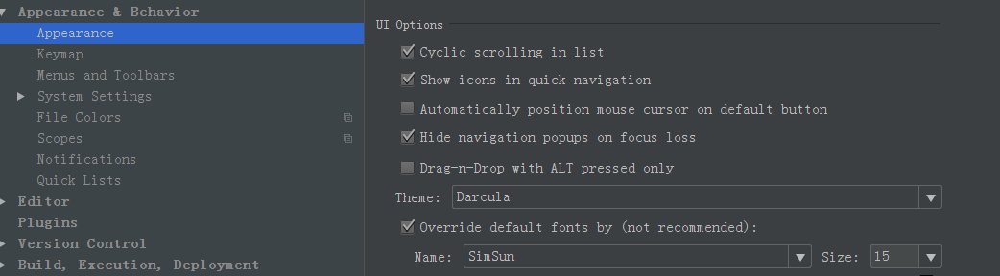
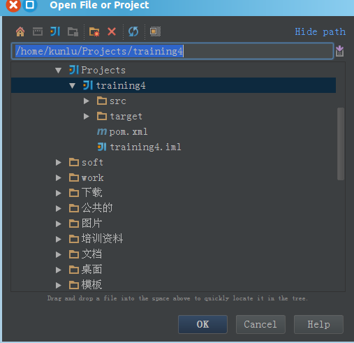

# [IntelliJ IDEA 中文乱码问题解决办法-image-201708191835.md](IntelliJ IDEA 中文乱码问题解决办法-image-201708191835.md)

自己最近在使用IntelliJ IDEA，发现总是出现中文乱码的问题，在网上找了很多教程，发现真是“天下文章一大抄”。还不如自己动手试着解决一下。

## 1、编辑器以及调试信息中文乱码问题

解决方案：

选择：File->settings->Editor->File Encoding

然 后在右边IDE Encoding处选择UTF-8,以及Project Encoding 处也选择UTF-8编码。这样，新建的文件就会以UTF-8编码形式建立，不会再出现中文乱码的情况。如果直接打开有些文件，同时这两处已经选择了 UTF-8编码，但是还是出现中文乱码情况。此时，有可能是因为新添加进来的这些文件在建立的时候并非是UTF-8编码的，因此还是会出现中文乱码情况。 比较直接的解决办法，先在idea下新建几个文件，然后将需要打开的文件中的内容直接复制粘贴到idea新建的文件中。

 

## 2、idea其他窗口的中文乱码问题

如下图所示：

在图中所示的文件打开窗口，或者是字体显示窗口，中文字符都变成了乱码。

出现这样的原因是linux系统提供的字体不支持中文的显示，在idea中，默认的是ubuntu字体，该字体并不支持中文显示。因此，还需要自己下载一个支持中文显示的字体。

（1）下载支持中文显示的字体

在网上搜了许久，很多人都推荐simsum(或者 Microsoft YaHei)字体（网上下载很方便）：

其中，simsun文件夹下面就包含了simsun.ttf字体文件。

 

（2）将下载好的字体添加到系统字体库中

我在这儿是添加到/usr/share/fonts/truetype文件夹下，如下所示

 

（3）重启idea

重启idea，然后选择File->settings->Appearance & Behavior->Appearance.如下所示：

在右边勾选上“Override default fonts by(....)”,并在“Name”选项中选择刚刚添加的SimSun字体，此时就可以显示中文了。如下所示：

问题得到完美解决。

 http://www.cnblogs.com/xingma0910/p/4651889.html