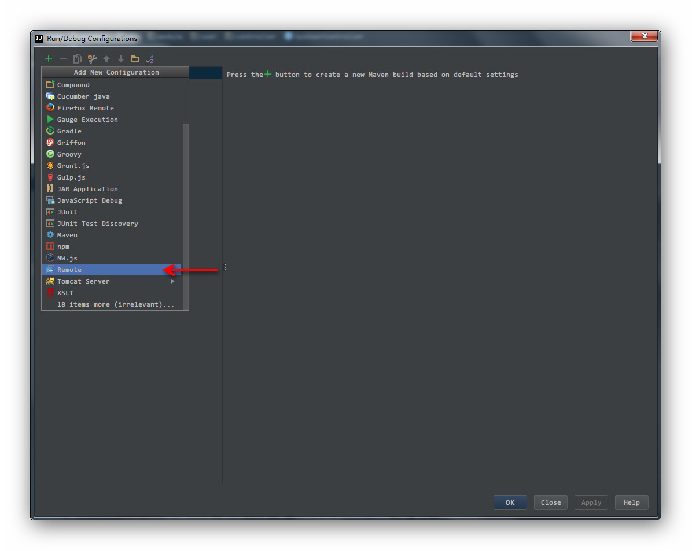
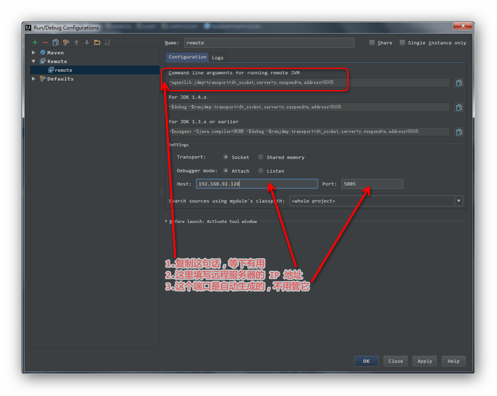
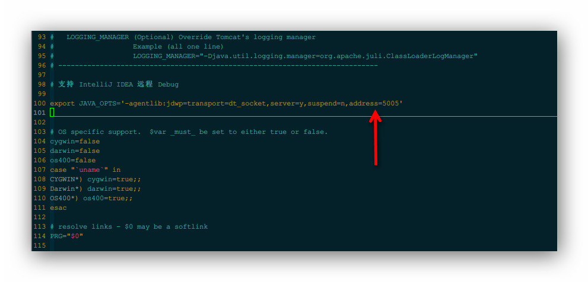
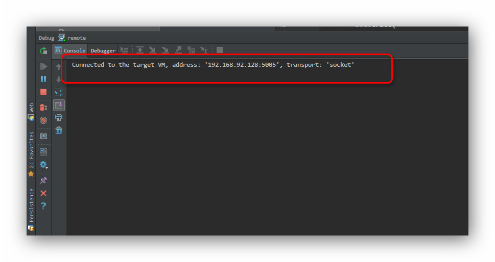
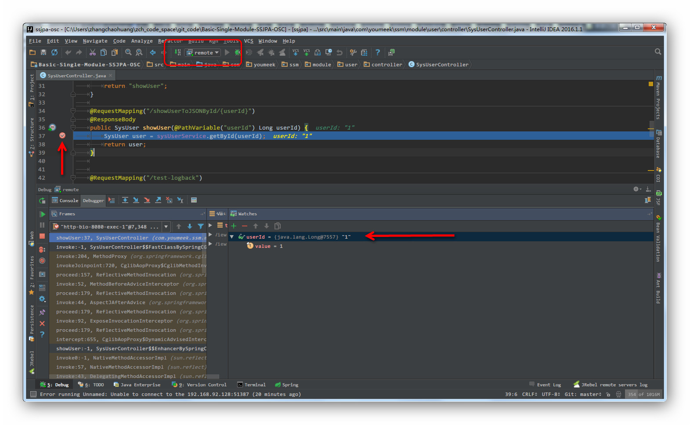

[TOC]


# IntelliJ IDEA 远程调试 Tomcat

## 准备工作

- 明确远程服务器的 IP 地址，比如我是：192.168.92.128
- 关掉服务器防火墙：`service iptables stop`

## 本地 Remote Server 配置

- 添加 Remote Server，如下图
  - 
- 复制 Remote Server 自动生成的 JVM 参数，等下有用，如下图，比如我的是：`-agentlib:jdwp=transport=dt_socket,server=y,suspend=n,address=5005`
- 如下图，在 Host 添加服务器的 IP 地址：192.168.92.128。
  - 
- 把刚刚复制参数加个前缀，变成：
  - Linux（有单引号）：`export JAVA_OPTS='-agentlib:jdwp=transport=dt_socket,server=y,suspend=n,address=5005'`
  - Windows（没有单引号）：`set JAVA_OPTS=-agentlib:jdwp=transport=dt_socket,server=y,suspend=n,address=5005`

## 服务器 Tomcat 配置

- 以 Linux 环境为例

- Tomcat 安装在 /usr/program/tomcat7

- Tomcat 的执行程序：/usr/program/tomcat7/bin/catalina.sh

- 编辑 Tomcat 执行程序：

  ```
  vim /usr/program/tomcat7/bin/catalina.sh
  ```

  （Windows 是编辑：catalina.bat）

  - 在该文件的最上面，添加我们刚刚复制的那句话：`export JAVA_OPTS='-agentlib:jdwp=transport=dt_socket,server=y,suspend=n,address=5005'`。
  - 如果你的项目有特殊 JVM 参数，那你就把你的那部分参数和这部分参数合并在一起。
  - 如下图所示：
  - 

## 服务器 Jetty 配置

- 同样是 Linux 环境

- jetty 不像Tomcat那样需要安装，只要有jetty的jar包就可以启动我们想要启动的应用。

- 在启动应用的时候加入之前上边我们copy的

  ```
  -agentlib:jdwp=transport=dt_socket,server=y,suspend=n,address=5005
  ```

  就可以了。

  - 就像这样：`java -agentlib:jdwp=transport=dt_socket,server=y,suspend=n,address=5005 -jar {your jetty path} {your port} --path {your war} 1>/dev/null 2>&1 &`

## 开始调试

- 启动服务器 Tomcat
- 启动本地 Remote Server
- 如果可以看到如下图效果，表示已经连接成功了，接下里就是跟往常一样，在本地代码上设置断点，然后你访问远程的地址，触发到该代码自动就会在本地停住。
  - 
- 如下图，可以看到调试效果
  - 


http://wiki.jikexueyuan.com/project/intellij-idea-tutorial/remote-debugging.html