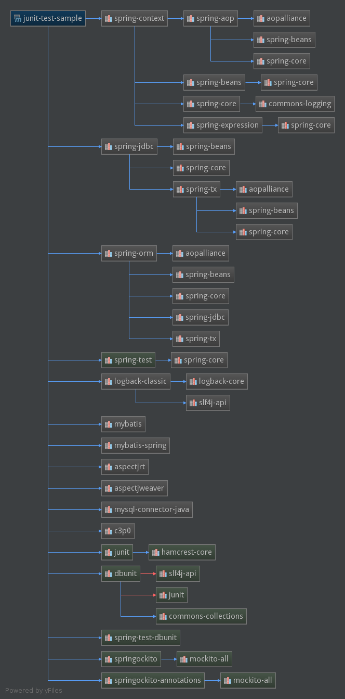
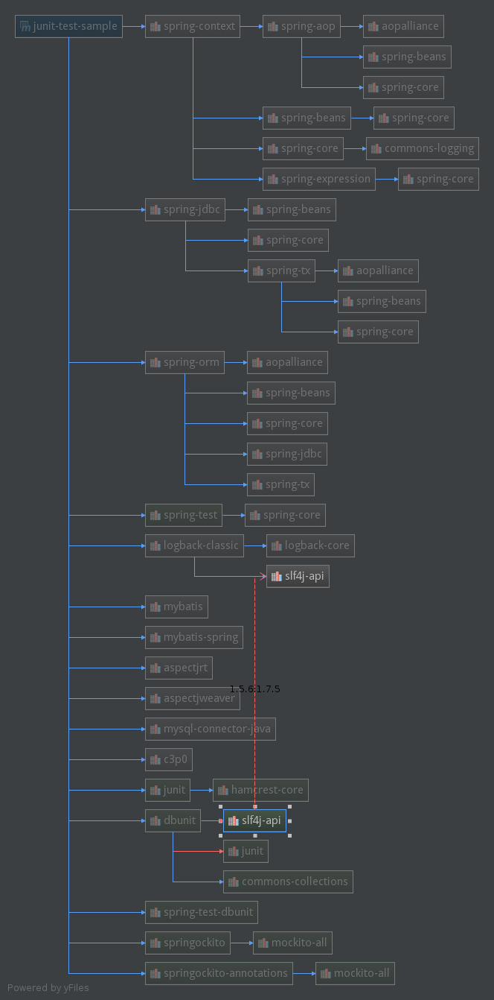

### [IntelliJ IDEA查找依赖关系，解决jar包冲突](http://baowp.iteye.com/blog/1989575)

maven工程，一个artifact的jar包可能不只一处被依赖；有时候依赖会出现相同的artifact却不同版本，相互存在冲突，这时就需要exclude某个版本。

 

试了在命令行工程目录下执行mvn dependency:tree可以出来文本的依赖关系，但是不会把一个artifact的每处依赖都显示出来，只会出现第一次被依赖的地方。

 

使用eclipse的都知道，如果要查看一个jar包是如何被依赖进来的，可以打开工程的pom.xml，切换到dependency hierarchy视图，然后右上角Filter输入artifactId就可以清晰地看到它是如何被直接或间接地依赖进来的；找到了就容易到pom文件里排除冲突包的引入了。

 

IntelliJ IDEA，该如何找某个artifact的全部依赖关系？

该工具有个Maven Projects窗口，一般在右侧能够找到，如果没有可以从菜单栏打开：View>Tool Windows>Maven Projects;

选择要分析的maven module(idea的module相当于eclipse的project),右击show dependencies,会出来该module的全部依赖关系图，非常清晰细致。

 

在图里选中一个artifact,则所有依赖该artifact的地方都会一起连带出来突出显示，如果有不同版本的也会标记出来。这样该artifact在该工程里是如何被直接或间接引入的进来也就明朗了。

 

 

 

如果有冲突的版本，可以右击该版本的节点然后Exclude，对应的pom.xml就已经成功修改了。(IntelliJ IDEA对于文件的修改都是实时保存的，无须Ctrl+S)

来源： <http://baowp.iteye.com/blog/1989575>