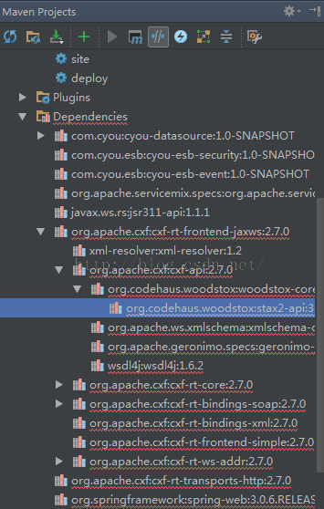

使用IDEA进行maven开发时，将新项目import进工作空间时，Maven Projects栏中的dependencies中总是有红色波浪线，如下图：

但是这些jar在我本地的maven仓库中实际上是存在的，后来无意中修改了下pom才发现这有可能是IDEA的bug，解决办法是：

对于有波浪线的dependency，将其从pom中删除，保存后，再撤销回来，奇迹出现了。。。。很无语的一个问题。

来源： <http://blog.csdn.net/shiqidide/article/details/50519319>