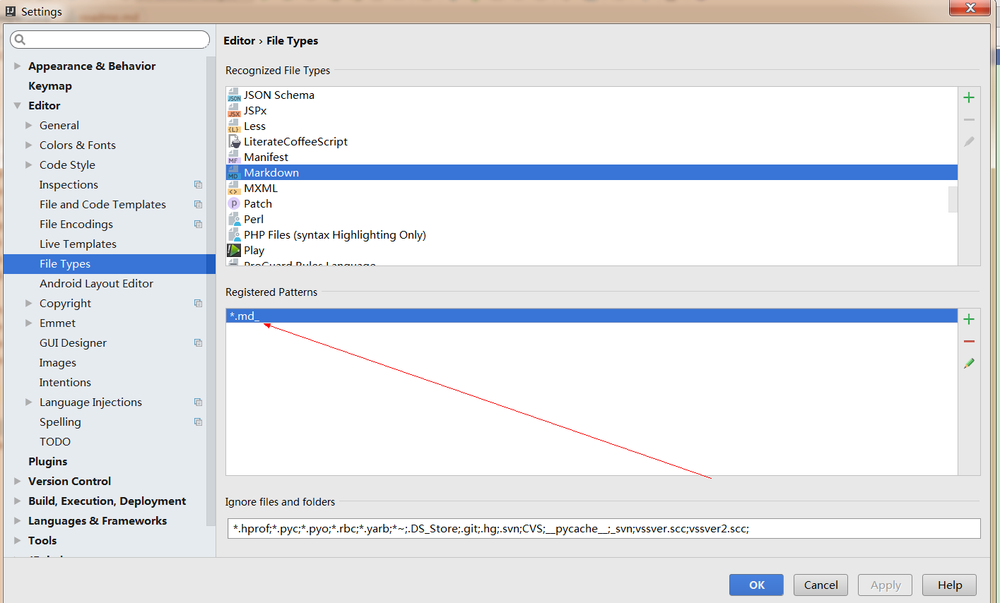
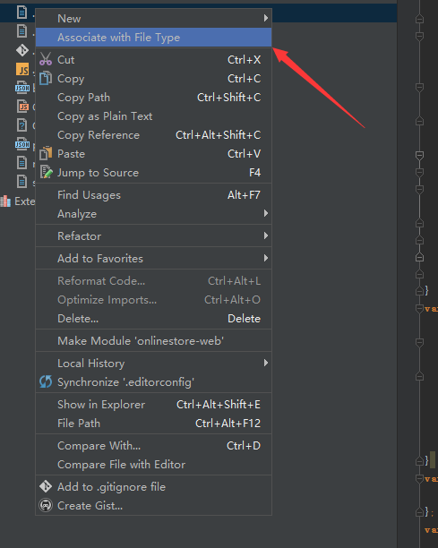
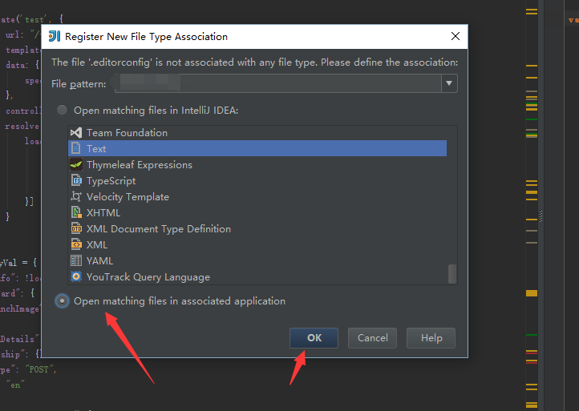

最近在为项目开发写思维导图，

　　为了留下思考的过程和业务逻辑。

　　本人使用的工具是很可怜的freemind，所以“脑图”的扩展名是“.mm”

情景：

　　在intellij idea (Android studio )直接双击很经常就把这个文件打开在“编辑器”局域。

关键我不是想在“在intellij idea (Android studio )”编写“.mm”这类型文件。

### 解决：

先把默认的打开方式去除（或者重命名）：

然后文件右键：

 

　　

然后就可以使用“已经安装的程序”打开相应的“扩展名”。

来源： <http://www.cnblogs.com/shortboy/p/5526141.html>