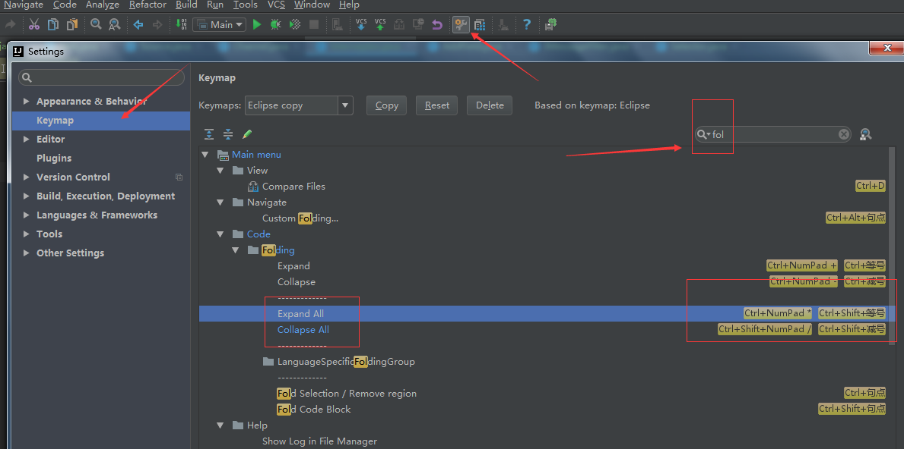
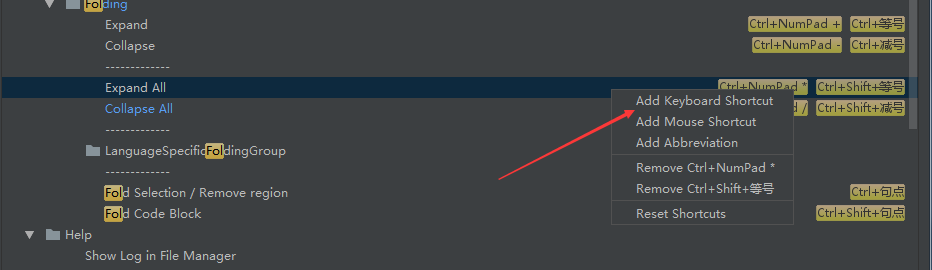
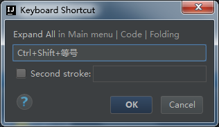

# [Intellij IDEA 中一次性折叠所有Java代码的快捷键设置 collapse all-image-201708191833.md](Intellij IDEA 中一次性折叠所有Java代码的快捷键设置 collapse all-image-201708191833.md)

**问题：**在[Java](http://lib.csdn.net/base/java)文件中，想把所有的Java方法代码都一次性给折叠起来，用哪个点开哪个。
**问题来源：**在新建model bean的时候，要是属性很多，那么对应的getter和setter就会很多，要是所有的方法代码都是展开状态，那么这个文件看着也不甚美观，所以，可以把方法都折叠起来。

下面看怎么设置快捷键：看法宝。。。

要是看不懂，系统自带的快捷键配置，大可以，自己再修改个，就像这个折叠代码的这个快件，折叠一个方法的快捷键是：  ctrl + 减号。

我就把折叠所有的快捷键设置成：ctrl+shift+减号。

这样也好记忆，

我觉得这肯定很是有用吧，不点赞，我都 不好意思。看官您觉得呢？

来源： <http://blog.csdn.net/qq_27093465/article/details/71405885>