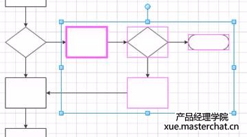
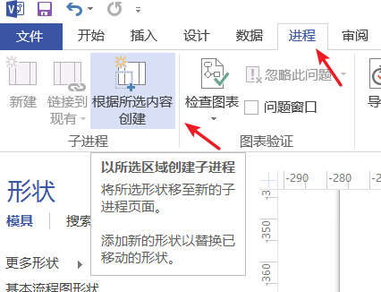
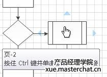

子流程图有助于您将复杂流程分解为可管理的部分。您可以选择一个形状序列：
 

　　菜单 进程 下单击“根据所选内容创建”：

 

　　Visio 会将所选形状移到新页面，并将它们替换为与新页面自动链接的“子流程”形状。
 

　　如果您尚未绘制子流程，则可以单击“新建”，以向页面添加一个子流程形状以及一个与该形状链接的新页面。如果已在其他页面或者不同文档中绘制了子流程，则可以将子流程形状放置在当前页面上，接着单击“连接到现有”，然后浏览至子流程页面。

(责任编辑：蓝极行)
来源： <http://xue.masterchat.cn/visio/68.html>