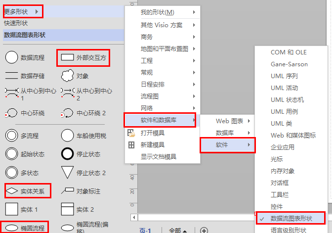
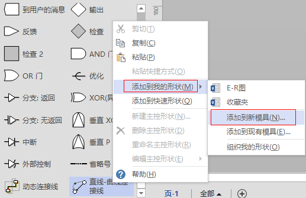
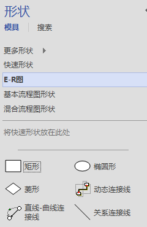

# 前言    

​    在数据的概念设计阶段,需要使用E-R将[数据库](http://lib.csdn.net/base/mysql)表之间的实体关系表示出来,这就要使用到E-R图了.

# E-R图

​    简介

​    E-R(Entity-Relationship Approach)图全称"实体-联系-方法"图.从这个中文名字我们基本上也就能理解他的作用.用于

描述实体世界中实体之间的关系模型.                                             详见:[E-R图](http://baike.baidu.com/view/15236.htm#7)

元素

​    实体型(Entity):具有共同特征和性质的同类型实体.如:学生 张三 学生 李四.均为实体.用矩形表示.

​    属性（Attribute）：详细描述这个实体的内部信息.如:学生 张三 .有身高 年龄 体重 等.用椭圆表示.

​    联系（Relationship）：描述实体之间或实体内部之间关系.如学生 张三 与 李四的老师为 王五 .则王五与

张三、李四之间的关系是师生.关系有 1：1（夫妻制）1：n（师生情）n：n（打群架）.

# VISIO演示

  在OFFICE 2013里面没有E-R图的模板。

**新建模具**

打开visio，创建空白模板。

这样一来我们的模具就新建好了 

来源： <http://blog.csdn.net/cfl20121314/article/details/9042411>