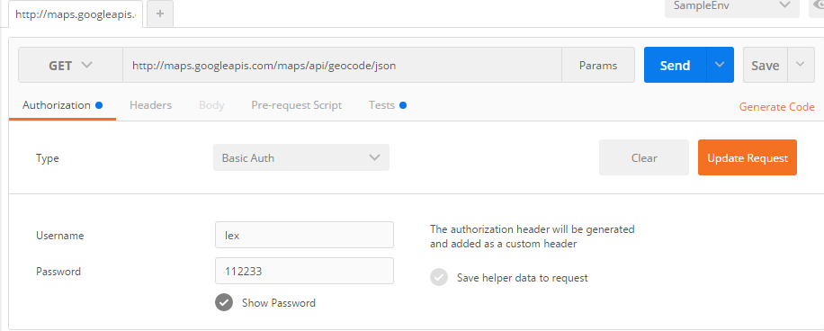

Postman这款工具可以让你很方便的[测试](http://lib.csdn.net/base/softwaretest)你的Web API，那如果你实在是没办法用Postman，必须手写代码，又或者你有别的需求是Postman没法实现的，你必须写一个特殊的script或App来测试你的接口，那这时候是不是Postman就没有用武之地了？ 
我来个你share一个小技巧吧，管不管用你说的算。 
假设我现在要这样来测我的接口： 
我们要设置用户名和密码： 
 
我们要设置参数和Header: 
 
如果让你写代码来生成这个HTTP Request是不是感觉有点麻烦? 如果你也是个懒人，就打开Postman，配好你想要的HTTP Request，然后点击上图中的Generate Code吧，在弹出的窗口里面，你可以看到这条Request在各种语言里面的对应写法，比如[Java ](http://lib.csdn.net/base/java)OK HTTP: 


```
OkHttpClient client = new OkHttpClient(); Request request = new Request.Builder() .url("http://maps.googleapis.com/maps/api/geocode/json?Address=%E4%B8%AD%E5%9B%BD%E5%9B%9B%E5%B7%9D%E6%88%90%E9%83%BD%E5%B8%82%E5%A4%A9%E5%8D%8E%E4%B8%80%E8%B7%AF&sensor=true") .get() .addHeader("accept", "application/xml") .addHeader("cache-control", "no-cache") .addHeader("pragma", "text/cmd") .addHeader("postman-token", "6f00b02c-419f-9b98-f2d3-942ddd1ba081") .build(); Response response = client.newCall(request).execute();123456789101112123456789101112
```

比如[JavaScript](http://lib.csdn.net/base/javascript) AJAX:

```
var settings = { "async": true, "crossDomain": true, "url": "http://maps.googleapis.com/maps/api/geocode/json?Address=%E4%B8%AD%E5%9B%BD%E5%9B%9B%E5%B7%9D%E6%88%90%E9%83%BD%E5%B8%82%E5%A4%A9%E5%8D%8E%E4%B8%80%E8%B7%AF&sensor=true", "method": "GET", "headers": { "accept": "application/xml", "cache-control": "no-cache", "pragma": "text/cmd", "postman-token": "c7d566f4-0e21-9680-e47f-667b3e65280d" } } $.ajax(settings).done(function (response) { console.log(response); });1234567891011121314151612345678910111213141516

```

转载：http://blog.csdn.net/u013613428/article/details/51577209