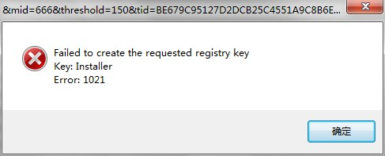

VMWARE 安装失败 “FAILED TO CREATE THE REQUESTED REGISTRY KEY KEY

分类: software
日期: 2014-06-21

原文地址: 

http://blog.chinaunix.net/uid-29632145-id-4314582.html

------

****[VMWARE 安装失败 “FAILED TO CREATE THE REQUESTED REGISTRY KEY KEY]() *2014-06-21 15:34:50*

分类： Windows平台

**问题详情：**

安装虚拟机VMWare Workstation8.0时出现“failed to create the requested registry key key installer error 1021”  

解决问题： 

1.在注册表（开始--运行[win+R]--输入**regedit**）中找到HKEY_LOCAL_MACHINE\SOFTWARE\VMware, Inc.

将VMware, Inc直接删除即可。

 2.但是可能你找不到 HKEY_LOCAL_MACHINE\SOFTWARE\VMware, Inc.，因为系统（还有32位，64位）的不同，可能会出现找不到的情况。像我（64位win7）就是在HKEY_LOCAL_MACHINE\SOFTWARE\Wow6432Node\VMware, Inc.找到的，还有在HKEY_CURRET_USER\SOFTWARE\VMware, Inc.也找到了。所以大家在解决这个问题时应仔细查看注册表。