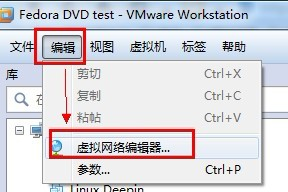
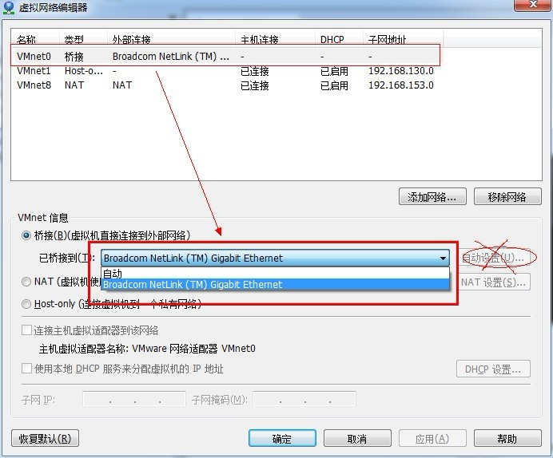

VMware下桥接设置

分类: software
日期: 2014-11-25

原文地址: 

http://blog.chinaunix.net/uid-29632145-id-4647729.html

------

****[VMware下桥接设置]() *2014-11-25 11:38:09*

分类： WINDOWS

操作环境

主机：Win7 X86 SP1

虚拟机：VMware station 8

虚拟机里的系统：Fedora 15

环境上，不管什么系统，什么版本的虚拟机，使用上都是大同小异的，毕竟核心是不变的。

 

VM虚拟机下linux系统，桥接和NAT方式，都是可以临时切换，即时生效的，不必纠结于到底使用哪个好。

```
关于虚拟机VMware 3种网络模式（桥接、nat、Host-only）的工作原理，可参见我的另一篇博客 http://www.cnblogs.com/gylei/archive/2012/04/06/2435087.html
```

 

 一、NAT方式不必多说，也没什么说的；你不会，就先别学linux了，先研究研究虚拟机和网络吧。

 二、桥接模式设置小解： 
**第1步**

　　虚拟机下fedora安装好后，打开VM虚拟机的菜单栏，单击编辑------虚拟网络编辑器，选择“主机虚拟网络 映射”标签，然后把VMnet0 手动选择为你本地的物理网卡（要选择正在使用的网卡，比如说你电脑有一个无线网卡，有一个有线网卡；你现在在用无线网络，那就桥接到无线网卡，要是你现在在用有线网卡，那就桥接到有线网卡）,不要选自动设置。然后点击确定。





**第2步**

　　进入虚拟机的操作系统，打开超级终端，输入ifconfig eth0,查看一下eth0的网络设置。 
　　主要要确定一下虚拟机和宿主机是不是在同一个网段。如果宿主机的IP是192.168.0.2，那么虚拟机的IP地址应该是从 192.168.0.1到192.168.0.254的。 还有最重要的一步，就是把虚拟机的网关设置成宿主机的物理IP地址(一般情况下设置成和宿主机一样就行，不能上网在执行这一步)。这一点很重要，很多人虚拟机上不了网都和这个有关，以主机的IP作为虚拟机的网关。

**第3步**

　　设置宿主机系统 和 虚拟机下的linux。 
　　　　1）关闭宿主机的防火墙；略

　　　　2）关闭虚拟机的防火墙；  
　　　　　　# chkconfig iptables off         //重启后生效，永久关闭 
　　　　　　# /etc/init.d/iptables status   //可查看防火墙状态

　　　　3）关闭虚拟机的selinux； 
　　　　　　# vi /etc/selinux/config 　　   //把SELINUX=enforcing改为SELINUX=disabled    //保存退出，重启生效，永久关闭

　　　　　　# getenforce       　　　　     //可查看selinux状态。

**第4步**

　　测试一下设置设置是否生效 
　　　　1）主机ping虚拟机eth0网卡的ip //不通说明虚拟机下防火墙或者selinux未关闭

　　　　2）虚拟机ping主机ip //不通说明主机下防火墙未关闭

　　　　3）能够互相ping同，设置即完成。 //enjoy！！

　　如果还有问题，查看一下防火墙等有没有设置好，想一下一些需要重启生效的操作是否重启了。一般做到此，不会有什么问题了。这个时候再启动虚拟机。应该可以上网了.对于使用拨号上网的用户，主机下和虚拟机下只能同时一个在线。