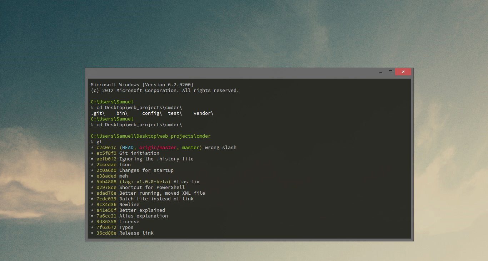
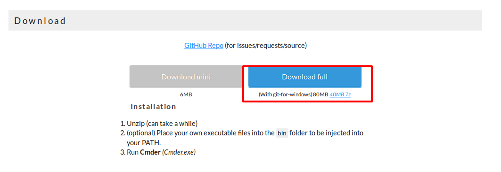
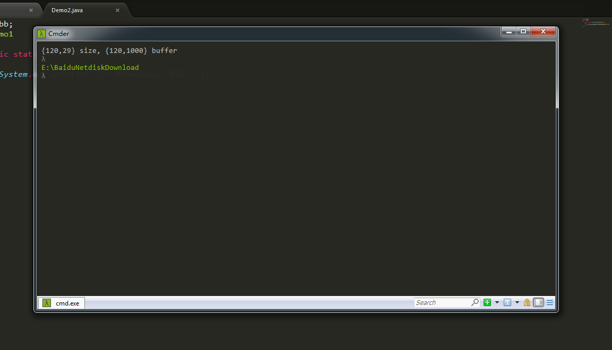
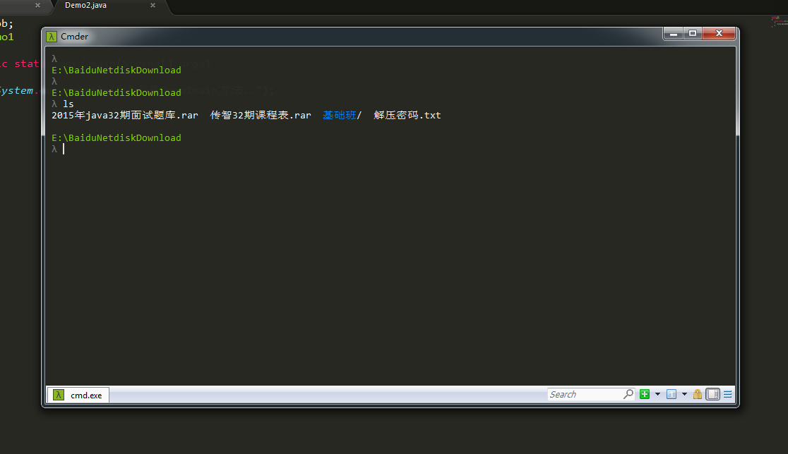

## 1、Windows必备神器Cmder

Windows的cmd终端，相信大家都觉的low爆了，一直想找一个类似[Linux](http://lib.csdn.net/base/linux)的终端，终于找到了：cmder，漂亮的界面，人性化的操作，一直诟病cmd的你值得拥有。 
 
推荐下载full包，里面集成了[Git](http://lib.csdn.net/base/git)工具。 
 
安装部分省略。。。。。。

## ２、Cmder常用功能介绍

```
cmder 功能极为强大，但从视窗画面上看不太出其强大实力，这里就先说下常用的功能：

如图示编号的部分说明如下：

1、Cmder常用快捷键

利用Tab，自动路径补全；

利用Ctrl+T建立新页签；利用Ctrl+W关闭页签;

利用Ctrl+Tab切换页签;

Alt+F4：关闭所有页签

Alt+Shift+1：开启cmd.exe

Alt+Shift+2：开启powershell.exe

Alt+Shift+3：开启powershell.exe (系统管理员权限)

Ctrl+1：快速切换到第1个页签

Ctrl+n：快速切换到第n个页签( n值无上限)

Alt + enter： 切换到全屏状态；

Ctr+r 历史命令搜索

2、可在视窗内搜寻画面上出现过的任意关键字。

3、新增页签按钮。

4、切换页签按钮。

5、锁定视窗，让视窗无法再输入。

6、切换视窗是否提供卷轴功能，启动时可查询之前显示过的内容。

7、按下滑鼠左键可开启系统选单，滑鼠右键可开启工具选项视窗。 
Win+Alt+P  ：开启工具选项视窗

```

## 3、Cmder进阶功能

```
1、Cmder增加了alias功能

他让你用短短的指令执行一些常见但指令超长又难以记忆的语法;
在其控制台输入alias可以查看。

2、主控台文字自动放大缩小功能

你只要按下Ctrl+滑鼠滚轮就可以办到;
还有：up，向上翻历史命令;

3、Cmder有极为简单的复制粘贴操作

Ctr+V直接粘贴;
用鼠标选中你想拷贝的内容，自动就复制到剪切板；

4、自定义aliases

打开Cmder目录下的config文件夹，里面的aliases文件就是我们可以配置的别名文件，只需将里面ls命令的别名按下列方式修改就可以在ls命令下显示中文。

```



## 4、常见问题

```
1、提示clink.lua文件找不到

cmder\vendor\clink\clink.lua: No such file or direct
原因分析：
这个是因为你的cmder的路径中有中文，将cmder文件夹移动到没有中文的目录下再重新打开，一切就恢复正常了。

2、ls命令中文路径/文件名乱码

win+ctrl+p打开Settings
在Settings > Startup > Environment里添加：set LANG=zh_CN.UTF8

PS：
这样修改过ls可以正确显示中文，但ls |more还是会出现乱码。
如果改为set LANG=zh_CN.GBK可以解决这个问题。

PPS：
因为cat命令读取文件的编码与此有关，如果改为GBK则cat一个UTF8文件会显示乱码，
如果改为UTF8则cat一个GBK文件会显示乱码，
具体设置还是看你环境中常用编码。
cd进一个中文目录，中文路径名显示乱码
经过上述设置，cmder一般情况下都能正常显示中文

```



```
但是如果你进入一个中文路径的话，cmder的路径的中文仍然是乱码
好在已经有人解决了这个问题
https://github.com/cmderdev/cmder/pull/1070 

```

来源：http://blog.csdn.net/mihupengpeng/article/details/53009110?locationNum=16&fps=1#

