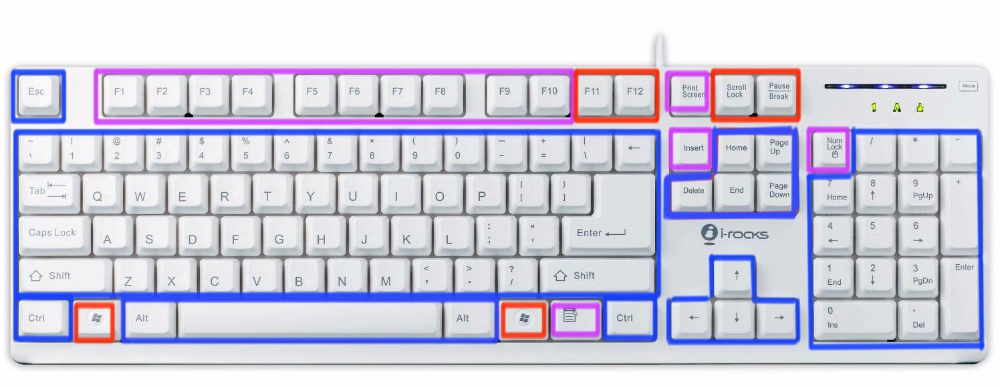

#  普通的101键盘在Mac上的键位对应

为了方便，搞了一个普通的101有线全键盘 + Magic TrackPad配Macbook。        然后发现了一个小问题，按键对应似乎不像我想的那么完美，F1~F12和Macbook不对应，于是乎，就开始试按键。
 
​       截图蓝色区域代表Mac键盘和普通键盘按键功能相同的按键。
​       截图红色区域代表目前我已知其功能并且和Mac上的印花不同的按键。
​       截图紫色区域代表功能尚不明确的按键。

- ​      Windows键====Command键（这个谁都知道）
- ​     Alt键====option键（这个谁都知道）
- ​     F11键==== 
- ​     F12键====显示DashBoard
- ​     Scroll Lock键====降低屏幕亮度
- ​     PauseBreak键====调高屏幕亮度
- ​     Insert键：按下后鼠标会变成“ ？”，意义不明。
- ​     右windows键右边的按键：意义不明。
- ​     F1~F10键：似乎只能作为标准功能键，似乎没发现特别的功能（按下后鼠标会消失，动动触控板又会出现），并且触发标准功能键不需要Fn+F1（在偏好设置里没选钩将F1、F2等键设为标准功能键）。按住Macbook上的Fn，再按普通键盘上的F1~F10也没反应。
- ​     NumLock键：不管怎么按小键盘指示灯都不亮，但是就算不亮也可以正常使用小键盘
- ​     额，就是Fn键没了，平时Fn习惯按两下Fn听写的。另外，请封釉分享一下有其他什么组合按键或者我每发现的按键功能。

 可以在偏好设置里定义按键作用
来源： [http://bbs.feng.com/read-htm-tid-6888222.html](http://bbs.feng.com/read-htm-tid-6888222.html)