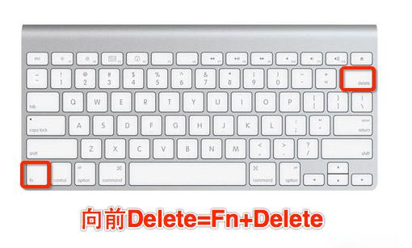

　在苹果Mac电脑的键盘上没有Home, End, Page UP, Page DOWN这些键，可以通过用Fn键来组合得到同样的功能：Home键=Fn+左方向、[End键](https://www.baidu.com/s?wd=End%E9%94%AE&tn=44039180_cpr&fenlei=mv6quAkxTZn0IZRqIHckPjm4nH00T1Y3uW0LPvR4PHTdrAuhPjnY0ZwV5Hcvrjm3rH6sPfKWUMw85HfYnjn4nH6sgvPsT6KdThsqpZwYTjCEQLGCpyw9Uz4Bmy-bIi4WUvYETgN-TLwGUv3EnHT4P1nYnHT1nWc1n1ndnHmzPs)=Fn+右方向、PageUP=Fn+上方向、PageDOWN=Fn+下方向、向前Delete=Fn+delete键。苹果笔记本上的Fn键功能很强大。

