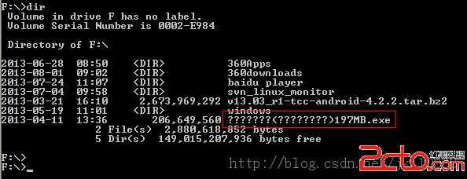
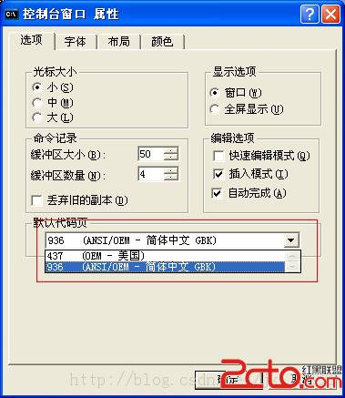
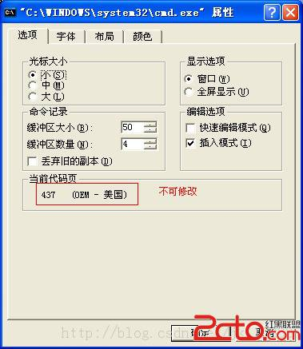
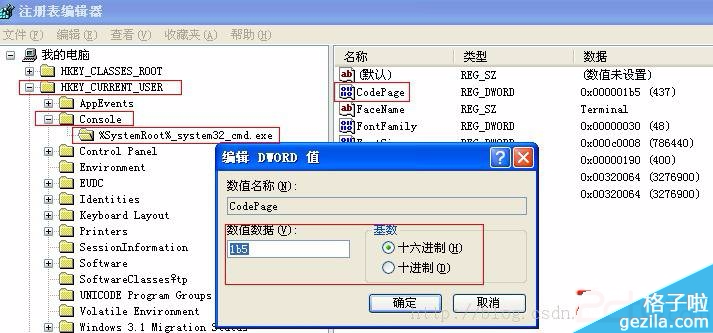
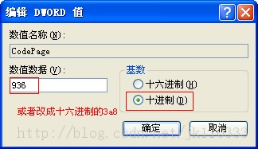
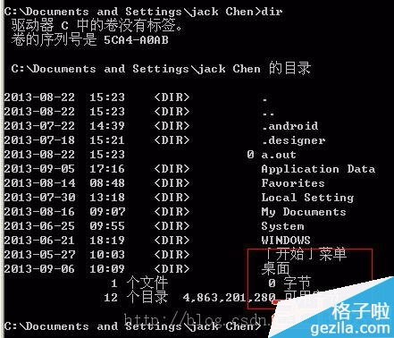

# 修改DOS窗口编码格式

1、打开CMD.exe命令行窗口 
2、通过 chcp命令改变代码页，UTF-8的代码页为65001 
F:\trash>**chcp 65001**
执行该操作后，代码页就被变成UTF-8了。但是，在窗口中仍旧不能正确显示UTF-8字符。 

3、修改窗口属性，改变字体 
在命令行标题栏上点击右键，选择**"属性"->"字体"**，将字体修改为True Type字体"**Lucida Console**"，然后点击确定将属性应用到当前窗口。 
4、通过以上操作并不能完全解决问题，因为显示出来的内容有可能不完全。可以先最小化，然后最大化命令行窗口，文件的内容就完整的显示出来了。
来源：[http://xlover.iteye.com/blog/1174104](http://xlover.iteye.com/blog/1174104) 


还可以在dos窗口执行以下命令来实现：

```
修改Dos窗口代码页:  
  
mode con cp select=936      // 简体中文  
mode con cp select=437      // MS-DOS美国英语  
mode con cp select=65001    // UTF-8  
```


From: [http://www.7edown.com/edu/article/soft_5339_1.html](http://www.7edown.com/edu/article/soft_5339_1.html)

记得以前的dos是可以显示中文的，但是今天复制东西发现竟然不能显示中文了，遇见中文就成了？



在右键->默认值中的默认代码页也显示有中文GBK，但是不管用



在右键->属性中的当前代码页显示为美国，但是修改不了



解决方法为：

修改注册表

运行->regedit

如下图看到原来的值为



修改codepage的值改为十进制的936或者十六进制的3a8

 



ok了



来源： [http://blog.csdn.net/joeblackzqq/article/details/7010322](http://blog.csdn.net/joeblackzqq/article/details/7010322)