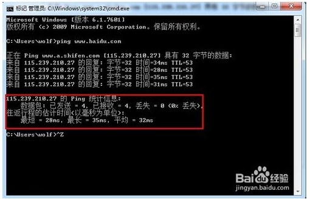
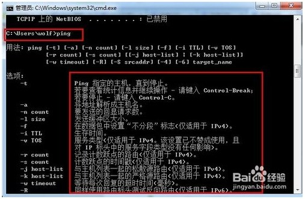

# 如何测试网络稳定

**1，网络是否稳定，是否延迟，是否丢包，用ping命令都可以看出来！**

**打开cmd.exe,win7直接在开始菜单栏输入cmd按回车键。**

 

**2，在输入框输入ping www.baidu.com -t**

请看下面图示内容：

**C:\Users\wolf>ping www.baidu.com**

**正在 Ping www.a.shifen.com [115.239.210.27] 具有 32 字节的数据:**

**来自 115.239.210.27 的回复: 字节=32 时间=34ms TTL=53**

**来自 115.239.210.27 的回复: 字节=32 时间=28ms TTL=53**

**来自 115.239.210.27 的回复: 字节=32 时间=35ms TTL=53**

**来自 115.239.210.27 的回复: 字节=32 时间=31ms TTL=53**

**115.239.210.27 的 Ping 统计信息:**

**    数据包: 已发送 = 4，已接收 = 4，丢失 = 0 (0% 丢失)，**

**往返行程的估计时间(以毫秒为单位):**

**    最短 = 28ms，最长 = 35ms，平均 = 32ms**

上面的信息意思是说，我们向百度服务器发送了4条数据的请求，结果全部收到4条数据包的返回，没有丢失，往返的时间最短为28ms，最长为35ms，平均为32ms。

这就说明我们的网络是稳定的！没有数据丢失！当然一般来说ping 的时间越久越能测试网络的稳定性，一般ping一分钟左右，不丢包，就说明网络很稳定!如果ping期间有Request timed out.提示就说明网络有丢包现象，说明网络不稳定，当然ping一分钟左右，如果有2、3条数据包丢失也算比较正常，如果丢失5个数据包以上就不正常了，我们需要先检测网线是否良好，水晶头是否插稳，再来检测网络。如果其他都正常还是丢包就说明网络的来源不稳定，可以及时向网络提供商上门来进行检测或叫客服在后台给我们调试好网络！

 

**3，再在对话框输入: ipconfig/all**

这个命令可以看到自己电脑的ip地址，子网掩码，DNS服务器，默认网关。

再来ping下我们的网关：ping 19.53.30.254

结果如下图，看出延迟<1ms这说明本地服务是非常通畅的！路由器是没问题的。

 

**4，还想知道ping命令有哪些功能，怎么用？直接在输入框内打一个ping命令。**

下面就会有详细的解释跟用法和说明！

 

来源： <http://jingyan.baidu.com/article/86fae346be0d6b3c49121a95.html>