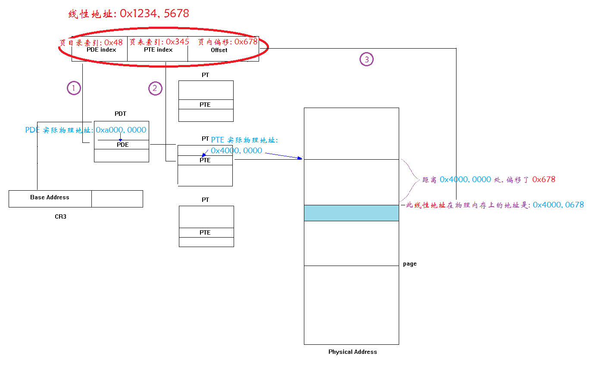
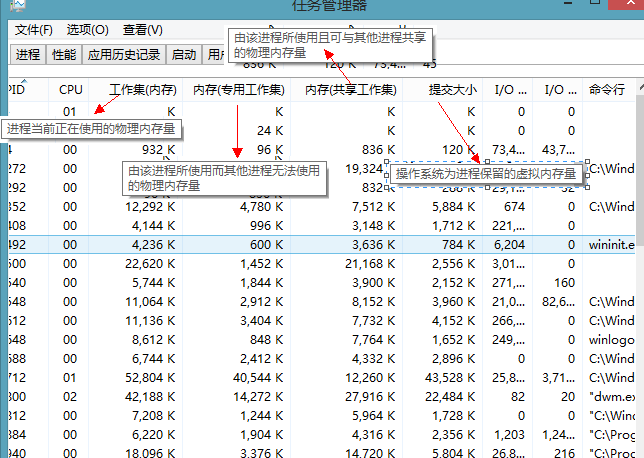
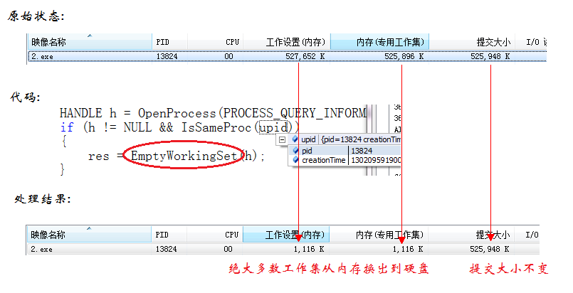

# [Windows 任务管理器中的几个内存概念](http://www.cnblogs.com/walfud/articles/3256233.html)

我们使用的大部分 PC 是基于 Intel 微处理器的 x86 和 x64 架构计算机. 

因此, 我们面对的 windows 避免不了和 Intel 架构有些设计上的契合. 比如接下来要说到的内存管理. **为简单起见, 我们只讨论 x86 体系架构的内存管理. 不考虑换页文件影响.**

 

进程的内存

------

* *图 1* (本图摘自 ref 2)*

对于系统中的每一个进程而言, 都有 4GB 的 "内存空间". 也就是每个进程都认为自己有 4GB 的内存可以使用.

系统将每个进程的 4GB 地址空间, 从逻辑上划分为两大部分:

　　a) 蓝色的是用户空间, 此空间是被用户程序所使用的. 比如我在代码中写 "分配 100MB 内存", 其实占用的就是这一部分.

　　b) 红色的是内核空间, 此空间是被用作操作系统执行必要的线程切换以及从用户态函数进入内核态执行功能所保留的内存地址. 应用程序无法操作此区域.

 

Intel x86 体系内存管理

------

Intel 规定, 一个在计算机内部, 可以使用 "分页机制" 对硬件内存进行 "虚拟化". 其核心技术如下图:

*             *图 2* (本图修改自 ref 1)*

首先, 在程序中的一个地址 0x1234, 5678 被计算机的页部件(硬件)经过 1,2,3 步, 从线性地址(程序中的地址) 转变为真正机器上的物理地址(即实际内存的硬件地址). 每个线性地址都被分成 "页目录索引(PDE, 10-bit)", "页表索引(PTE, 10-bit)", "页内偏移(offset, 12-bit)" 三部分.

　　1) 在页目录中根据 PDE 找到页表的位置, 即通过 0x48 找到 0xa000, 0000.

　　2) 根据页表中的 PTE 找到页地址, 即通过 0x345 找到 0x4000, 0000.

　　3) 根据偏移, 在页中找到我们要的具体地址, 即已知页位于 0x4000, 0000, 我们需要存取其 0x678 偏移处的数据, 则我们所需要操作的真是物理地址就是 0x4000, 0678.

 

基于 x86 的 Windows 内存管理

------

 

​                                                            图 3 

首先澄清两个概念:

　　1. 一个进程中的内存有三种分类, **空闲, 保留, 提交**. 具体的含义可以在 *图 3* 中找到说明. 这三种类型的内存在某一时刻可能位于内存中, 也可能位于交换文件中.

　　2. 工作集定义: The working set of a process is the set of pages in the virtual address space of the process that** are currently resident in physical memory**. 即: 实际在物理内存中的大小.

结合实际系统, 以我家安装的 win8.1 为例, 打开任务管理器, 可见如下:

*               *          图 4

工作集(内存): 可以这么理解, 此值就是该进程所占用的总物理内存. 但是这个值是由两部分组成, 即 **'专用工作集'** + **'共享工作集'**.

内存(专用工作集): 这对于一个进程是最重要的, 它代表了一个进程**独占**用了多少内存. 

内存(共享工作集): 这是该进程**和别的进程共享**的内存量. 通常, 这是加载一个 dll 所占用的内存. 

提交大小: 属于 Committed 那一类. 但是**不一定在物理内存中**, 有些可能位于交换文件中. 如果有一个程序, 原本占 500MB 内存, 但是绝大多数内存都不使用, 则可以通过 `EmptyWorkingSet` 向操作系统发送请求, 将此进程的不常用的内容从物理内存中换出到换页文件中保存, 如下图:

*        *          图 5

 

写在最后

------

\0. 工作集, 即在物理内存中的数据的集合.

\1. 工作集 = 专用 + 共享

\2. 将所有的 "工作集" 相加后的值会大于任务管理器中内存占用的百分比, 因为百分比对共享内存进行排重了.

\3. "提交大小" 和 "工作集" 是两个层面的概念, 大部分活跃进程的 "工作集" 会大于 "提交大小", 而大部分非活跃的进程 "工作集" 会小于 "提交大小", 但是两者没有绝对关系.

\4. 虚拟内存: 就是换页文件.

 

references:

1. <http://www.mouseos.com/arch/paging.html>

2. [Pushing the Limits of Windows: Virtual Memory](http://blogs.technet.com/markrussinovich/archive/2008/11/17/3155406.aspx)

 

来源： <http://www.cnblogs.com/walfud/articles/3256233.html>