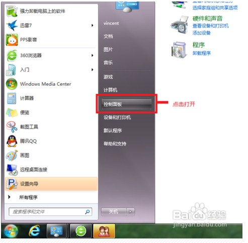
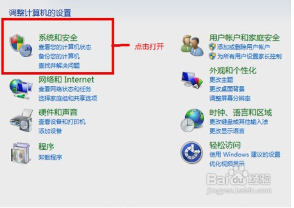
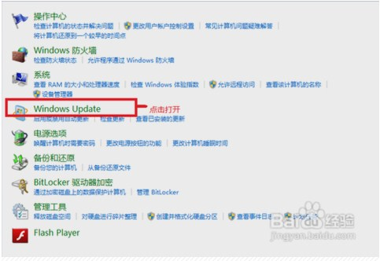
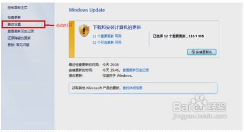
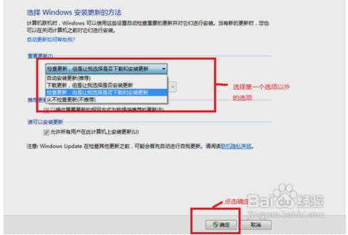
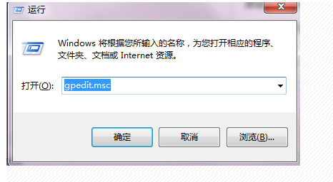
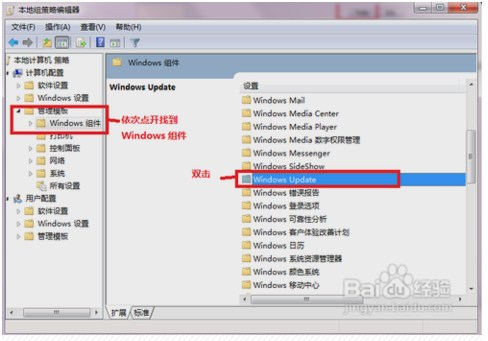
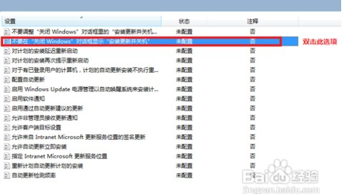
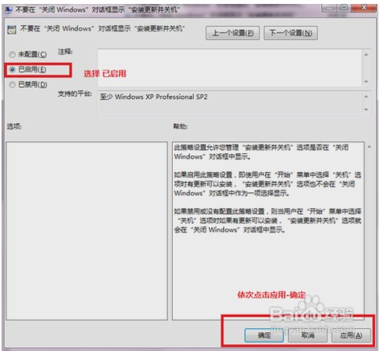

大多数朋友可能会遇上WIN7系统关机时出现自动更新延长关机时间，导致有急事无法快速关机拔电源。下面提供一个解决办法，有效地解决这个问题。

1,点击计算机左下角开始菜单，找到控制面板，点击打开

 2,选择 系统安全，点击打开

3,点击 Windows Update 打开

 

4,左边栏选择 更改设置 打开

 

5,选择下拉栏 选择 除了“自动更新（推荐）”以外的其它选项，点击确定

 

6,接下来同时按键盘按键 Win和R键,调出命令提示符，输入gpedit.msc，点击确定，调出 本地组策略编辑器

 7,依次点开左边栏，找到管理模板/Windows组件，找到Windows Update，双击

 8,选择 不要在“关闭Windows”对话框显示“安装更新并关机”并双击

 9,选择“已启用” 并依次点击 应用-确定

 