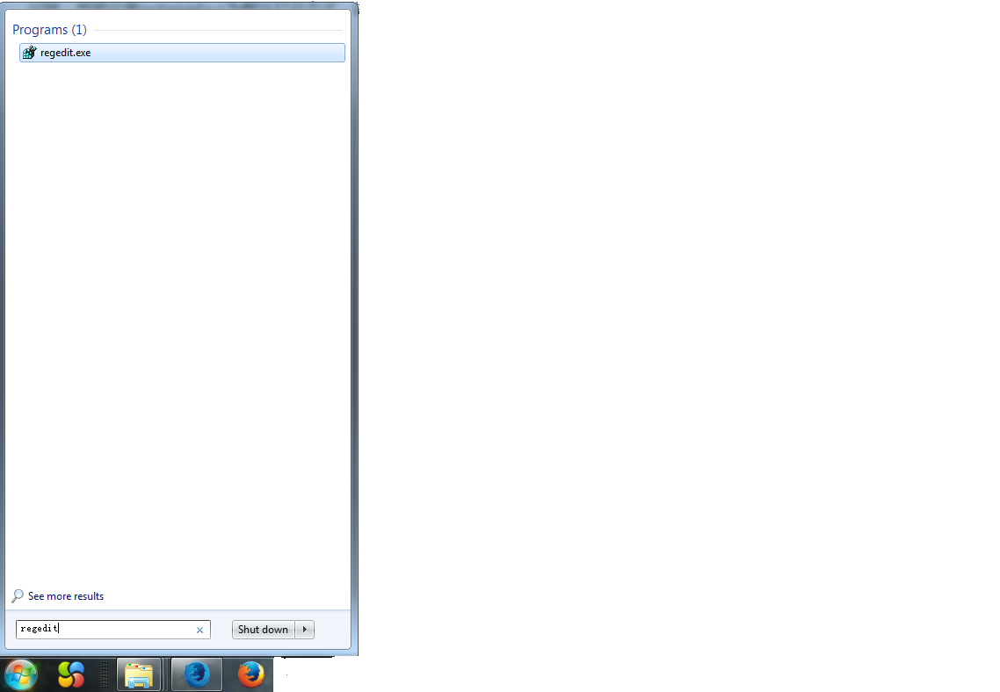
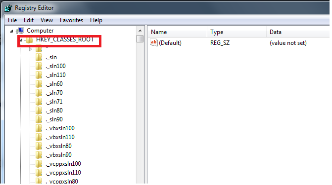
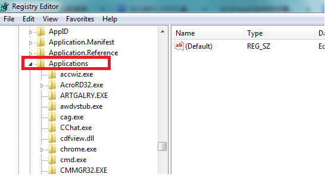
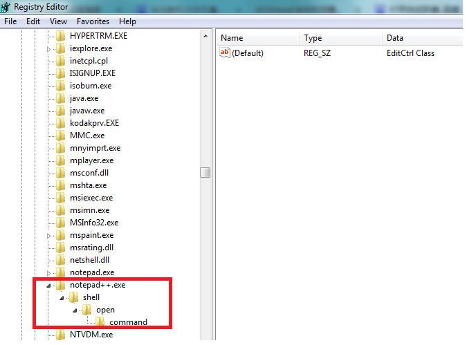
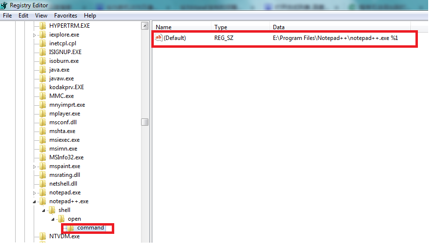
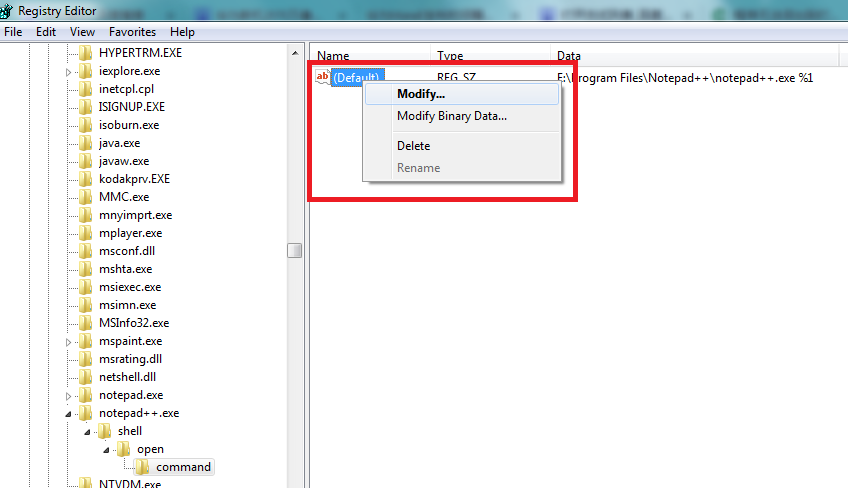
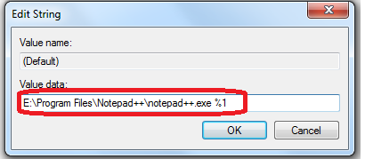

问题：想要设置notepad++为默认打开方式，却发现在点击browse找到notepad++.exe点击打开后没有在打开方式列表中找到notepad++。 
原因：更新程序版本后程序的路径发生了变动。然而注册表中得文件路径并没有改变导致的。 
解决办法：

```
1. 点击开始，输入regedit，点击回车

```



```
 2.在注册表中找到 HKEY_CLASSES_ROOT 下面的 Applications

```

 


```
3.修改注册表     
    1).在Applications下面找到对应的程序名,我名为notepad++.exe,点开shell\open\command 

```



```
    2).点击command，我们可以看到左边窗口中名为Default对应的Data的值不是notepad++.exe所在的文件的正确路径。

```



```
    3).点击Default--->右键选择Modify

```



```
    4).点击Modify后出现下图弹框，在value data中输入当前notepad++.exe对应的文件路径+" %1"（eg:假设你的路径为D:\notepad++\notepad++.exe 
    则 在value data中输入 D:\notepad++\notepad++.exe %1），点击确定，当你再次在打开方式中手动添加notepad++时，就会发现notepad++能够成功添加了。

```



来源： <http://m.blog.csdn.net/article/details?id=50749075>