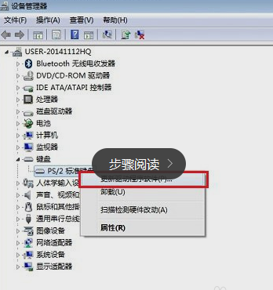
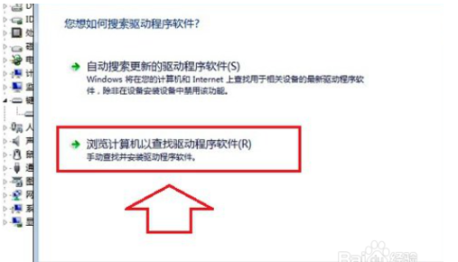
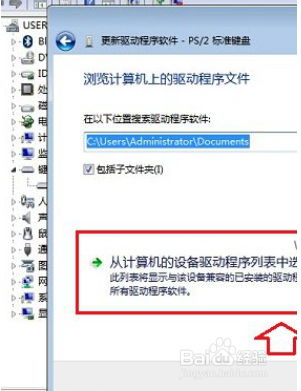
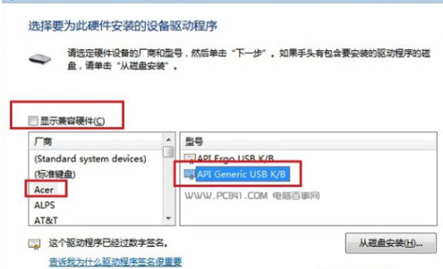
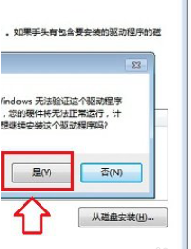

1、首先在笔记本电脑桌面的“计算机（我的电脑）”上右键鼠标，然后选择打开“属性”。

2、打开系统属性后，点击进入上角的【设备管理器】

3、打开笔记本设备管理器之后，找到【键盘】，点击展开，然后在【PS/2标准键盘】上右键鼠标，然后选择【更新驱动程序软件】，如下示意图所示。

4、在接下来的您如何搜索驱动程序软件界面，点击【浏览计算机一查找驱动程序软件】，如下图所示。

5、之后会进入浏览计算机上的驱动程序文件选择界面，这里依旧点击底部的【从计算机的设备驱动程序列表中选择】，如下图所示。

6、下面的这步“选择要为此硬件安装的设备驱动程序”，首先要将【显示兼容硬件】前面的勾去掉，然后在厂商里，任意选择一个其他笔记本品牌，比如笔者用的是联想笔记本，在这里我们故意选择“宏碁（Acer）”厂商，然后在右侧的型号里，任意选择一个，完成后点击下面的【下一步】，如下图所示。

 

7、最后会弹出一个“不推荐安装这个设备的驱动程序），因为Window无法验证这个驱动程序是否与硬件兼容...”，这里我们直接点击底部的【是】，如下图所示。

8、以上步骤完成后，笔记本自带键盘禁用了，需要重启笔记本才会生效。

 注意事项

 以上是Win7笔记本禁用自带键盘方法，其他Windows系统笔记本禁用键盘方法与此操作类似。 

以上就是禁用笔记本键盘方法，仅仅是卸载驱动，一般重启电脑后又自动恢复了

 以上这种禁用笔记本自带键盘的方法，主要是为笔记本键盘适配一个不兼容的驱动，导致其无法正常工作，从而达到禁用笔记本自带键盘的作用，如果想恢复正常，只需要卸载驱动，然后重启电脑，让笔记本自带安装驱动即可。

来源： <http://zhidao.baidu.com/question/96257501.html?fr=iks&word=%D3%D0%CA%B2%C3%B4%B0%EC%B7%A8%C4%DC%C8%C3%B1%CA%BC%C7%B1%BE%D7%D4%B4%F8%B5%C4%BC%FC%C5%CC%CA%A7%C1%E9&ie=gbk>