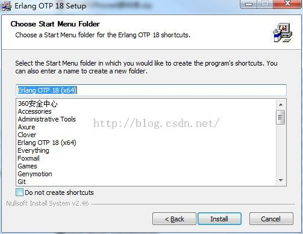

# 一、下载

1. RabbitMQ下载地址

​        进入RabbitMQ官网 ： <http://www.rabbitmq.com/>   点击右侧【最新版本列表】中的3.6.0版本下载最新版本【rabbitmq-server-3.6.0.exe】。由于RabbitMQ是Erlang语言写的，所以，在安装RabbitMQ之前，必选先安装[Erlang OTP](http://www.erlang.org/download.html)到我们的电脑上.

​      

2、Erlang OTP下载安装

​        Erlang OTP包含了一组库和实现方式,可以构建大规模、容错和分布式的应用程序,包含了许多强大的工具,能够实现H248，SNMP等多种协议. RabbitMQ是基于Erlang OTP开发出来的，所以需要下安装OTP环境。我的电脑是Windows7 64位系统，所以选择Windows 64-bit Binary File. 下载完成后，双击下载的应用【otp_win64_18.2.1.exe】一路下一步安装。安装完成后，需要在系统环境变量中配置一个【ERLANG_HOME】地址指向刚刚安装Erlang的目录：【C:\Program Files\erl7.2.1】，并将这个路径加入系统环境变量Path中【;%ERLANG_HOME%\bin】，“；”冒号是间隔，一定要加！

# 二、RabbitMQ安装

​        双击下载的应用程序，选择一个安装目录【C:\Program Files\RabbitMQ Server】（保持默认就可以了），安装完成后，需要配置一下环境变量【RABBITMQ_BASE】到【C:\Program Files\RabbitMQ Server\rabbitmq_server-3.6.0】，并将路径加入到Path这个系统环境变量中【;%RABBITMQ_BASE%\sbin】，然后 进入安装目录【C:\Program Files\RabbitMQ Server\rabbitmq_server-3.6.0\sbin】下，双击【rabbitmq-server.bat】启动. 

​        如果安装成功后双击【rabbitmq-server.bat】启动不了，提示【node with name rabbit already running on ***】的错误，就试着删除【C:\Users\Administrator\AppData\Roaming\rabbitmq】这个目录，如果还是没有效果，就点击开始菜单，在所有程序》RabbitMQ Service 》RabbitMQ Service stop，先关闭已经启动的RabbitMQ，然后再启动。

# 三、配置

​       安装完成后，需要对RabbitMQ进行配置，在RabbitMQ中，有几个概念需要了解：

​      virtual hosts : 虚拟主机。类似于数据库中的库的概念。一个RabbitMQ服务器可以有多个虚拟主机，默认虚拟主角是“/” 根目录。

​      user：访问虚拟主机的用户.

​      roles: 角色。有none、mamagement、policymaker、monitoring、administrator等权限。

​      permissions: 权限。分conf、write、read三种权限。类似Linux的执行、写、读权限。

​      1. 添加用户【rabbitmqctl add_user username password】    

​      2. 分配角色【rabbitmqctl set_user_tags username administrator】

​      3. 新增虚拟主机【rabbitmqctl add_vhost  vhost_name】

​      4. 将新虚拟主机授权给新用户【rabbitmqctl set_permissions -p vhost_name username '.*' '.*' '.*'】

# 四、角色说明：

**1. none  最小权限角色** 不能访问管理插件。权限最小。

**2. management 管理员角** 用户可以通过AMQP协议做的任何事，还包括：
列出自己可以通过AMQP登入的virtual hosts  
查看自己的virtual hosts中的queues, exchanges 和 bindings
查看和关闭自己的channels 和 connections
查看有关自己的virtual hosts的“全局”的统计信息，包含其他用户在这些virtual hosts中的活动。

**3. policymaker   决策者** management可以做的任何事，还包括：
查看、创建和删除自己的virtual hosts所属的policies和parameters

**4. monitoring  监控** management可以做的任何事，还包括：
列出所有virtual hosts，包括他们不能登录的virtual hosts
查看其他用户的connections和channels
查看节点级别的数据如clustering和memory使用情况
查看真正的关于所有virtual hosts的全局的统计信息

**5.administrator  超级管理员** 
policymaker和monitoring可以做的任何事，还包括:
创建和删除virtual hosts
查看、创建和删除users
查看创建和删除permissions
关闭其他用户的connections

# 五、权限说明

权限管理的指令格式是：【set_permissions [-p ] 】

的位置分别用正则表达式来匹配特定的资源

例如【'^(amq.gen.*|amq.default)$'】可以匹配RabbitMQ服务器默认生成的交换器

【'^$'】不匹配任何资源

# 六，用户、角色、权限、插件配置

**添加用户** rabbitmqctl add_user [username] [password]

**添加虚拟主机** rabbitmqctl add_vhost [vhost_name]

**修改虚拟机权限** rabbitmqctl set_permissions -p [vhost_name] [username] '.*' '.*' '.*'

**设置角色** rabbitmqctl set_user_tags [username] administrator

**启用web管理界面插件** rabbitmq-plugins enable rabbitmq_management

来源： <http://www.kancloud.cn/digest/rabbitmq-for-java/122044>