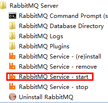
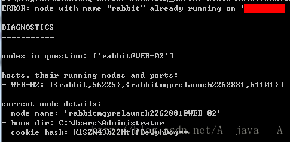
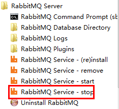

# [rabbitMQ windows 安装 入门](http://www.cnblogs.com/junrong624/p/4121656.html)

1、下载,其实erlang不装也是可以的

下载 rabbitMQ ：<http://www.rabbitmq.com/download.html>，安装rabbitmq需要erlang，下载erlang：<http://www.erlang.org/download.html>

 

2、安装RABBITMQ

rabbitMQ安装，查看安装文档：<http://www.rabbitmq.com/install-windows.html>

 

3、启动RABBITMQ

如果是安装版的直接在开始那里找到安装目录点击启动即可



 

启动的时候有可能碰到这个问题。



 

碰到这种情况的时候就先执行停止，执行完后再启动即可。

 



5、安装管理工具

参考官方文档：<http://www.rabbitmq.com/management.html>

操作起来很简单，只需要在DOS下面，进入安装目录（C：\RabbitMQ Server\rabbitmq_server-3.2.2\sbin）执行如下命令就可以成功安装。

 

```
rabbitmq-plugins enable rabbitmq_management
```

可以通过访问 http://localhost:15672  进行测试，默认的登陆账号为：guest，密码为：guest。

 

 

如果访问成功了，恭喜，整个rabbitMQ安装完成了。

 

 

# [rabbitmq 如何删除队列中的消息](http://www.oschina.net/question/190643_155714)

 

手动删除的话，访问http://{rabbitmq安装IP}:15672，帐号guest，密码guest（也可以使用自己创建的帐号）。

登录后访问http://{rabbitmq安装IP}:15672/#/queues，这里可以看到你创建的所有的Queue，选中某一个Queue，下方有个Delete/Purge，展开，选择purge即可。

注意：Delete表示delete这个Queue，而purge表示清除所有暂存在Queue里面的消息。

 

来源： <http://www.cnblogs.com/junrong624/p/4121656.html>