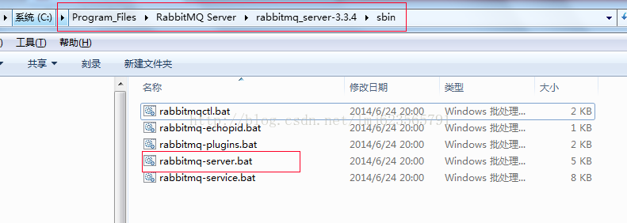
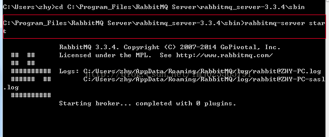
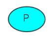
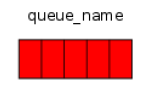
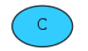
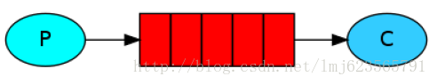

转载请标明出处：<http://blog.csdn.net/lmj623565791/article/details/37607165>

本系列教程主要来自于官网入门教程的翻译，然后自己进行了部分的修改与实验，内容仅供参考。

“Hello world” of RabbitMQ

1、Windows下RabbitMQ的安装

下载Erlang，地址：http://www.erlang.org/download/otp_win32_R15B.exe ，双击安装即可（首先装）

下载RabbitMQ，地址：http://www.rabbitmq.com/releases/rabbitmq-server/v3.3.4/rabbitmq-server-3.3.4.exe ，双击安装即可

下载rabbit-client.jar ，[Java](http://lib.csdn.net/base/17)代码时需要导入。地址：http://www.rabbitmq.com/releases/rabbitmq-java-client/v3.3.4/rabbitmq-java-client-bin-3.3.4.zip

安装完成后，在RabbitMQ的安装目录的sbin先会有：rabbitmq-server.bat

例如：



在cmd下：进入sbin目录，运行rabbitmq-server start



2、介绍

RabbitMQ 是信息传输的中间者。本质上，他从生产者（producers）接收消息，转发这些消息给消费者（consumers）.换句话说，他能够按根据你指定的规则进行消息转发、缓冲、和持久化。

RabbitMQ 的一些常见的术语：
Producing意味着无非是发送。一个发送消息的程序是一个producer(生产者)。一般用下图表示Producer：



Queue（队列）类似邮箱。依存于RabbitMQ内部。虽然消息通过RabbitMQ在你的应用中传递，但是它们只能存储在queue中。队列不受任何限制，可以存储任何数量的消息—本质上是一个无限制的缓存。很多producers可以通过同一个队列发送消息，相同的很多consumers可以从同一个队列上接收消息。一般用下图表示队列：



Consuming（消费）类似于接收。consumer是基本属于等待接收消息的程序。一般使用下图表示Consumer:



注意：producer（生产者）,consumer（消费者）,broker（RabbitMQ服务）并不需要部署在同一台机器上，实际上在大多数实际的应用中，也不会部署在同一台机器上。

2、Java入门实例
 一个producer发送消息，一个接收者接收消息，并在控制台打印出来。如下图：



注：需要在官网下载rabbitmq-java-client-bin-*.zip将jar放入项目的classpath.

发送端：

Send.java 连接到RabbitMQ（此时服务需要启动），发送一条数据，然后退出。

```
package com.zhy.rabbit._01;  
  
import com.rabbitmq.client.Channel;  
import com.rabbitmq.client.Connection;  
import com.rabbitmq.client.ConnectionFactory;  
  
public class Send  
{  
    //队列名称  
    private final static String QUEUE_NAME = "hello";  
  
    public static void main(String[] argv) throws java.io.IOException  
    {  
        /** 
         * 创建连接连接到MabbitMQ 
         */  
        ConnectionFactory factory = new ConnectionFactory();  
        //设置MabbitMQ所在主机ip或者主机名  
        factory.setHost("localhost");  
        //创建一个连接  
        Connection connection = factory.newConnection();  
        //创建一个频道  
        Channel channel = connection.createChannel();  
        //指定一个队列  
        channel.queueDeclare(QUEUE_NAME, false, false, false, null);  
        //发送的消息  
        String message = "hello world!";  
        //往队列中发出一条消息  
        channel.basicPublish("", QUEUE_NAME, null, message.getBytes());  
        System.out.println(" [x] Sent '" + message + "'");  
        //关闭频道和连接  
        channel.close();  
        connection.close();  
     }  
}  
```

值得注意的是队列只会在它不存在的时候创建，多次声明并不会重复创建。信息的内容是字节数组，也就意味着你可以传递任何数据。

**接收端：**Recv.java 不断等待服务器推送消息，然后在控制台输出。

```
package com.zhy.rabbit._01;  
  
import com.rabbitmq.client.Channel;  
import com.rabbitmq.client.Connection;  
import com.rabbitmq.client.ConnectionFactory;  
import com.rabbitmq.client.QueueingConsumer;  
  
public class Recv  
{  
    //队列名称  
    private final static String QUEUE_NAME = "hello";  
  
    public static void main(String[] argv) throws java.io.IOException,  
            java.lang.InterruptedException  
    {  
        //打开连接和创建频道，与发送端一样  
        ConnectionFactory factory = new ConnectionFactory();  
        factory.setHost("localhost");  
        Connection connection = factory.newConnection();  
        Channel channel = connection.createChannel();  
        //声明队列，主要为了防止消息接收者先运行此程序，队列还不存在时创建队列。  
        channel.queueDeclare(QUEUE_NAME, false, false, false, null);  
        System.out.println(" [*] Waiting for messages. To exit press CTRL+C");  
          
        //创建队列消费者  
        QueueingConsumer consumer = new QueueingConsumer(channel);  
        //指定消费队列  
        channel.basicConsume(QUEUE_NAME, true, consumer);  
        while (true)  
        {  
            //nextDelivery是一个阻塞方法（内部实现其实是阻塞队列的take方法）  
            QueueingConsumer.Delivery delivery = consumer.nextDelivery();  
            String message = new String(delivery.getBody());  
            System.out.println(" [x] Received '" + message + "'");  
        }  
  
    }  
}  
```

分别运行Send.java和Recv.java 顺序无所谓。前提RabbitMQ服务开启。

运行结果：

[x]Sent 'hello world!'

\----------------------------------------

[*] Waiting for messages. To exitpress CTRL+C

[x] Received 'hello world!'

下一篇将介绍如何通过一个工作队列（queue）分发耗时任务给不同的工作者(consumers)。