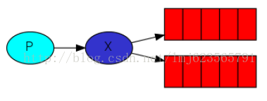
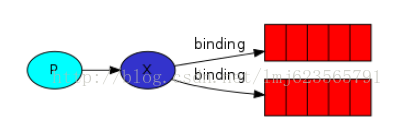
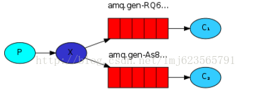
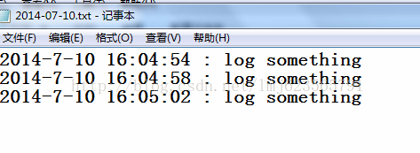

RabbitMQ （三） 发布/订阅

转发请标明出处：<http://blog.csdn.net/lmj623565791/article/details/37657225>

本系列教程主要来自于官网入门教程的翻译，然后自己进行了部分的修改与实验，内容仅供参考。 

上一篇博客中，我们实现了工作队列，并且我们的工作队列中的一个任务只会发给一个工作者，除非某个工作者未完成任务意外被杀死，会转发给另外的工作者，如果你还不了解：[RabbitMQ （二）工作队列](http://blog.csdn.net/lmj623565791/article/details/37620057)。这篇博客中，我们会做一些改变，就是把一个消息发给多个消费者，这种模式称之为发布/订阅（类似观察者模式）。

​         为了验证这种模式，我们准备构建一个简单的日志系统。这个系统包含两类程序，一类程序发动日志，另一类程序接收和处理日志。

​         在我们的日志系统中，每一个运行的接收者程序都会收到日志。然后我们实现，一个接收者将接收到的数据写到硬盘上，与此同时，另一个接收者把接收到的消息展现在屏幕上。

​         本质上来说，就是发布的日志消息会转发给所有的接收者。

###### 1、转发器（Exchanges）

前面的博客中我们主要的介绍都是发送者发送消息给队列，接收者从队列接收消息。下面我们会引入Exchanges，展示RabbitMQ的完整的消息模型。

RabbitMQ消息模型的核心理念是生产者永远不会直接发送任何消息给队列，一般的情况生产者甚至不知道消息应该发送到哪些队列。

相反的，生产者只能发送消息给转发器（Exchange）。转发器是非常简单的，一边接收从生产者发来的消息，另一边把消息推送到队列中。转发器必须清楚的知道消息如何处理它收到的每一条消息。是否应该追加到一个指定的队列？是否应该追加到多个队列？或者是否应该丢弃？这些规则通过转发器的类型进行定义。



下面列出一些可用的转发器类型：

Direct

Topic

Headers

Fanout

目前我们关注最后一个fanout，声明转发器类型的代码：

channel.exchangeDeclare("logs","fanout");

fanout类型转发器特别简单，把所有它介绍到的消息，广播到所有它所知道的队列。不过这正是我们前述的日志系统所需要的。

###### 2、匿名转发器（nameless exchange）

前面说到生产者只能发送消息给转发器（Exchange），但是我们前两篇博客中的例子并没有使用到转发器，我们仍然可以发送和接收消息。这是因为我们使用了一个默认的转发器，它的标识符为””。之前发送消息的代码：

channel.basicPublish("", QUEUE_NAME,MessageProperties.PERSISTENT_TEXT_PLAIN, message.getBytes());

第一个参数为转发器的名称，我们设置为”” : 如果存在routingKey（第二个参数），消息由routingKey决定发送到哪个队列。

现在我们可以指定消息发送到的转发器：

channel.basicPublish( "logs","", null, message.getBytes());

###### 3、临时队列（Temporary queues）

前面的博客中我们都为队列指定了一个特定的名称。能够为队列命名对我们来说是很关键的，我们需要指定消费者为某个队列。当我们希望在生产者和消费者间共享队列时，为队列命名是很重要的。
不过，对于我们的日志系统我们并不关心队列的名称。我们想要接收到所有的消息，而且我们也只对当前正在传递的数据的感兴趣。为了满足我们的需求，需要做两件事：
第一， 无论什么时间连接到Rabbit我们都需要一个新的空的队列。为了实现，我们可以使用随机数创建队列，或者更好的，让服务器给我们提供一个随机的名称。
第二， 一旦消费者与Rabbit断开，消费者所接收的那个队列应该被自动删除。
[Java](http://lib.csdn.net/base/17)中我们可以使用queueDeclare()方法，不传递任何参数，来创建一个非持久的、唯一的、自动删除的队列且队列名称由服务器随机产生。
String queueName = channel.queueDeclare().getQueue();
一般情况这个名称与amq.gen-JzTY20BRgKO-HjmUJj0wLg 类似。

###### 4、绑定（Bindings）



###### 5、完整的例子



日志发送端：

```
package com.zhy.rabbit._03_bindings_exchanges;  
  
import java.io.IOException;  
import java.util.Date;  
  
import com.rabbitmq.client.Channel;  
import com.rabbitmq.client.Connection;  
import com.rabbitmq.client.ConnectionFactory;  
  
public class EmitLog  
{  
    private final static String EXCHANGE_NAME = "ex_log";  
  
    public static void main(String[] args) throws IOException  
    {  
        // 创建连接和频道  
        ConnectionFactory factory = new ConnectionFactory();  
        factory.setHost("localhost");  
        Connection connection = factory.newConnection();  
        Channel channel = connection.createChannel();  
        // 声明转发器和类型  
        channel.exchangeDeclare(EXCHANGE_NAME, "fanout" );  
          
        String message = new Date().toLocaleString()+" : log something";  
        // 往转发器上发送消息  
        channel.basicPublish(EXCHANGE_NAME, "", null, message.getBytes());  
  
        System.out.println(" [x] Sent '" + message + "'");  
  
        channel.close();  
        connection.close();  
  
    }  
  
}  
```

接收端1 :ReceiveLogsToSave.java：

```
package com.zhy.rabbit._03_bindings_exchanges;  
  
import java.io.File;  
import java.io.FileNotFoundException;  
import java.io.FileOutputStream;  
import java.io.IOException;  
import java.text.SimpleDateFormat;  
import java.util.Date;  
  
import com.rabbitmq.client.Channel;  
import com.rabbitmq.client.Connection;  
import com.rabbitmq.client.ConnectionFactory;  
import com.rabbitmq.client.QueueingConsumer;  
  
public class ReceiveLogsToSave  
{  
    private final static String EXCHANGE_NAME = "ex_log";  
  
    public static void main(String[] argv) throws java.io.IOException,  
            java.lang.InterruptedException  
    {  
        // 创建连接和频道  
        ConnectionFactory factory = new ConnectionFactory();  
        factory.setHost("localhost");  
        Connection connection = factory.newConnection();  
        Channel channel = connection.createChannel();  
  
        channel.exchangeDeclare(EXCHANGE_NAME, "fanout");  
        // 创建一个非持久的、唯一的且自动删除的队列  
        String queueName = channel.queueDeclare().getQueue();  
        // 为转发器指定队列，设置binding  
        channel.queueBind(queueName, EXCHANGE_NAME, "");  
  
        System.out.println(" [*] Waiting for messages. To exit press CTRL+C");  
  
        QueueingConsumer consumer = new QueueingConsumer(channel);  
        // 指定接收者，第二个参数为自动应答，无需手动应答  
        channel.basicConsume(queueName, true, consumer);  
  
        while (true)  
        {  
            QueueingConsumer.Delivery delivery = consumer.nextDelivery();  
            String message = new String(delivery.getBody());  
  
            print2File(message);  
        }  
  
    }  
  
    private static void print2File(String msg)  
    {  
        try  
        {  
            String dir = ReceiveLogsToSave.class.getClassLoader().getResource("").getPath();  
            String logFileName = new SimpleDateFormat("yyyy-MM-dd")  
                    .format(new Date());  
            File file = new File(dir, logFileName+".txt");  
            FileOutputStream fos = new FileOutputStream(file, true);  
            fos.write((msg + "\r\n").getBytes());  
            fos.flush();  
            fos.close();  
        } catch (FileNotFoundException e)  
        {  
            e.printStackTrace();  
        } catch (IOException e)  
        {  
            e.printStackTrace();  
        }  
    }  
}  
```

随机创建一个队列，然后将队列与转发器绑定，然后将消费者与该队列绑定，然后写入日志文件。

接收端2：ReceiveLogsToConsole.java

```
package com.zhy.rabbit._03_bindings_exchanges;  
  
import com.rabbitmq.client.Channel;  
import com.rabbitmq.client.Connection;  
import com.rabbitmq.client.ConnectionFactory;  
import com.rabbitmq.client.QueueingConsumer;  
  
public class ReceiveLogsToConsole  
{  
    private final static String EXCHANGE_NAME = "ex_log";  
  
    public static void main(String[] argv) throws java.io.IOException,  
            java.lang.InterruptedException  
    {  
        // 创建连接和频道  
        ConnectionFactory factory = new ConnectionFactory();  
        factory.setHost("localhost");  
        Connection connection = factory.newConnection();  
        Channel channel = connection.createChannel();  
  
        channel.exchangeDeclare(EXCHANGE_NAME, "fanout");  
        // 创建一个非持久的、唯一的且自动删除的队列  
        String queueName = channel.queueDeclare().getQueue();  
        // 为转发器指定队列，设置binding  
        channel.queueBind(queueName, EXCHANGE_NAME, "");  
  
        System.out.println(" [*] Waiting for messages. To exit press CTRL+C");  
  
        QueueingConsumer consumer = new QueueingConsumer(channel);  
        // 指定接收者，第二个参数为自动应答，无需手动应答  
        channel.basicConsume(queueName, true, consumer);  
  
        while (true)  
        {  
            QueueingConsumer.Delivery delivery = consumer.nextDelivery();  
            String message = new String(delivery.getBody());  
            System.out.println(" [x] Received '" + message + "'");  
  
        }  
  
    }  
  
}  
```

随机创建一个队列，然后将队列与转发器绑定，然后将消费者与该队列绑定，然后打印到控制台。

现在把两个接收端运行，然后运行3次发送端：

输出结果：

发送端：

 [x] Sent '2014-7-10 16:04:54 : log something'

 [x] Sent '2014-7-10 16:04:58 : log something'

 [x] Sent '2014-7-10 16:05:02 : log something'

接收端1：



接收端2：

 [*] Waiting for messages. To exit press CTRL+C
 [x] Received '2014-7-10 16:04:54 : log something'
 [x] Received '2014-7-10 16:04:58 : log something'
 [x] Received '2014-7-10 16:05:02 : log something'

这个例子实现了我们文章开头所描述的日志系统，利用了转发器的类型：fanout。

本篇说明了，生产者将消息发送至转发器，转发器决定将消息发送至哪些队列，消费者绑定队列获取消息。