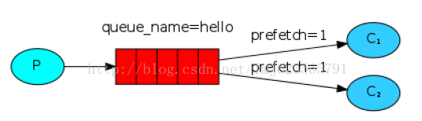

RabbitMQ （二）工作队列

转载请标明出处：<http://blog.csdn.net/lmj623565791/article/details/37620057>

本系列教程主要来自于官网入门教程的翻译，然后自己进行了部分的修改与实验，内容仅供参考。

上一篇博客中我们写了通过一个命名的队列发送和接收消息，如果你还不了解请点击：[RabbitMQ 入门 Helloworld](http://blog.csdn.net/lmj623565791/article/details/37607165)。这篇中我们将会创建一个工作队列用来在工作者（consumer）间分发耗时任务。

工作队列的主要任务是：避免立刻执行资源密集型任务，然后必须等待其完成。相反地，我们进行任务调度：我们把任务封装为消息发送给队列。工作进行在后台运行并不断的从队列中取出任务然后执行。当你运行了多个工作进程时，任务队列中的任务将会被工作进程共享执行。

这样的概念在web应用中极其有用，当在很短的HTTP请求间需要执行复杂的任务。

###### 1、 准备

我们使用Thread.sleep来模拟耗时的任务。我们在发送到队列的消息的末尾添加一定数量的点，每个点代表在工作线程中需要耗时1秒，例如hello…将会需要等待3秒。

发送端：

NewTask.[Java](http://lib.csdn.net/base/17)

```
package com.zhy.rabbit._02_workqueue;  
  
import java.io.IOException;  
  
import com.rabbitmq.client.Channel;  
import com.rabbitmq.client.Connection;  
import com.rabbitmq.client.ConnectionFactory;  
  
public class NewTask  
{  
    //队列名称  
    private final static String QUEUE_NAME = "workqueue";  
  
    public static void main(String[] args) throws IOException  
    {  
        //创建连接和频道  
        ConnectionFactory factory = new ConnectionFactory();  
        factory.setHost("localhost");  
        Connection connection = factory.newConnection();  
        Channel channel = connection.createChannel();  
        //声明队列  
        channel.queueDeclare(QUEUE_NAME, false, false, false, null);  
        //发送10条消息，依次在消息后面附加1-10个点  
        for (int i = 0; i < 10; i++)  
        {  
            String dots = "";  
            for (int j = 0; j <= i; j++)  
            {  
                dots += ".";  
            }  
            String message = "helloworld" + dots+dots.length();  
            channel.basicPublish("", QUEUE_NAME, null, message.getBytes());  
            System.out.println(" [x] Sent '" + message + "'");  
        }  
        //关闭频道和资源  
        channel.close();  
        connection.close();  
  
    }  
  
  
}  
```

接收端：

Work.java

```
package com.zhy.rabbit._02_workqueue;  
  
import com.rabbitmq.client.Channel;  
import com.rabbitmq.client.Connection;  
import com.rabbitmq.client.ConnectionFactory;  
import com.rabbitmq.client.QueueingConsumer;  
  
public class Work  
{  
    //队列名称  
    private final static String QUEUE_NAME = "workqueue";  
  
    public static void main(String[] argv) throws java.io.IOException,  
            java.lang.InterruptedException  
    {  
        //区分不同工作进程的输出  
        int hashCode = Work.class.hashCode();  
        //创建连接和频道  
        ConnectionFactory factory = new ConnectionFactory();  
        factory.setHost("localhost");  
        Connection connection = factory.newConnection();  
        Channel channel = connection.createChannel();  
        //声明队列  
        channel.queueDeclare(QUEUE_NAME, false, false, false, null);  
        System.out.println(hashCode  
                + " [*] Waiting for messages. To exit press CTRL+C");  
      
        QueueingConsumer consumer = new QueueingConsumer(channel);  
        // 指定消费队列  
        channel.basicConsume(QUEUE_NAME, true, consumer);  
        while (true)  
        {  
            QueueingConsumer.Delivery delivery = consumer.nextDelivery();  
            String message = new String(delivery.getBody());  
  
            System.out.println(hashCode + " [x] Received '" + message + "'");  
            doWork(message);  
            System.out.println(hashCode + " [x] Done");  
  
        }  
  
    }  
  
    /** 
     * 每个点耗时1s 
     * @param task 
     * @throws InterruptedException 
     */  
    private static void doWork(String task) throws InterruptedException  
    {  
        for (char ch : task.toCharArray())  
        {  
            if (ch == '.')  
                Thread.sleep(1000);  
        }  
    }  
}  
```

Round-robin 转发

使用任务队列的好处是能够很容易的并行工作。如果我们积压了很多工作，我们仅仅通过增加更多的工作者就可以解决问题，使系统的伸缩性更加容易。

下面我们先运行3个工作者（Work.java）实例，然后运行NewTask.java，3个工作者实例都会得到信息。但是如何分配呢？让我们来看输出结果：[x] Sent 'helloworld.1'

[x] Sent 'helloworld..2'

[x] Sent 'helloworld...3'

[x] Sent 'helloworld....4'

[x] Sent 'helloworld.....5'

[x] Sent 'helloworld......6'

[x] Sent 'helloworld.......7'

[x] Sent 'helloworld........8'

[x] Sent 'helloworld.........9'

[x] Sent 'helloworld..........10'

工作者1：
605645 [*] Waiting for messages. To exit press CTRL+C
605645 [x] Received 'helloworld.1'
605645 [x] Done
605645 [x] Received 'helloworld....4'
605645 [x] Done
605645 [x] Received 'helloworld.......7'
605645 [x] Done
605645 [x] Received 'helloworld..........10'
605645 [x] Done

工作者2：
18019860 [*] Waiting for messages. To exit press CTRL+C
18019860 [x] Received 'helloworld..2'
18019860 [x] Done
18019860 [x] Received 'helloworld.....5'
18019860 [x] Done
18019860 [x] Received 'helloworld........8'
18019860 [x] Done

工作者3：
18019860 [*] Waiting for messages. To exit press CTRL+C
18019860 [x] Received 'helloworld...3'
18019860 [x] Done
18019860 [x] Received 'helloworld......6'
18019860 [x] Done
18019860 [x] Received 'helloworld.........9'
18019860 [x] Done
可以看到，默认的，RabbitMQ会一个一个的发送信息给下一个消费者(consumer)，而不考虑每个任务的时长等等，且是一次性分配，并非一个一个分配。平均的每个消费者将会获得相等数量的消息。这样分发消息的方式叫做round-robin。

###### 2、 消息应答（message acknowledgments）

执行一个任务需要花费几秒钟。你可能会担心当一个工作者在执行任务时发生中断。我们上面的代码，一旦RabbItMQ交付了一个信息给消费者，会马上从内存中移除这个信息。在这种情况下，如果杀死正在执行任务的某个工作者，我们会丢失它正在处理的信息。我们也会丢失已经转发给这个工作者且它还未执行的消息。

上面的例子，我们首先开启两个任务，然后执行发送任务的代码（NewTask.java），然后立即关闭第二个任务，结果为：

工作者2：

31054905 [*] Waiting for messages. To exit press CTRL+C
31054905 [x] Received 'helloworld..2'
31054905 [x] Done
31054905 [x] Received 'helloworld....4'

工作者1：
18019860 [*] Waiting for messages. To exit press CTRL+C
18019860 [x] Received 'helloworld.1'
18019860 [x] Done
18019860 [x] Received 'helloworld...3'
18019860 [x] Done
18019860 [x] Received 'helloworld.....5'
18019860 [x] Done
18019860 [x] Received 'helloworld.......7'
18019860 [x] Done
18019860 [x] Received 'helloworld.........9'
18019860 [x] Done
可以看到，第二个工作者至少丢失了6，8，10号任务，且4号任务未完成。

但是，我们不希望丢失任何任务（信息）。当某个工作者（接收者）被杀死时，我们希望将任务传递给另一个工作者。
为了保证消息永远不会丢失，RabbitMQ支持消息应答（message acknowledgments）。消费者发送应答给RabbitMQ，告诉它信息已经被接收和处理，然后RabbitMQ可以自由的进行信息删除。
如果消费者被杀死而没有发送应答，RabbitMQ会认为该信息没有被完全的处理，然后将会重新转发给别的消费者。通过这种方式，你可以确认信息不会被丢失，即使消者偶尔被杀死。
这种机制并没有超时时间这么一说，RabbitMQ只有在消费者连接断开是重新转发此信息。如果消费者处理一个信息需要耗费特别特别长的时间是允许的。
消息应答默认是打开的。上面的代码中我们通过显示的设置autoAsk=true关闭了这种机制。下面我们修改代码（Work.java）：

```
boolean ack = false ; //打开应答机制  
channel.basicConsume(QUEUE_NAME, ack, consumer);  
//另外需要在每次处理完成一个消息后，手动发送一次应答。  
channel.basicAck(delivery.getEnvelope().getDeliveryTag(), false);  
```

完整修改后的Work.java

```
package com.zhy.rabbit._02_workqueue.ack;  
  
import com.rabbitmq.client.Channel;  
import com.rabbitmq.client.Connection;  
import com.rabbitmq.client.ConnectionFactory;  
import com.rabbitmq.client.QueueingConsumer;  
  
public class Work  
{  
    //队列名称  
    private final static String QUEUE_NAME = "workqueue";  
  
    public static void main(String[] argv) throws java.io.IOException,  
            java.lang.InterruptedException  
    {  
        //区分不同工作进程的输出  
        int hashCode = Work.class.hashCode();  
        //创建连接和频道  
        ConnectionFactory factory = new ConnectionFactory();  
        factory.setHost("localhost");  
        Connection connection = factory.newConnection();  
        Channel channel = connection.createChannel();  
        //声明队列  
        channel.queueDeclare(QUEUE_NAME, false, false, false, null);  
        System.out.println(hashCode  
                + " [*] Waiting for messages. To exit press CTRL+C");  
        QueueingConsumer consumer = new QueueingConsumer(channel);  
        // 指定消费队列  
        boolean ack = false ; //打开应答机制  
        channel.basicConsume(QUEUE_NAME, ack, consumer);  
        while (true)  
        {  
            QueueingConsumer.Delivery delivery = consumer.nextDelivery();  
            String message = new String(delivery.getBody());  
  
            System.out.println(hashCode + " [x] Received '" + message + "'");  
            doWork(message);  
            System.out.println(hashCode + " [x] Done");  
            //发送应答  
            channel.basicAck(delivery.getEnvelope().getDeliveryTag(), false);  
  
        }  
  
    }  
}  
```

测试：

我们把消息数量改为5，然后先打开两个消费者（Work.java），然后发送任务（NewTask.java），立即关闭一个消费者，观察输出：

[x] Sent 'helloworld.1'

[x] Sent 'helloworld..2'

[x] Sent 'helloworld...3'

[x] Sent 'helloworld....4'

[x] Sent 'helloworld.....5'

工作者2
18019860 [*] Waiting for messages. To exit press CTRL+C
18019860 [x] Received 'helloworld..2'
18019860 [x] Done
18019860 [x] Received 'helloworld....4'

工作者1
31054905 [*] Waiting for messages. To exit press CTRL+C
31054905 [x] Received 'helloworld.1'
31054905 [x] Done
31054905 [x] Received 'helloworld...3'
31054905 [x] Done
31054905 [x] Received 'helloworld.....5'
31054905 [x] Done
31054905 [x] Received 'helloworld....4'
31054905 [x] Done

可以看到工作者2没有完成的任务4，重新转发给工作者1进行完成了。

###### 3、 消息持久化（Message durability）

我们已经学习了即使消费者被杀死，消息也不会被丢失。但是如果此时RabbitMQ服务被停止，我们的消息仍然会丢失。

当RabbitMQ退出或者异常退出，将会丢失所有的队列和信息，除非你告诉它不要丢失。我们需要做两件事来确保信息不会被丢失：我们需要给所有的队列和消息设置持久化的标志。
第一， 我们需要确认RabbitMQ永远不会丢失我们的队列。为了这样，我们需要声明它为持久化的。
boolean durable = true;
channel.queueDeclare("task_queue", durable, false, false, null);
注：RabbitMQ不允许使用不同的参数重新定义一个队列，所以已经存在的队列，我们无法修改其属性。
第二， 我们需要标识我们的信息为持久化的。通过设置MessageProperties（implements BasicProperties）值为PERSISTENT_TEXT_PLAIN。
channel.basicPublish("", "task_queue",MessageProperties.PERSISTENT_TEXT_PLAIN,message.getBytes());
现在你可以执行一个发送消息的程序，然后关闭服务，再重新启动服务，运行消费者程序做下实验。

###### 4、公平转发（Fair dispatch）

或许会发现，目前的消息转发机制（Round-robin）并非是我们想要的。例如，这样一种情况，对于两个消费者，有一系列的任务，奇数任务特别耗时，而偶数任务却很轻松，这样造成一个消费者一直繁忙，另一个消费者却很快执行完任务后等待。

造成这样的原因是因为RabbitMQ仅仅是当消息到达队列进行转发消息。并不在乎有多少任务消费者并未传递一个应答给RabbitMQ。仅仅盲目转发所有的奇数给一个消费者，偶数给另一个消费者。

为了解决这样的问题，我们可以使用basicQos方法，传递参数为prefetchCount = 1。这样告诉RabbitMQ不要在同一时间给一个消费者超过一条消息。换句话说，只有在消费者空闲的时候会发送下一条信息。

**[java]** [view plain](http://blog.csdn.net/lmj623565791/article/details/37620057#) [copy](http://blog.csdn.net/lmj623565791/article/details/37620057#)

1. int prefetchCount = 1;  
2. channel.basicQos(prefetchCount);  



注：如果所有的工作者都处于繁忙状态，你的队列有可能被填充满。你可能会观察队列的使用情况，然后增加工作者，或者使用别的什么策略。
测试：改变发送消息的代码，将消息末尾点数改为6-2个，然后首先开启两个工作者，接着发送消息：

[x] Sent 'helloworld......6'

[x] Sent 'helloworld.....5'

[x] Sent 'helloworld....4'

[x] Sent 'helloworld...3'

[x] Sent 'helloworld..2'

工作者1：
18019860 [*] Waiting for messages. To exit press CTRL+C
18019860 [x] Received 'helloworld......6'
18019860 [x] Done
18019860 [x] Received 'helloworld...3'
18019860 [x] Done

工作者2：
31054905 [*] Waiting for messages. To exit press CTRL+C
31054905 [x] Received 'helloworld.....5'
31054905 [x] Done
31054905 [x] Received 'helloworld....4'
31054905 [x] Done
31054905 [x] Received 'helloworld..2'
31054905 [x] Done

可以看出此时并没有按照之前的Round-robin机制进行转发消息，而是当消费者不忙时进行转发。且这种模式下支持动态增加消费者，因为消息并没有发送出去，动态增加了消费者马上投入工作。而默认的转发机制会造成，即使动态增加了消费者，此时的消息已经分配完毕，无法立即加入工作，即使有很多未完成的任务。

###### 5、完整的代码

NewTask.java

```
package com.zhy.rabbit._02_workqueue.ackandpersistence;  
  
import java.io.IOException;  
  
import com.rabbitmq.client.Channel;  
import com.rabbitmq.client.Connection;  
import com.rabbitmq.client.ConnectionFactory;  
import com.rabbitmq.client.MessageProperties;  
  
public class NewTask  
{  
    // 队列名称  
    private final static String QUEUE_NAME = "workqueue_persistence";  
  
    public static void main(String[] args) throws IOException  
    {  
        // 创建连接和频道  
        ConnectionFactory factory = new ConnectionFactory();  
        factory.setHost("localhost");  
        Connection connection = factory.newConnection();  
        Channel channel = connection.createChannel();  
        // 声明队列  
        boolean durable = true;// 1、设置队列持久化  
        channel.queueDeclare(QUEUE_NAME, durable, false, false, null);  
        // 发送10条消息，依次在消息后面附加1-10个点  
        for (int i = 5; i > 0; i--)  
        {  
            String dots = "";  
            for (int j = 0; j <= i; j++)  
            {  
                dots += ".";  
            }  
            String message = "helloworld" + dots + dots.length();  
            // MessageProperties 2、设置消息持久化  
            channel.basicPublish("", QUEUE_NAME,  
                    MessageProperties.PERSISTENT_TEXT_PLAIN, message.getBytes());  
            System.out.println(" [x] Sent '" + message + "'");  
        }  
        // 关闭频道和资源  
        channel.close();  
        connection.close();  
  
    }  
  
}  
```

Work.java

```
package com.zhy.rabbit._02_workqueue.ackandpersistence;  
  
import com.rabbitmq.client.Channel;  
import com.rabbitmq.client.Connection;  
import com.rabbitmq.client.ConnectionFactory;  
import com.rabbitmq.client.QueueingConsumer;  
  
public class Work  
{  
    // 队列名称  
    private final static String QUEUE_NAME = "workqueue_persistence";  
  
    public static void main(String[] argv) throws java.io.IOException,  
            java.lang.InterruptedException  
    {  
        // 区分不同工作进程的输出  
        int hashCode = Work.class.hashCode();  
        // 创建连接和频道  
        ConnectionFactory factory = new ConnectionFactory();  
        factory.setHost("localhost");  
        Connection connection = factory.newConnection();  
        Channel channel = connection.createChannel();  
        // 声明队列  
        boolean durable = true;  
        channel.queueDeclare(QUEUE_NAME, durable, false, false, null);  
        System.out.println(hashCode  
                + " [*] Waiting for messages. To exit press CTRL+C");  
        //设置最大服务转发消息数量  
        int prefetchCount = 1;  
        channel.basicQos(prefetchCount);  
        QueueingConsumer consumer = new QueueingConsumer(channel);  
        // 指定消费队列  
        boolean ack = false; // 打开应答机制  
        channel.basicConsume(QUEUE_NAME, ack, consumer);  
        while (true)  
        {  
            QueueingConsumer.Delivery delivery = consumer.nextDelivery();  
            String message = new String(delivery.getBody());  
  
            System.out.println(hashCode + " [x] Received '" + message + "'");  
            doWork(message);  
            System.out.println(hashCode + " [x] Done");  
            //channel.basicAck(delivery.getEnvelope().getDeliveryTag(), false);  
            channel.basicAck(delivery.getEnvelope().getDeliveryTag(), false);  
  
        }  
  
    }  
  
    /** 
     * 每个点耗时1s 
     *  
     * @param task 
     * @throws InterruptedException 
     */  
    private static void doWork(String task) throws InterruptedException  
    {  
        for (char ch : task.toCharArray())  
        {  
            if (ch == '.')  
                Thread.sleep(1000);  
        }  
    }  
}  
```

