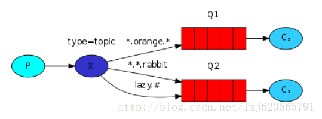

 

# [RabbitMQ （五）主题（Topic）](http://blog.csdn.net/lmj623565791/article/details/37706355)

转载请标明出处：<http://blog.csdn.net/lmj623565791/article/details/37706355>

上一篇博客中，我们进步改良了我们的日志系统。我们使用direct类型转发器，使得接收者有能力进行选择性的接收日志,，而非fanout那样，只能够无脑的转发，如果你还不了解：[RabbitMQ （四） 路由选择 (Routing)](http://blog.csdn.net/lmj623565791/article/details/37669573)。

虽然使用direct类型改良了我们的系统，但是仍然存在一些局限性：它不能够基于多重条件进行路由选择。

在我们的日志系统中，我们有可能希望不仅根据日志的级别而且想根据日志的来源进行订阅。这个概念类似unix工具：syslog，它转发日志基于严重性（info/warning/crit…）和设备（auth/cron/kern…）

这样可能给我们更多的灵活性：我们可能只想订阅来自’cron’的致命错误日志，而不是来自’kern’的。

为了在我们的系统中实现上述的需求，我们需要学习稍微复杂的主题类型的转发器（topic exchange）。

###### 1、 主题转发（Topic Exchange）

发往主题类型的转发器的消息不能随意的设置选择键（routing_key），必须是由点隔开的一系列的标识符组成。标识符可以是任何东西，但是一般都与消息的某些特性相关。一些合法的选择键的例子："stock.usd.nyse", "nyse.vmw","quick.orange.rabbit".你可以定义任何数量的标识符，上限为255个字节。

绑定键和选择键的形式一样。主题类型的转发器背后的逻辑和直接类型的转发器很类似：一个附带特殊的选择键将会被转发到绑定键与之匹配的队列中。需要注意的是：关于绑定键有两种特殊的情况。

*可以匹配一个标识符。

\#可以匹配0个或多个标识符。

###### 2、 图解：



我们准备发送关于动物的消息。消息会附加一个选择键包含3个标识符（两个点隔开）。第一个标识符描述动物的速度，第二个标识符描述动物的颜色，第三个标识符描述动物的物种：<speed>.<color>.<species>。

我们创建3个绑定键：Q1与*.orange.*绑定Q2与*.*.rabbit和lazy.#绑定。

可以简单的认为:

Q1对所有的橙色动物感兴趣。

Q2想要知道关于兔子的一切以及关于懒洋洋的动物的一切。

一个附带quick.orange.rabbit的选择键的消息将会被转发到两个队列。附带lazy.orange.elephant的消息也会被转发到两个队列。另一方面quick.orange.fox只会被转发到Q1，lazy.brown.fox将会被转发到Q2。lazy.pink.rabbit虽然与两个绑定键匹配，但是也只会被转发到Q2一次。quick.brown.fox不能与任何绑定键匹配，所以会被丢弃。

如果我们违法我们的约定，发送一个或者四个标识符的选择键，类似：orange，quick.orange.male.rabbit，这些选择键不能与任何绑定键匹配，所以消息将会被丢弃。

另一方面，lazy.orange.male.rabbit，虽然是四个标识符，也可以与lazy.#匹配，从而转发至Q2。

注：主题类型的转发器非常强大，可以实现其他类型的转发器。

当一个队列与绑定键#绑定，将会收到所有的消息，类似fanout类型转发器。

当绑定键中不包含任何#与*时，类似direct类型转发器。

###### 3、 完整的例子

发送端EmitLogTopic.[Java](http://lib.csdn.net/base/17)：

```
package com.zhy.rabbit._05_topic_exchange;  
  
import java.util.UUID;  
  
import com.rabbitmq.client.Channel;  
import com.rabbitmq.client.Connection;  
import com.rabbitmq.client.ConnectionFactory;  
  
public class EmitLogTopic  
{  
  
    private static final String EXCHANGE_NAME = "topic_logs";  
  
    public static void main(String[] argv) throws Exception  
    {  
        // 创建连接和频道  
        ConnectionFactory factory = new ConnectionFactory();  
        factory.setHost("localhost");  
        Connection connection = factory.newConnection();  
        Channel channel = connection.createChannel();  
  
        channel.exchangeDeclare(EXCHANGE_NAME, "topic");  
  
        String[] routing_keys = new String[] { "kernal.info", "cron.warning",  
                "auth.info", "kernel.critical" };  
        for (String routing_key : routing_keys)  
        {  
            String msg = UUID.randomUUID().toString();  
            channel.basicPublish(EXCHANGE_NAME, routing_key, null, msg  
                    .getBytes());  
            System.out.println(" [x] Sent routingKey = "+routing_key+" ,msg = " + msg + ".");  
        }  
  
        channel.close();  
        connection.close();  
    }  
}  
```

 

我们发送了4条消息，分别设置了不同的选择键。

接收端1，ReceiveLogsTopicForKernel.java

```
package com.zhy.rabbit._05_topic_exchange;  
  
import com.rabbitmq.client.Channel;  
import com.rabbitmq.client.Connection;  
import com.rabbitmq.client.ConnectionFactory;  
import com.rabbitmq.client.QueueingConsumer;  
  
public class ReceiveLogsTopicForKernel  
{  
  
    private static final String EXCHANGE_NAME = "topic_logs";  
  
    public static void main(String[] argv) throws Exception  
    {  
        // 创建连接和频道  
        ConnectionFactory factory = new ConnectionFactory();  
        factory.setHost("localhost");  
        Connection connection = factory.newConnection();  
        Channel channel = connection.createChannel();  
        // 声明转发器  
        channel.exchangeDeclare(EXCHANGE_NAME, "topic");  
        // 随机生成一个队列  
        String queueName = channel.queueDeclare().getQueue();  
          
        //接收所有与kernel相关的消息  
        channel.queueBind(queueName, EXCHANGE_NAME, "kernel.*");  
  
        System.out.println(" [*] Waiting for messages about kernel. To exit press CTRL+C");  
  
        QueueingConsumer consumer = new QueueingConsumer(channel);  
        channel.basicConsume(queueName, true, consumer);  
  
        while (true)  
        {  
            QueueingConsumer.Delivery delivery = consumer.nextDelivery();  
            String message = new String(delivery.getBody());  
            String routingKey = delivery.getEnvelope().getRoutingKey();  
  
            System.out.println(" [x] Received routingKey = " + routingKey  
                    + ",msg = " + message + ".");  
        }  
    }  
}  
```

直接收和Kernel相关的日志消息。

接收端2，ReceiveLogsTopicForCritical.java

```
package com.zhy.rabbit._05_topic_exchange;  
  
import com.rabbitmq.client.Channel;  
import com.rabbitmq.client.Connection;  
import com.rabbitmq.client.ConnectionFactory;  
import com.rabbitmq.client.QueueingConsumer;  
  
public class ReceiveLogsTopicForCritical  
{  
  
    private static final String EXCHANGE_NAME = "topic_logs";  
  
    public static void main(String[] argv) throws Exception  
    {  
        // 创建连接和频道  
        ConnectionFactory factory = new ConnectionFactory();  
        factory.setHost("localhost");  
        Connection connection = factory.newConnection();  
        Channel channel = connection.createChannel();  
        // 声明转发器  
        channel.exchangeDeclare(EXCHANGE_NAME, "topic");  
        // 随机生成一个队列  
        String queueName = channel.queueDeclare().getQueue();  
  
        // 接收所有与kernel相关的消息  
        channel.queueBind(queueName, EXCHANGE_NAME, "*.critical");  
  
        System.out  
                .println(" [*] Waiting for critical messages. To exit press CTRL+C");  
  
        QueueingConsumer consumer = new QueueingConsumer(channel);  
        channel.basicConsume(queueName, true, consumer);  
  
        while (true)  
        {  
            QueueingConsumer.Delivery delivery = consumer.nextDelivery();  
            String message = new String(delivery.getBody());  
            String routingKey = delivery.getEnvelope().getRoutingKey();  
  
            System.out.println(" [x] Received routingKey = " + routingKey  
                    + ",msg = " + message + ".");  
        }  
    }  
}  
```

只接收致命错误的日志消息。

运行结果：

 [x] Sent routingKey = kernal.info ,msg = a7261f0d-18cc-4c85-ba80-5ecd9283dae7.
 [x] Sent routingKey = cron.warning ,msg = 0c7e4484-66e0-4846-a869-a7a266e16281.
 [x] Sent routingKey = auth.info ,msg = 3273f21f-6e6e-42f2-83df-1f2fafa7a19a.
 [x] Sent routingKey = kernel.critical ,msg = f65d3e1a-0619-4f85-8b0d-59375380ecc9.

\--------------------------------------------------------------------------------------------------------------------

 [*] Waiting for messages about kernel. To exit press CTRL+C
 [x] Received routingKey = kernel.critical,msg = f65d3e1a-0619-4f85-8b0d-59375380ecc9.

\--------------------------------------------------------------------------------------------------------------------

 [*] Waiting for critical messages. To exit press CTRL+C
 [x] Received routingKey = kernel.critical,msg = f65d3e1a-0619-4f85-8b0d-59375380ecc9.

可以看到，我们通过使用topic类型的转发器，成功实现了多重条件选择的订阅。