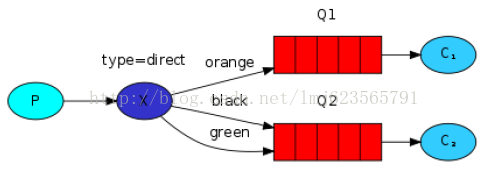
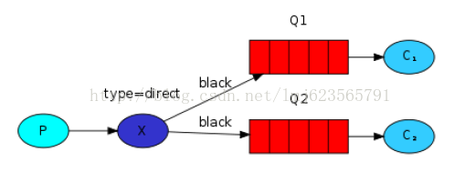
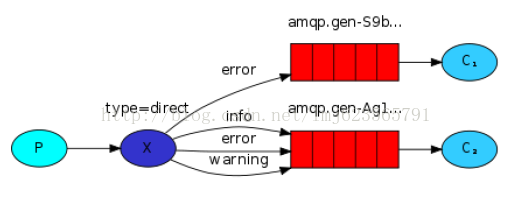

RabbitMQ （四） 路由选择 (Routing)

上一篇博客我们建立了一个简单的日志系统，我们能够广播日志消息给所有你的接收者，如果你不了解，请查看：[RabbitMQ （三） 发布/订阅](http://blog.csdn.net/lmj623565791/article/details/37657225)。本篇博客我们准备给日志系统添加新的特性，让日志接收者能够订阅部分消息。例如，我们可以仅仅将致命的错误写入日志文件，然而仍然在控制面板上打印出所有的其他类型的日志消息。

###### 1、绑定（Bindings）

###### 2、直接转发（Direct exchange）



上图，我们可以看到direct类型的转发器与两个队列绑定。第一个队列与绑定键orange绑定，第二个队列与转发器间有两个绑定，一个与绑定键black绑定，另一个与green绑定键绑定。
这样的话，当一个消息附带一个选择键（routing key） orange发布至转发器将会被导向到队列Q1。消息附带一个选择键（routing key）black或者green将会被导向到Q2.所有的其他的消息将会被丢弃。

###### 3、多重绑定（multiple bindings）



使用一个绑定键（binding key）绑定多个队列是完全合法的。如上图，一个附带选择键（routing key）的消息将会被转发到Q1和Q2。

###### 4、发送日志（Emittinglogs）

我们准备将这种模式用于我们的日志系统。我们将消息发送到direct类型的转发器而不是fanout类型。我们将把日志的严重性作为选择键（routing key）。这样的话，接收程序可以根据严重性来选择接收。我们首先关注发送日志的代码：

像以前一样，我们需要先创建一个转发器：

channel.exchangeDeclare(EXCHANGE_NAME,"direct");

然后我们准备发送一条消息：

channel.basicPublish(EXCHANGE_NAME,severity, null, message.getBytes());

为了简化代码，我们假定‘severity’是‘info’，‘warning’，‘error’中的一个。

###### 5、订阅

接收消息的代码和前面的博客的中类似，只有一点不同：我们给我们所感兴趣的严重性类型的日志创建一个绑定。

StringqueueName = channel.queueDeclare().getQueue();

for(Stringseverity : argv)

{

channel.queueBind(queueName, EXCHANGE_NAME, severity);

}

###### 6、完整的实例



发送端：EmitLogDirect.java

```
package com.zhy.rabbit._04_binding_key;  
  
import java.util.Random;  
import java.util.UUID;  
  
import com.rabbitmq.client.Channel;  
import com.rabbitmq.client.Connection;  
import com.rabbitmq.client.ConnectionFactory;  
  
public class EmitLogDirect  
{  
  
    private static final String EXCHANGE_NAME = "ex_logs_direct";  
    private static final String[] SEVERITIES = { "info", "warning", "error" };  
  
    public static void main(String[] argv) throws java.io.IOException  
    {  
        // 创建连接和频道  
        ConnectionFactory factory = new ConnectionFactory();  
        factory.setHost("localhost");  
        Connection connection = factory.newConnection();  
        Channel channel = connection.createChannel();  
        // 声明转发器的类型  
        channel.exchangeDeclare(EXCHANGE_NAME, "direct");  
  
        //发送6条消息  
        for (int i = 0; i < 6; i++)  
        {  
            String severity = getSeverity();  
            String message = severity + "_log :" + UUID.randomUUID().toString();  
            // 发布消息至转发器，指定routingkey  
            channel.basicPublish(EXCHANGE_NAME, severity, null, message  
                    .getBytes());  
            System.out.println(" [x] Sent '" + message + "'");  
        }  
  
        channel.close();  
        connection.close();  
    }  
  
    /** 
     * 随机产生一种日志类型 
     *  
     * @return 
     */  
    private static String getSeverity()  
    {  
        Random random = new Random();  
        int ranVal = random.nextInt(3);  
        return SEVERITIES[ranVal];  
    }  
}  
```

接收端：ReceiveLogsDirect.java

```
package com.zhy.rabbit._04_binding_key;  
  
import java.util.Random;  
  
import com.rabbitmq.client.Channel;  
import com.rabbitmq.client.Connection;  
import com.rabbitmq.client.ConnectionFactory;  
import com.rabbitmq.client.QueueingConsumer;  
  
public class ReceiveLogsDirect  
{  
  
    private static final String EXCHANGE_NAME = "ex_logs_direct";  
    private static final String[] SEVERITIES = { "info", "warning", "error" };  
  
    public static void main(String[] argv) throws java.io.IOException,  
            java.lang.InterruptedException  
    {  
        // 创建连接和频道  
        ConnectionFactory factory = new ConnectionFactory();  
        factory.setHost("localhost");  
        Connection connection = factory.newConnection();  
        Channel channel = connection.createChannel();  
        // 声明direct类型转发器  
        channel.exchangeDeclare(EXCHANGE_NAME, "direct");  
  
        String queueName = channel.queueDeclare().getQueue();  
        String severity = getSeverity();  
        // 指定binding_key  
        channel.queueBind(queueName, EXCHANGE_NAME, severity);  
        System.out.println(" [*] Waiting for "+severity+" logs. To exit press CTRL+C");  
  
        QueueingConsumer consumer = new QueueingConsumer(channel);  
        channel.basicConsume(queueName, true, consumer);  
  
        while (true)  
        {  
            QueueingConsumer.Delivery delivery = consumer.nextDelivery();  
            String message = new String(delivery.getBody());  
  
            System.out.println(" [x] Received '" + message + "'");  
        }  
    }  
  
    /** 
     * 随机产生一种日志类型 
     *  
     * @return 
     */  
    private static String getSeverity()  
    {  
        Random random = new Random();  
        int ranVal = random.nextInt(3);  
        return SEVERITIES[ranVal];  
    }  
}  
```

接收端随机设置一个日志严重级别（binding_key）。。。

我开启了3个接收端程序，两个准备接收error类型日志，一个接收info类型日志，然后运行发送端程序

运行结果：

```
 [x] Sent 'error_log :d142b096-46c0-4380-a1d2-d8b2ac136a9c'
 [x] Sent 'error_log :55ee1fc4-c87c-4e5e-81ba-49433890b9ce'
 [x] Sent 'error_log :d01877d6-87c7-4e0a-a109-697d122bc4c9'
 [x] Sent 'error_log :b42471b1-875c-43f1-b1ea-0dd5b49863f3'
 [x] Sent 'info_log :a6c1bc87-efb0-43eb-8314-8a74c345ed05'
 [x] Sent 'info_log :b6a84b6a-353e-4e88-8c23-c791d93b44be'
------------------------------------------------------------------------------------
 [*] Waiting for error logs. To exit press CTRL+C
 [x] Received 'error_log :d142b096-46c0-4380-a1d2-d8b2ac136a9c'
 [x] Received 'error_log :55ee1fc4-c87c-4e5e-81ba-49433890b9ce'
 [x] Received 'error_log :d01877d6-87c7-4e0a-a109-697d122bc4c9'
 [x] Received 'error_log :b42471b1-875c-43f1-b1ea-0dd5b49863f3'
------------------------------------------------------------------------------------
 [*] Waiting for error logs. To exit press CTRL+C
 [x] Received 'error_log :d142b096-46c0-4380-a1d2-d8b2ac136a9c'
 [x] Received 'error_log :55ee1fc4-c87c-4e5e-81ba-49433890b9ce'
 [x] Received 'error_log :d01877d6-87c7-4e0a-a109-697d122bc4c9'
 [x] Received 'error_log :b42471b1-875c-43f1-b1ea-0dd5b49863f3'
------------------------------------------------------------------------------------
 [*] Waiting for info logs. To exit press CTRL+C
 [x] Received 'info_log :a6c1bc87-efb0-43eb-8314-8a74c345ed05'
 [x] Received 'info_log :b6a84b6a-353e-4e88-8c23-c791d93b44be'
```

可以看到我们实现了博文开头所描述的特性，接收者可以自定义自己感兴趣类型的日志。

其实文章这么长就在说：发送消息时可以设置routing_key，接收队列与转发器间可以设置binding_key，接收者接收与binding_key与routing_key相同的消息。

来源： <http://blog.csdn.net/lmj623565791/article/details/37669573>