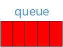
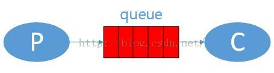

# 【1】 - Hello World

# RabbitMQ入门教程 For Java【1】 - Hello World

​       RabbitMQ是消息代理。从本质上说，它接受来自生产者的信息，并将它们传递给消费者。在两者之间，它可以根据你给它的路由，缓冲规则进行传递消息。 
​       如果你的工作中需要用到RabbitMQ，那么我建议你先在电脑上安装好RabbitMQ服务器，然后打开eclipse，跟这我的教程一步步的学习RabbitMQ,这样你会对RabbitMQ有一个全面的认识，而且能打好一个很好的基础。如果你只是了解一下，那就随便看看吧。

### **我的开发环境：**

操作系统：**Windows7 64bit**

开发环境：**JDK 1.7 - 1.7.0_55**

开发工具：**Eclipse Kepler SR2**

RabbitMQ版本：**3.6.0**

Elang版本：**erl7.2.1**

关于Windows7下安装RabbitMQ的教程请先在网上找一下，有空我再补安装教程。

### 源码地址

<https://github.com/chwshuang/rabbitmq.git>

### 一、专业术语

### 1. 生产者：

​       在现实生活中就好比制造商品的工厂，他们是商品的生产者。生产者只意味着发送。发送消息的程序称之为一个生产者。我们用“P”表示： 


### 2. 队列：

​        队列就像存放商品的仓库或者商店，是生产商品的工厂和购买商品的用户之间的中转站。队列就像是一个仓库或者流水线。在RabbitMQ中，信息流从你的应用程序出发，来到RabbitMQ的队列，所有信息可以只存储在一个队列中。队列可以存储很多的消息，因为它基本上是一个无限制的缓冲区，前提是你的机器有足够的存储空间。多个生产者可以将消息发送到同一个队列中，多个消费者也可以只从同一个队列接收数据。这就是队列的特性。队列用下面的图表示，图上面是队列的名字： 



### 3. 消费者

​        消费者就好比是从商店购买或从仓库取走商品的人，消费的意思就是接收。消费者是一个程序，主要是等待接收消息。我们的用“C”表示 


**注意：**         生产者，消费者和队列（RabbitMQ）不必部署在同一台机器上。实际在生产环境的大多数应用中，他们都是分开部署的。

### 二、“Hello World”

### 1. 说明

​        在本教程中，我们我们通过2个java程序，一个发送消息的生产者，和一个接收信息并打印的消费者。想要了解rabbitmq，必须了解一些最基础的内容，我们先从一些代码片段来了解产生信息和接收消息的流程和方法。在编写代码前，我们先来用户一张图表示要做的事，在下图中，“P”是我们的生产者，“C”是我们的消费者。在中间红色框是代表RabbitMQ中的一个消息队列。箭头指向表示信息流的方向。 

​                                                                                                                                                    

### 2. 项目目录 

​        在eclipse中创建一个rabbitmq的java项目，然后在项目下建一个名为lib的source folder, 然后将rabbitmq官网下载的rabbitmq-java-client-bin-3.6.0.rar解压出rabbitmq-client.jar拷贝到lib目录，如果创建的是Maven项目，只需要添加如下依赖：

```
<dependencies>        <dependency>            <groupId>com.rabbitmq</groupId>            <artifactId>amqp-client</artifactId>            <version>3.6.0</version>        </dependency>        ... ...    </dependencies>
```

然后在src目录下创建一个com.aitongyi.rabbit.helloworld包，最后项目目录如下：


### 3.  消息生产者

```
import com.rabbitmq.client.Channel;import com.rabbitmq.client.Connection;import com.rabbitmq.client.ConnectionFactory;/** * 消息生产者 *  * @author hushuang *  */public class P {    private final static String QUEUE_NAME = "hello";    public static void main(String[] argv) throws Exception {        // 创建连接工厂        ConnectionFactory factory = new ConnectionFactory();//        设置RabbitMQ地址        factory.setHost("localhost");//        创建一个新的连接        Connection connection = factory.newConnection();//        创建一个频道        Channel channel = connection.createChannel();//        声明一个队列 -- 在RabbitMQ中，队列声明是幂等性的（一个幂等操作的特点是其任意多次执行所产生的影响均与一次执行的影响相同），也就是说，如果不存在，就创建，如果存在，不会对已经存在的队列产生任何影响。         channel.queueDeclare(QUEUE_NAME, false, false, false, null);        String message = "Hello World!";//        发送消息到队列中        channel.basicPublish("", QUEUE_NAME, null, message.getBytes("UTF-8"));        System.out.println("P [x] Sent '" + message + "'");//        关闭频道和连接        channel.close();        connection.close();    }}
```

### 4. 消息消费者

```
import com.rabbitmq.client.*;
import java.io.IOException;

/**
 * 消息消费者
 * 
 * @author hushuang
 * 
 */public class C {

    private final static String QUEUE_NAME = "hello";

    public static void main(String[] argv) throws Exception {
        // 创建连接工厂
        ConnectionFactory factory = new ConnectionFactory();
//        设置RabbitMQ地址
        factory.setHost("localhost");
//        创建一个新的连接
        Connection connection = factory.newConnection();
//        创建一个频道
        Channel channel = connection.createChannel();
//        声明要关注的队列 -- 在RabbitMQ中，队列声明是幂等性的（一个幂等操作的特点是其任意多次执行所产生的影响均与一次执行的影响相同），也就是说，如果不存在，就创建，如果存在，不会对已经存在的队列产生任何影响。
        channel.queueDeclare(QUEUE_NAME, false, false, false, null);
        System.out.println("C [*] Waiting for messages. To exit press CTRL+C");
//        DefaultConsumer类实现了Consumer接口，通过传入一个频道，告诉服务器我们需要那个频道的消息，如果频道中有消息，就会执行回调函数handleDelivery
        Consumer consumer = new DefaultConsumer(channel) {
            @Overridepublic void handleDelivery(String consumerTag, Envelope envelope, AMQP.BasicProperties properties, byte[] body) throws IOException {
                String message = new String(body, "UTF-8");
                System.out.println("C [x] Received '" + message + "'");
            }
        };
//        自动回复队列应答 -- RabbitMQ中的消息确认机制，后面章节会详细讲解
        channel.basicConsume(QUEUE_NAME, true, consumer);
    }
}
```

### 5. 运行测试

​        如果在windows7下，你需要先双击【RabbitMQ Server\rabbitmq_server-3.6.0\sbin】目录下的rabbitmq-server.bat，来启动RabbitMQ服务。负责，运行我们的程序时，会提示【java.net.ConnectException: Connection refused: connect】

C [*] Waiting for messages. To exit press CTRL+CC [x] Received 'Hello World!' 
​        先运行消费者服务器来关注【hello】这个队列的情况。

```
C [*] Waiting for messages. To exit press CTRL+C
```

C [*] Waiting for messages. To exit press CTRL+CC [x] Received 'Hello World!' 
​        然后再运行生产者端，发送消息到队列中：

```
P [x] Sent 'Hello World!'
```

C [*] Waiting for messages. To exit press CTRL+CC [x] Received 'Hello World!' 
​        再切换到消费者端的控制台，查看日志：

```
C [*] Waiting for messages. To exit press CTRL+C
C [x] Received 'Hello World!'
```

### 6. 总结

​        从上面的日志，我们就算是对RabbitMQ 的消息流有了一个基本的了解，如果你想更进一步，请进入到第二章-Work Queues的教程

本教程所有文章：

[RabbitMQ入门教程 For Java【1】 - Hello World](http://blog.csdn.net/chwshuang/article/details/50521708)  - 你好世界！ 

[RabbitMQ入门教程 For Java【2】 - Work Queues](http://blog.csdn.net/chwshuang/article/details/50506284)  - 工作队列

[RabbitMQ入门教程 For Java【3】 - Publish/Subscribe](http://blog.csdn.net/chwshuang/article/details/50512057) - 发布/订阅

[RabbitMQ入门教程 For Java【4】 - Routing](http://blog.csdn.net/chwshuang/article/details/50505060) -  消息路由

[RabbitMQ入门教程 For Java【5】 - Topic](http://blog.csdn.net/chwshuang/article/details/50516904)  -  模糊匹配

[RabbitMQ入门教程 For Java【6】 - Remote procedure call (RPC)](http://blog.csdn.net/chwshuang/article/details/50518570) - 远程调用

### 提示

由于本教程中rabbitmq是在本机安装，使用的是默认端口（5672）。  
如果你的例子运行中的主机、端口不同，请进行必要设置，否则可能无法运行。 
如果你对rabbitmq有更多想法，可以通过GitHub项目成员找到我们的邮件地址联系他们：<https://github.com/orgs/rabbitmq/people>

上一篇：[【6】 - Remote procedure call (RPC)](http://www.kancloud.cn/digest/rabbitmq-for-java/122042)

下一篇：[【7】 - Window下的安装与配](http://www.kancloud.cn/digest/rabbitmq-for-java/122044)

来源： <http://www.kancloud.cn/digest/rabbitmq-for-java/122043>