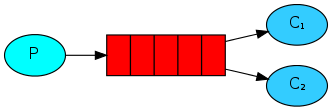
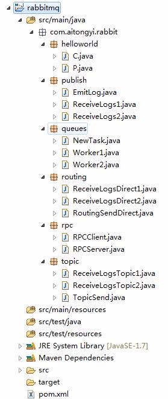
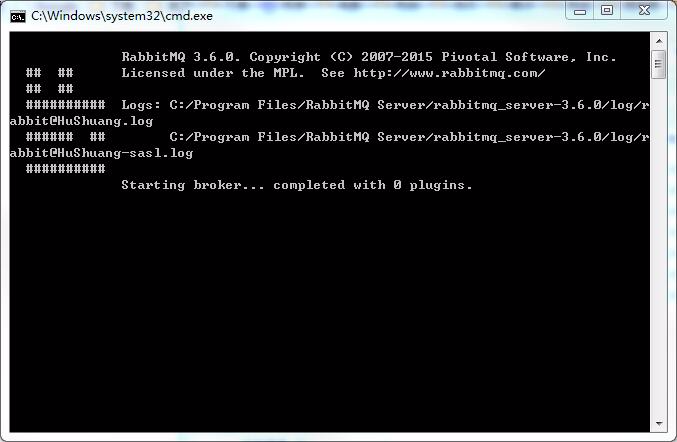
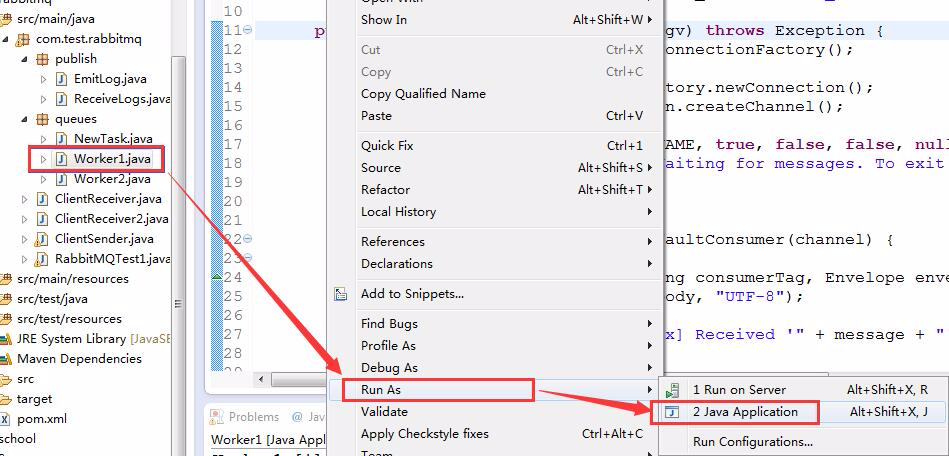
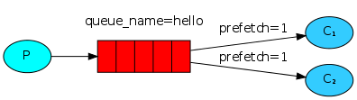

# 【2】 - Work Queues

RabbitMQ入门教程 For Java【2】 - Work Queues

提示： 
我的开发环境： 
操作系统： Windows7 64bit 
开发环境： JDK 1.7 - 1.7.0_55 
开发工具： Eclipse Kepler SR2 
RabbitMQ版本： 3.6.0 
Elang版本： erl7.2.1 
关于Windows7下安装RabbitMQ的教程请先在网上找一下，有空我再补安装教程。 
源码地址 
<https://github.com/chwshuang/rabbitmq.git>

# 工作队列



> 在使用此教程的时候，请记住，一定要将所有内容看一遍，特别是代码片段说明部分，这是非常重要的基础，如果你跳过这里直接将最后的源码拿去运行查看，效果会大打折扣。基础不牢固的情况下，后面学习就更难了。学习一定要静下心、琢磨透。

在第一个教程中，我们编写了一个程序来发送和接收来自一个指定队列的消息。在这一篇，我们将创建一个工作队列，将信息发送到多个消费者。这中分配方式主要场景是消费者需要根据消息中的内容进行业务逻辑处理，这种消息可以看成是一个任务指令，处理起来比较耗时，通过多个消费者来处理这些消息，来提高数据的吞吐能力。 
工作队列（即任务队列）的主要思想是不用一直等待资源密集型的任务处理完成，这就像一个生产线，将半成品放到生产线中，然后在生产线后面安排多个工人同时对半成品进行处理，这样比一个生产线对应一个工人的吞吐量大几个数量级。

准备 
在第一篇教程中，我们通过Hello World的例子，从生产者发送一条消息到RabbitMQ，然后消费者接收到这条消息并打印出来。这次我们模拟一个工厂流水线的场景，由工厂任务安排者（生产者P）向流水线（RabbitMQ的队列hello）放入半成品，然后由多个工人（消费者C1和C2）从流水线获取半成品进行处理。 
我们先来看看工厂任务安排者的代码，我们一共发送5条消息，然后给每个消息编号，看看消费者分别收到了那些消息：

```
for(int i = 0 ; i < 5; i++){
    String message = "Hello World! " + i;
    channel.basicPublish("", TASK_QUEUE_NAME,   MessageProperties.PERSISTENT_TEXT_PLAIN, message.getBytes());
    System.out.println(" [x] Sent '" + message + "'");
}
```

再来看看流水线上的工人处理半成品的函数，我们使用线程休眠模拟工作处理一条消息花费1秒钟：

```
    private static void doWork(String task) {
        try {
            Thread.sleep(1000); // 暂停1秒钟
        } catch (InterruptedException _ignored) {
            Thread.currentThread().interrupt();
        }
    }
```

### 源码

目录结构： 


工厂任务安排者（生产者P）NewTask.java：

```
import com.rabbitmq.client.Channel;import com.rabbitmq.client.Connection;import com.rabbitmq.client.ConnectionFactory;import com.rabbitmq.client.MessageProperties;/** * @author hushuang *  */public class NewTask {    private static final String TASK_QUEUE_NAME = "task_queue";    public static void main(String[] argv) throws java.io.IOException, Exception {        ConnectionFactory factory = new ConnectionFactory();        factory.setHost("localhost");        Connection connection = factory.newConnection();        Channel channel = connection.createChannel();        channel.queueDeclare(TASK_QUEUE_NAME, true, false, false, null);//      分发消息        for(int i = 0 ; i < 5; i++){            String message = "Hello World! " + i;            channel.basicPublish("", TASK_QUEUE_NAME, MessageProperties.PERSISTENT_TEXT_PLAIN, message.getBytes());            System.out.println(" [x] Sent '" + message + "'");        }        channel.close();        connection.close();    }}
```

工人（消费者C1和C2）Worker1.java

```
import java.io.IOException;

public class Worker1 {
    private static final String TASK_QUEUE_NAME = "task_queue";

    public static void main(String[] argv) throws Exception {
        ConnectionFactory factory = new ConnectionFactory();
        factory.setHost("localhost");
        final Connection connection = factory.newConnection();
        final Channel channel = connection.createChannel();

        channel.queueDeclare(TASK_QUEUE_NAME, true, false, false, null);
        System.out.println("Worker1 [*] Waiting for messages. To exit press CTRL+C");
        // 每次从队列中获取数量
        channel.basicQos(1);

        final Consumer consumer = new DefaultConsumer(channel) {
            @Overridepublic void handleDelivery(String consumerTag, Envelope envelope, AMQP.BasicProperties properties, byte[] body) throws IOException {
                String message = new String(body, "UTF-8");

                System.out.println("Worker1 [x] Received '" + message + "'");
                try {
                    doWork(message);
                } finally {
                    System.out.println("Worker1 [x] Done");
                    // 消息处理完成确认
                    channel.basicAck(envelope.getDeliveryTag(), false);
                }
            }
        };
        // 消息消费完成确认
        channel.basicConsume(TASK_QUEUE_NAME, false, consumer);
    }

    private static void doWork(String task) {
        try {
            Thread.sleep(1000); // 暂停1秒钟
        } catch (InterruptedException _ignored) {
            Thread.currentThread().interrupt();
        }
    }
}
```

工人（消费者C1和C2）Worker2.java

```
import com.rabbitmq.client.*;
import java.io.IOException;

public class Worker2 {
    private static final String TASK_QUEUE_NAME = "task_queue";

    public static void main(String[] argv) throws Exception {
        ConnectionFactory factory = new ConnectionFactory();
        factory.setHost("localhost");
        final Connection connection = factory.newConnection();
        final Channel channel = connection.createChannel();

        channel.queueDeclare(TASK_QUEUE_NAME, true, false, false, null);
        System.out.println("Worker2 [*] Waiting for messages. To exit press CTRL+C");
        // 每次从队列中获取数量
        channel.basicQos(1);

        final Consumer consumer = new DefaultConsumer(channel) {
            @Overridepublic void handleDelivery(String consumerTag, Envelope envelope, AMQP.BasicProperties properties, byte[] body) throws IOException {
                String message = new String(body, "UTF-8");

                System.out.println("Worker2 [x] Received '" + message + "'");
                try {
                    doWork(message);
                } finally {
                    System.out.println("Worker2 [x] Done");
                    // 消息处理完成确认
                    channel.basicAck(envelope.getDeliveryTag(), false);
                }
            }
        };
        // 消息消费完成确认
        channel.basicConsume(TASK_QUEUE_NAME, false, consumer);
    }

    /**
     * 任务处理
     * 
     * @param task
     *            void
     */private static void doWork(String task) {
        try {
            Thread.sleep(1000); // 暂停1秒钟
        } catch (InterruptedException _ignored) {
            Thread.currentThread().interrupt();
        }
    }
}
```

### 消息轮询分发

#### **启动RabbitMQ 服务器**

在RabbitMQ Server\rabbitmq_server-3.6.0\sbin目录中，我们双击rabbitmq-server.bat，启动RabbitMQ ，Window下会弹出一个窗口，看到下面Starting broker…的信息就说明启动成功了：（关于RabbitMQ 在Windows7下的安装参考这里） 


#### **启动工人（消费者）**

然后在eclipse中，启动Worker1.java 和Worker2.java，可以看到Worker的启动日志： 


```
Worker1 [*] Waiting for messages. To exit press CTRL+C

Worker2 [*] Waiting for messages. To exit press CTRL+C
```

#### **启动工厂任务安排者（生产者）**

生产者启动后打印的日志：

```
 [x] Sent 'Hello World! 0'
 [x] Sent 'Hello World! 1'
 [x] Sent 'Hello World! 2'
 [x] Sent 'Hello World! 3'
 [x] Sent 'Hello World! 4'
```

Worker1日志输入结果：

```
Worker1 [x] Received 'Hello World! 1'
Worker1 [x] Done
Worker1 [x] Received 'Hello World! 3'
Worker1 [x] Done
Worker1 [x] Received 'Hello World! 4'
Worker1 [x] Done
```

Worker2日志输入结果：

```
Worker2 [x] Received 'Hello World! 0'
Worker2 [x] Done
Worker2 [x] Received 'Hello World! 2'
Worker2 [x] Done
```

### 消息确认

如果处理一条消息需要几秒钟的时间，你可能会想，如果在处理消息的过程中，消费者服务器、网络、网卡出现故障挂了，那可能这条正在处理的消息或者任务就没有完成，就会失去这个消息和任务。 
为了确保消息或者任务不会丢失，RabbitMQ支持消息确认–ACK。ACK机制是消费者端从RabbitMQ收到消息并处理完成后，反馈给RabbitMQ，RabbitMQ收到反馈后才将此消息从队列中删除。如果一个消费者在处理消息时挂掉（网络不稳定、服务器异常、网站故障等原因导致频道、连接关闭或者TCP连接丢失等），那么他就不会有ACK反馈，RabbitMQ会认为这个消息没有正常消费，会将此消息重新放入队列中。如果有其他消费者同时在线，RabbitMQ会立即将这个消息推送给这个在线的消费者。这种机制保证了在消费者服务器故障的时候，能不丢失任何消息和任务。 
如果RabbitMQ向消费者发送消息时，消费者服务器挂了，消息也不会有超时；即使一个消息需要非常长的时间处理，也不会导致消息超时。这样消息永远不会从RabbitMQ服务器中删除。只有当消费者正确的发送ACK确认反馈，RabbitMQ确认收到后，消息才会从RabbitMQ服务器的数据中删除。 
消息的ACK确认机制默认是打开的。在上面的代码中，我们显示返回autoAck=true 这个标签。 
看看下面的代码，即使你在发送消息过程中，停掉一个消费者，消费者没有通过ACK反馈确认的消息，很快会被退回。

```
channel.basicQos(1);

final Consumer consumer = new DefaultConsumer(channel) {
  @Overridepublic void handleDelivery(String consumerTag, Envelope envelope, AMQP.BasicProperties properties, byte[] body) throws IOException {
    String message = new String(body, "UTF-8");

    System.out.println(" [x] Received '" + message + "'");
    try {
      doWork(message);
    } finally {
      System.out.println(" [x] Done");
      channel.basicAck(envelope.getDeliveryTag(), false);
    }
  }
};
```

> 忘记确认 
> 忘记通过basicAck返回确认信息是常见的错误。这个错误非常严重，将导致消费者客户端退出或者关闭后，消息会被退回RabbitMQ服务器，这会使RabbitMQ服务器内存爆满，而且RabbitMQ也不会主动删除这些被退回的消息。 
> 如果要监控这种错误，可以使用rabbitmqctl messages_unacknowledged命令打印出出相关的信息。

```
$ sudo rabbitmqctl list_queues name messages_ready messages_unacknowledged
Listing queues ...
hello    0       0
...done.
```

### 消息持久化

通过上一节我们已经知道如何确保消费者挂掉的情况下，任务不会消失。但是如果RabbitMQ服务器挂了呢？ 
如果你不告诉RabbitMQ，当RabbitMQ服务器挂了，她可能就丢失所有队列中的消息和任务。如果你想让RabbitMQ记住她当前的状态和内容，就需要通过2件事来确保消息和任务不会丢失。 
第一件事，在队列声明时，告诉RabbitMQ，这个队列需要持久化：

```
boolean durable = true;
channel.queueDeclare("hello", durable, false, false, null);
```

上面的这个方法是正确的，当在我们的例子中也无法持久化！因为已经定义的队列，再次定义是无效的，这就是幂次原理。RabbitMQ不允许重新定义一个已有的队列信息，也就是说不允许修改已经存在的队列的参数。如果你非要这样做，只会返回异常。 
咋整？ 
一个快速有效的方法就是重新声明另一个名称的队列，不过这需要修改生产者和消费者的代码，所以，在开发时，最好是将队列名称放到配置文件中。 
这时，即使RabbitMQ服务器重启，新队列中的消息也不会丢失。 
下面我们来看看新消息发送的代码：

```
import com.rabbitmq.client.MessageProperties;

channel.basicPublish("", "task_queue",
            MessageProperties.PERSISTENT_TEXT_PLAIN,
            message.getBytes());
```

> 关于消息持久化的说明 
> 标记为持久化后的消息也不能完全保证不会丢失。虽然已经告诉RabbitMQ消息要保存到磁盘上，但是理论上，RabbitMQ已经接收到生产者的消息，但是还没有来得及保存到磁盘上，服务器就挂了（比如机房断电），那么重启后，RabbitMQ中的这条未及时保存的消息就会丢失。因为RabbitMQ不做实时立即的磁盘同步（fsync）。这种情况下，对于持久化要求不是特别高的简单任务队列来说，还是可以满足的。如果需要更强大的保证，那么你可以考虑使用生产者确认反馈机制。

### 负载均衡

默认情况下，RabbitMQ将队列消息随机分配给每个消费者，这时可能出现消息调度不均衡的问题。例如有两台消费者服务器，一个服务器可能非常繁忙，消息不断，另外一个却很悠闲，没有什么负载。RabbitMQ不会主动介入这些情况，还是会随机调度消息到每台服务器。 
这是因为RabbitMQ此时只负责调度消息，不会根据ACK的反馈机制来分析那台服务器返回反馈慢，是不是处理不过来啊？

就像下面这个图： 


为了解决这个问题，我们可以使用【prefetchcount = 1】这个设置。这个设置告诉RabbitMQ，不要一次将多个消息发送给一个消费者。这样做的好处是只有当消费者处理完成当前消息并反馈后，才会收到另外一条消息或任务。这样就避免了负载不均衡的事情了。

```
int prefetchCount = 1;
channel.basicQos(prefetchCount);
```

> 关于队列大小的说明 
> 你必选注意：如果所有的消费者负载都很高，你的队列很可能会被塞满。这时你需要增加更多的消费者或者其他方案。

想了解更多关于 Channel 方法和 MessageProperties 的信息，请浏览以下相关的文档：

[javadocs 在线文档.](http://www.rabbitmq.com/releases/rabbitmq-java-client/current-javadoc/)

现在，咱们可以进入第三章的教程了。

本教程所有文章： 
[RabbitMQ入门教程 For Java【1】 - Hello World - 你好世界！](http://blog.csdn.net/chwshuang/article/details/50521708) 
[RabbitMQ入门教程 For Java【2】 - Work Queues - 工作队列](http://blog.csdn.net/chwshuang/article/details/50506284) 
[RabbitMQ入门教程 For Java【3】 - Publish/Subscribe - 发布/订阅](http://blog.csdn.net/chwshuang/article/details/50512057) 
[RabbitMQ入门教程 For Java【4】 - Routing - 消息路由](http://blog.csdn.net/chwshuang/article/details/50505060) 
[RabbitMQ入门教程 For Java【5】 - Topic - 模糊匹配](http://blog.csdn.net/chwshuang/article/details/50516904) 
[RabbitMQ入门教程 For Java【6】 - Remote procedure call (RPC) - 远程调用](http://blog.csdn.net/chwshuang/article/details/50518570)

### 提示

由于本教程中rabbitmq是在本机安装，使用的是默认端口（5672）。 
如果你的例子运行中的主机、端口不同，请进行必要设置，否则可能无法运行。

### 获得帮助

如果你阅读这个教程有障碍，可以通过GitHub项目成员找到开发者的邮件地址联系他们。

```
https://github.com/orgs/rabbitmq/people
```

上一篇：[【4】 -Routing](http://www.kancloud.cn/digest/rabbitmq-for-java/122038)

下一篇：[【3】 - Publish/Subscribe](http://www.kancloud.cn/digest/rabbitmq-for-java/122040)

来源： <http://www.kancloud.cn/digest/rabbitmq-for-java/122039>