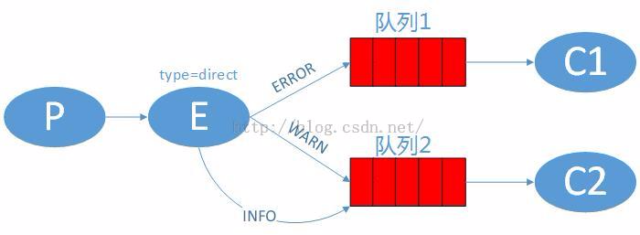
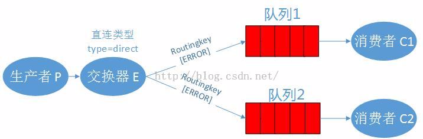
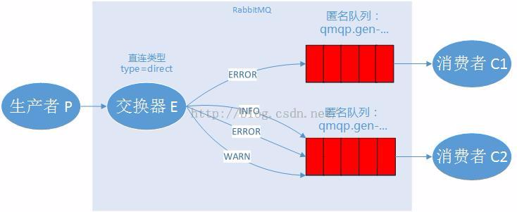
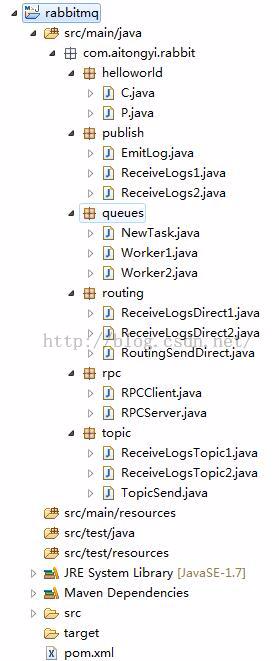

# 【4】 -Routing

#  RabbitMQ入门教程 For Java【4】 - [Routing](http://www.rabbitmq.com/tutorials/tutorial-four-python.html)

### **我的开发环境：**

操作系统：**Windows7 64bit**

开发环境：**JDK 1.7 - 1.7.0_55**

开发工具：**Eclipse Kepler SR2**

RabbitMQ版本： **3.6.0**

Elang版本：**erl7.2.1**

关于Windows7下安装RabbitMQ的教程请先在网上找一下，有空我再补安装教程。

### 源码地址

<https://github.com/chwshuang/rabbitmq.git>

### 消息路由

​        上一章教程中我们建立了一个简单的日志记录系统，能够将消息广播到多个消费者。本章，我们将添加一个新功能，类似订阅消息的子集。例如：我们只接收日志文件中ERROR类型的日志。

### 绑定关系

​        在之前的例子中也使用了类似的方式：

```
channel.queueBind(queueName, EXCHANGE_NAME, "");
```

​        绑定是交换器和队列之间的一种关系，用户微博，微信的例子可以简单的理解为关注，就是队列（某屌丝）对交换器（女神）非常感兴趣，关注了她，以后女神发的每条微博，屌丝都能看到。

​        绑定可以使用routingkey这个参数，是为了避免所有的消息都使用同一个路由线索带来的麻烦。为了区分路由规则，我们创建创建一个唯一的路由线索。

```
channel.queueBind(queueName, EXCHANGE_NAME, "black");
```

​        绑定关系中使用的路由关键字【routingkey】是否有效取决于交换器的类型。如果交换器是分发【fanout】类型，就会忽略路由关键字【routingkey】的作用。

### 直连类型交换器

​        上一章的例子是通过分发【fanout】类型的交换器【logs】广播日志信息，现在我们将日志分debug、info、warn、error这几种基本的级别，实际在生产环境中，避免磁盘空间浪费，应用只会将error级别的日志打印出来。而分发【fanout】类型的交换器会将所有基本的日志都发送出来，如果我们想只接收某一级别的日志信息，就需要使用直连【direct】类型的交换器了, 下面的图中，队列1通过ERROR这个routingkey绑定到E交换器，队列2通过WARN和INFO绑定到E交换器，E交换器的类型是直连【direct】的，如果生产者【P】发出ERROR的日志，只会有队列1会收到，如果生产者【P】发出INFO和WARN的日志，只有队列2会收到，如果生产者【P】发出DEBUG级别的日志，队列1和队列2都会忽略它。



### 多重绑定

​        我们允许多个队列以相同的路由关键字绑定到同一个交换器中，可以看到，交换器虽然是直连类型，但是绑定后的效果却跟分发类型的交换器类似，相同的是队列1和队列2都会收到同一条来自交换器的消息。

​        他们的区别：分发模式下，队列1、队列2会收到所有级别（除ERROR级别以外）的消息，而直连模式下，他们仅仅只会收到ERROR关键字类型的消息。



### 发送日志消息

​        我们还是用日志系统进行讲解，现在我们用日志的级别来作为路由关键字【routingkey】，这样，消费者端就可以按照他关心的日志级别进行接收，我们先看看如何发送日志：

​        先声明交换器

```
channel.exchangeDeclare(EXCHANGE_NAME, "direct");
```

​        然后发送消息到交换器

```
        for (String severity : routingKeys) {
            channel.queueBind(queueName, EXCHANGE_NAME, severity);
            System.out.println("ReceiveLogsDirect1 exchange:"+EXCHANGE_NAME+", queue:"+queueName+", BindRoutingKey:" + severity);
        }
```

### 订阅消息

​        我们先获取一个随机的队列名称，然后根据多个路由关键字【routingkey】将队列和交换器绑定起来：

```
String queueName = channel.queueDeclare().getQueue();

for(String severity : argv){    
  channel.queueBind(queueName, EXCHANGE_NAME, severity);
}
```

### 项目说明

### 流程图



### 包图



### 代码

RoutingSendDirect.java

```
import com.rabbitmq.client.ConnectionFactory;import com.rabbitmq.client.Connection;import com.rabbitmq.client.Channel;/** * @author hushuang * */public class RoutingSendDirect {    private static final String EXCHANGE_NAME = "direct_logs"; // 路由关键字     private static final String[] routingKeys = new String[]{"info" ,"warning", "error"};    public static void main(String[] argv) throws Exception {        ConnectionFactory factory = new ConnectionFactory();        factory.setHost("localhost");        Connection connection = factory.newConnection();        Channel channel = connection.createChannel();//        声明交换器        channel.exchangeDeclare(EXCHANGE_NAME, "direct");//        发送消息        for(String severity :routingKeys){            String message = "Send the message level:" + severity;            channel.basicPublish(EXCHANGE_NAME, severity, null, message.getBytes());            System.out.println(" [x] Sent '" + severity + "':'" + message + "'");        }        channel.close();        connection.close();    }}
```

ReceiveLogsDirect1.java和ReceiveLogsDirect2.java

```
import com.rabbitmq.client.*;import java.io.IOException;public class ReceiveLogsDirect1 {    // 交换器名称    private static final String EXCHANGE_NAME = "direct_logs";    // 路由关键字    private static final String[] routingKeys = new String[]{"info" ,"warning", "error"};    public static void main(String[] argv) throws Exception {        ConnectionFactory factory = new ConnectionFactory();        factory.setHost("localhost");        Connection connection = factory.newConnection();        Channel channel = connection.createChannel();//        声明交换器        channel.exchangeDeclare(EXCHANGE_NAME, "direct");//        获取匿名队列名称        String queueName = channel.queueDeclare().getQueue();//        根据路由关键字进行多重绑定        for (String severity : routingKeys) {            channel.queueBind(queueName, EXCHANGE_NAME, severity);            System.out.println("ReceiveLogsDirect1 exchange:"+EXCHANGE_NAME+", queue:"+queueName+", BindRoutingKey:" + severity);        }        System.out.println("ReceiveLogsDirect1 [*] Waiting for messages. To exit press CTRL+C");        Consumer consumer = new DefaultConsumer(channel) {            @Override            public void handleDelivery(String consumerTag, Envelope envelope, AMQP.BasicProperties properties, byte[] body) throws IOException {                String message = new String(body, "UTF-8");                System.out.println(" [x] Received '" + envelope.getRoutingKey() + "':'" + message + "'");            }        };        channel.basicConsume(queueName, true, consumer);    }}
```

```
import com.rabbitmq.client.*;import java.io.IOException;public class ReceiveLogsDirect2 {    // 交换器名称    private static final String EXCHANGE_NAME = "direct_logs";    // 路由关键字    private static final String[] routingKeys = new String[]{"error"};    public static void main(String[] argv) throws Exception {        ConnectionFactory factory = new ConnectionFactory();        factory.setHost("localhost");        Connection connection = factory.newConnection();        Channel channel = connection.createChannel();//        声明交换器        channel.exchangeDeclare(EXCHANGE_NAME, "direct");//        获取匿名队列名称        String queueName = channel.queueDeclare().getQueue();//        根据路由关键字进行多重绑定        for (String severity : routingKeys) {            channel.queueBind(queueName, EXCHANGE_NAME, severity);            System.out.println("ReceiveLogsDirect1 exchange:"+EXCHANGE_NAME+", queue:"+queueName+", BindRoutingKey:" + severity);        }        System.out.println("ReceiveLogsDirect1 [*] Waiting for messages. To exit press CTRL+C");        Consumer consumer = new DefaultConsumer(channel) {            @Override            public void handleDelivery(String consumerTag, Envelope envelope, AMQP.BasicProperties properties, byte[] body) throws IOException {                String message = new String(body, "UTF-8");                System.out.println(" [x] Received '" + envelope.getRoutingKey() + "':'" + message + "'");            }        };        channel.basicConsume(queueName, true, consumer);    }}
```

先运行ReceiveLogsDirect1.java和ReceiveLogsDirect2.java

查看日志，我们发现RabbitMQ中已经创建了direct_logs的交换器，以及amq.gen-dVUpkqxmladY3Jg1upDsDQ 和amq.gen-skrmBAlYKSDzELKtVg_zFw这两个临时队列，

```
ReceiveLogsDirect1 exchange:direct_logs, queue:amq.gen-skrmBAlYKSDzELKtVg_zFw, BindRoutingKey:info
ReceiveLogsDirect1 exchange:direct_logs, queue:amq.gen-skrmBAlYKSDzELKtVg_zFw, BindRoutingKey:warning
ReceiveLogsDirect1 exchange:direct_logs, queue:amq.gen-skrmBAlYKSDzELKtVg_zFw, BindRoutingKey:error
ReceiveLogsDirect1 [*] Waiting for messages. To exit press CTRL+C
```

```
ReceiveLogsDirect2 exchange:direct_logs, queue:amq.gen-dVUpkqxmladY3Jg1upDsDQ, BindRoutingKey:error
ReceiveLogsDirect2 [*] Waiting for messages. To exit press CTRL+C
```

运行RoutingSendDirect.java发送消息：

### 运行结果

查看日志：

RoutingSendDirect.java

```
 [x] Sent 'info':'Send the message level:info'
 [x] Sent 'warning':'Send the message level:warning'
 [x] Sent 'error':'Send the message level:error'
```

ReceiveLogsDirect1.java

```
 [x] Received 'info':'Send the message level:info'
 [x] Received 'warning':'Send the message level:warning'
 [x] Received 'error':'Send the message level:error'
```

ReceiveLogsDirect2.java

```
 [x] Received 'error':'Send the message level:error'
```

我们看到，队列1收到了所有的消息，队列2只收到了error级别的消息。这与我们的预期一样。

下一阶段我们可以进入第五章-主题的学习了。

本教程所有文章：

[RabbitMQ入门教程 For Java【1】 - Hello World](http://blog.csdn.net/chwshuang/article/details/50521708)  - 你好世界！ 

[RabbitMQ入门教程 For Java【2】 - Work Queues](http://blog.csdn.net/chwshuang/article/details/50506284)  - 工作队列

[RabbitMQ入门教程 For Java【3】 - Publish/Subscribe](http://blog.csdn.net/chwshuang/article/details/50512057) - 发布/订阅

[RabbitMQ入门教程 For Java【4】 - Routing](http://blog.csdn.net/chwshuang/article/details/50505060) -  消息路由

[RabbitMQ入门教程 For Java【5】 - Topic](http://blog.csdn.net/chwshuang/article/details/50516904)  -  模糊匹配

[RabbitMQ入门教程 For Java【6】 - Remote procedure call (RPC)](http://blog.csdn.net/chwshuang/article/details/50518570) - 远程调用

上一篇：[前言](http://www.kancloud.cn/digest/rabbitmq-for-java/122037)

下一篇：[【2】 - Work Queues](http://www.kancloud.cn/digest/rabbitmq-for-java/122039)

来源： <http://www.kancloud.cn/digest/rabbitmq-for-java/122038>