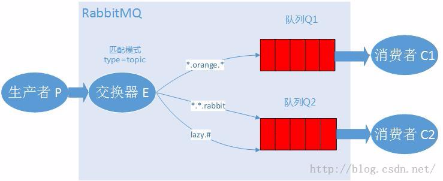
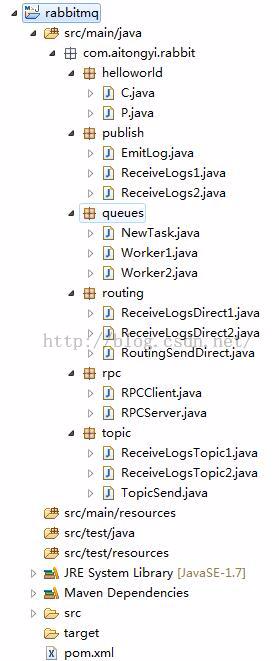

# 【5】 - Topic

RabbitMQ入门教程 For Java【5】 - Topic

### **我的开发环境：**

操作系统：**Windows7 64bit**

开发环境：**JDK 1.7 - 1.7.0_55**

开发工具：**Eclipse Kepler SR2**

RabbitMQ版本： **3.6.0**

Elang版本：**erl7.2.1**

关于Windows7下安装RabbitMQ的教程请先在网上找一下，有空我再补安装教程。

### 源码地址

<https://github.com/chwshuang/rabbitmq.git>

# Topic模式

​        匹配模式，如果按照百度翻译和百度百科，直接叫主题或者话题就得了，但是如果你真的明白它在RabbitMQ中代表什么，就不能这么直接的翻译成中文了。如果要用中文理解它的意思，先了解它在RabbitMQ中用来做什么：topic类型的交换器允许在RabbitMQ中使用模糊匹配来绑定自己感兴趣的信息。

​        所以，我觉得这一章应该叫match模式更合适，中文 - 匹配模式。

​        在上一章，通过直连交换器，生产者发送不同路由关键字的日志，消费者端通过绑定自己感兴趣的路由关键字来接收消息，进行完善日志系统。如果我想只接收生产者com.test.rabbitmq.topic包下的日志，其他包的忽略掉，之前的日志系统处理起来可能就非常麻烦，还好，我们有匹配模式，现在我们将生产者发送过来的消息按照包名来命名，那么消费者端就可以在匹配模式下使用【#.topic.*】这个路由关键字来获得感兴趣的消息。

### 匹配交换器

通过匹配交换器，我们可以配置更灵活的消息系统，你可以在匹配交换器模式下发送这样的路由关键字：

“a.b.c”、“c.d”、“quick.orange.rabbit”

不过一定要记住，路由关键字【routingKey】不能超过255个字节（bytes）

匹配交换器的匹配符

- *（星号）表示一个单词   (连续的字母会表示成一个单词)

- # （井号）表示零个或者多个单词

### **示例说明：**

这一章的例子中，我们使用三个段式的路由关键字，有三个单词和两个点组成。第一个词是速度，第二个词是颜色，第三个是动物名称。

我们用三个关键字来绑定，Q1绑定关键字是【*.orange.*】,Q2绑定关键字是【*.*.rabbit】和【lazy.#】，然后分析会发生什么：



- Q1会收到所有orange这种颜色相关的消息
- Q2会收到所有rabbit这个动物相关的消息和所有速度lazy的动物的消息

### **分析：**

生产者发送“quick.orange.rabbit”的消息，两个队列都会收到

生产者发送“lazy.orange.elephant”，两队列也都会收到。

生产者发送"quick.orange.fox"，那么只有Q1会收到。

生产者发送"lazy.brown.fox"，那么只会有Q2能收到。

生产者发送"quick.brown.fox"，那么这条消息会被丢弃，谁也收不到。

生产者发送"quick.orange.male.rabbit"，这个消息也会被丢弃，谁也收不到。

生产者发送"lazy.orange.male.rabbit"，这个消息会被Q2的【lazy.#】规则匹配上，发送到Q2队列中。

### 注意

交换器在匹配模式下：

如果消费者端的路由关键字只使用【#】来匹配消息，在匹配【topic】模式下，它会变成一个分发【fanout】模式，接收所有消息。

如果消费者端的路由关键字中没有【#】或者【*】，它就变成直连【direct】模式来工作。

### 测试代码

### 包图



### 代码

ReceiveLogsTopic1.java

```
import com.rabbitmq.client.*;import java.io.IOException;public class ReceiveLogsTopic1 {    private static final String EXCHANGE_NAME = "topic_logs";    public static void main(String[] argv) throws Exception {        ConnectionFactory factory = new ConnectionFactory();        factory.setHost("localhost");        Connection connection = factory.newConnection();        Channel channel = connection.createChannel();//        声明一个匹配模式的交换器        channel.exchangeDeclare(EXCHANGE_NAME, "topic");        String queueName = channel.queueDeclare().getQueue();        // 路由关键字        String[] routingKeys = new String[]{"*.orange.*"};//        绑定路由关键字        for (String bindingKey : routingKeys) {            channel.queueBind(queueName, EXCHANGE_NAME, bindingKey);            System.out.println("ReceiveLogsTopic1 exchange:"+EXCHANGE_NAME+", queue:"+queueName+", BindRoutingKey:" + bindingKey);        }        System.out.println("ReceiveLogsTopic1 [*] Waiting for messages. To exit press CTRL+C");        Consumer consumer = new DefaultConsumer(channel) {            @Override            public void handleDelivery(String consumerTag, Envelope envelope, AMQP.BasicProperties properties, byte[] body) throws IOException {                String message = new String(body, "UTF-8");                System.out.println("ReceiveLogsTopic1 [x] Received '" + envelope.getRoutingKey() + "':'" + message + "'");            }        };        channel.basicConsume(queueName, true, consumer);    }}
```

ReceiveLogsTopic2.java

```
import com.rabbitmq.client.*;import java.io.IOException;public class ReceiveLogsTopic2 {    private static final String EXCHANGE_NAME = "topic_logs";    public static void main(String[] argv) throws Exception {        ConnectionFactory factory = new ConnectionFactory();        factory.setHost("localhost");        Connection connection = factory.newConnection();        Channel channel = connection.createChannel();//        声明一个匹配模式的交换器        channel.exchangeDeclare(EXCHANGE_NAME, "topic");        String queueName = channel.queueDeclare().getQueue();        // 路由关键字        String[] routingKeys = new String[]{"*.*.rabbit", "lazy.#"};//        绑定路由关键字        for (String bindingKey : routingKeys) {            channel.queueBind(queueName, EXCHANGE_NAME, bindingKey);            System.out.println("ReceiveLogsTopic2 exchange:"+EXCHANGE_NAME+", queue:"+queueName+", BindRoutingKey:" + bindingKey);        }        System.out.println("ReceiveLogsTopic2 [*] Waiting for messages. To exit press CTRL+C");        Consumer consumer = new DefaultConsumer(channel) {            @Override            public void handleDelivery(String consumerTag, Envelope envelope, AMQP.BasicProperties properties, byte[] body) throws IOException {                String message = new String(body, "UTF-8");                System.out.println("ReceiveLogsTopic2 [x] Received '" + envelope.getRoutingKey() + "':'" + message + "'");            }        };        channel.basicConsume(queueName, true, consumer);    }}
```

TopicSend.java

```
import com.rabbitmq.client.ConnectionFactory;import com.rabbitmq.client.Connection;import com.rabbitmq.client.Channel;public class TopicSend {    private static final String EXCHANGE_NAME = "topic_logs";    public static void main(String[] argv) {        Connection connection = null;        Channel channel = null;        try {            ConnectionFactory factory = new ConnectionFactory();            factory.setHost("localhost");            connection = factory.newConnection();            channel = connection.createChannel();//            声明一个匹配模式的交换器            channel.exchangeDeclare(EXCHANGE_NAME, "topic");            // 待发送的消息            String[] routingKeys = new String[]{"quick.orange.rabbit",                                                 "lazy.orange.elephant",                                                 "quick.orange.fox",                                                 "lazy.brown.fox",                                                 "quick.brown.fox",                                                 "quick.orange.male.rabbit",                                                 "lazy.orange.male.rabbit"};//            发送消息            for(String severity :routingKeys){                String message = "From "+severity+" routingKey' s message!";                channel.basicPublish(EXCHANGE_NAME, severity, null, message.getBytes());                System.out.println("TopicSend [x] Sent '" + severity + "':'" + message + "'");            }        } catch (Exception e) {            e.printStackTrace();        } finally {            if (connection != null) {                try {                    connection.close();                } catch (Exception ignore) {                }            }        }    }}
```

先运行ReceiveLogsTopic1.java

```
ReceiveLogsTopic1 [*] Waiting for messages. To exit press CTRL+C
```

再运行ReceiveLogsTopic2

```
ReceiveLogsTopic2 exchange:topic_logs, queue:amq.gen-JwqUJNUGpdFGkeY5B6TsLw, BindRoutingKey:*.*.rabbit
ReceiveLogsTopic2 exchange:topic_logs, queue:amq.gen-JwqUJNUGpdFGkeY5B6TsLw, BindRoutingKey:lazy.#
ReceiveLogsTopic2 [*] Waiting for messages. To exit press CTRL+C
```

然后运行TopicSend.java发送7条消息

```
TopicSend [x] Sent 'quick.orange.rabbit':'From quick.orange.rabbit routingKey' s message!'
TopicSend [x] Sent 'lazy.orange.elephant':'From lazy.orange.elephant routingKey' s message!'
TopicSend [x] Sent 'quick.orange.fox':'From quick.orange.fox routingKey' s message!'
TopicSend [x] Sent 'lazy.brown.fox':'From lazy.brown.fox routingKey' s message!'
TopicSend [x] Sent 'quick.brown.fox':'From quick.brown.fox routingKey' s message!'
TopicSend [x] Sent 'quick.orange.male.rabbit':'From quick.orange.male.rabbit routingKey' s message!'
TopicSend [x] Sent 'lazy.orange.male.rabbit':'From lazy.orange.male.rabbit routingKey' s message!'
```

再看ReceiveLogsTopic1.java，收到3条匹配的消息。

```
ReceiveLogsTopic1 [x] Received 'quick.orange.rabbit':'From quick.orange.rabbit routingKey' s message!'
ReceiveLogsTopic1 [x] Received 'lazy.orange.elephant':'From lazy.orange.elephant routingKey' s message!'
ReceiveLogsTopic1 [x] Received 'quick.orange.fox':'From quick.orange.fox routingKey' s message!'
```

再看ReceiveLogsTopic2.java，收到4条匹配的消息。

```
ReceiveLogsTopic2 [x] Received 'quick.orange.rabbit':'From quick.orange.rabbit routingKey' s message!'
ReceiveLogsTopic2 [x] Received 'lazy.orange.elephant':'From lazy.orange.elephant routingKey' s message!'
ReceiveLogsTopic2 [x] Received 'lazy.brown.fox':'From lazy.brown.fox routingKey' s message!'
ReceiveLogsTopic2 [x] Received 'lazy.orange.male.rabbit':'From lazy.orange.male.rabbit routingKey' s message!'
```

最后，咱们来开动脑筋看看下面的题，当是我留的课外作业：

1. 在匹配交互器模式下，消费者端路由关键字 “*” 能接收到生产者端发来路由关键字为空的消息吗？  不能。
2. 在匹配交换器模式下，消费者端路由关键字“#.*”能接收到生产者端以“..”为关键字的消息吗？ 不能。如果发送来的消息只有一个单词，能匹配上吗？不能。
3. “a.*.#” 与 “a.#” 有什么不同吗？

如果你的课外作业做完，并且自己动手验证过，OK，进入第六章-远程方法调用吧！

本教程所有文章：

[RabbitMQ入门教程 For Java【1】 - Hello World](http://blog.csdn.net/chwshuang/article/details/50521708)  - 你好世界！ 

[RabbitMQ入门教程 For Java【2】 - Work Queues](http://blog.csdn.net/chwshuang/article/details/50506284)  - 工作队列

[RabbitMQ入门教程 For Java【3】 - Publish/Subscribe](http://blog.csdn.net/chwshuang/article/details/50512057) - 发布/订阅

[RabbitMQ入门教程 For Java【4】 - Routing](http://blog.csdn.net/chwshuang/article/details/50505060) -  消息路由

[RabbitMQ入门教程 For Java【5】 - Topic](http://blog.csdn.net/chwshuang/article/details/50516904)  -  模糊匹配

[RabbitMQ入门教程 For Java【6】 - Remote procedure call (RPC)](http://blog.csdn.net/chwshuang/article/details/50518570) - 远程调用

### 提示

由于本教程中rabbitmq是在本机安装，使用的是默认端口（5672）。 
如果你的例子运行中的主机、端口不同，请进行必要设置，否则可能无法运行。

### 获得帮助

如果你阅读这个教程有障碍，可以通过GitHub项目成员找到开发者的邮件地址联系他们。

```
https://github.com/orgs/rabbitmq/people
```

上一篇：[【3】 - Publish/Subscribe](http://www.kancloud.cn/digest/rabbitmq-for-java/122040)

下一篇：[【6】 - Remote procedure call (RPC)](http://www.kancloud.cn/digest/rabbitmq-for-java/122042)

来源： <http://www.kancloud.cn/digest/rabbitmq-for-java/122041>