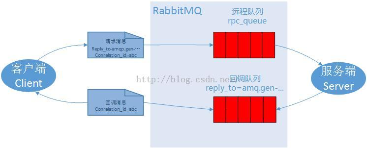

# 【6】 - Remote procedure call (RPC)

RabbitMQ入门教程 For Java【6】 - Remote procedure call (RPC)

### **我的开发环境：**

操作系统：**Windows7 64bit**

开发环境：**JDK 1.7 - 1.7.0_55**

开发工具：**Eclipse Kepler SR2**

RabbitMQ版本： **3.6.0**

Elang版本：**erl7.2.1**

关于Windows7下安装RabbitMQ的教程请先在网上找一下，有空我再补安装教程。

### 源码地址

<https://github.com/chwshuang/rabbitmq.git>

​        本教程中，我们将学习使用工作队列让多个消费者端来执行耗时的任务。比如我们需要通过远程服务器帮我们计算某个结果。这种模式通常被称之为远程方法调用或RPC.

​        我们通过RabbitMQ搭建一个RPC系统，一个客户端和一个RPC服务器，客户端有一个斐波那契数列方面的问题需要解决（Fibonacci numbers），RPC服务器负责技术收到这个消息，然后计算结果，并且返回这个斐波那契数列。

### 客户端接口

​        我们需要创建一个简单的客户端类，通过调用客户端的call方法，来计算结果。

```
FibonacciRpcClient fibonacciRpc = new FibonacciRpcClient();   
String result = fibonacciRpc.call("4");
System.out.println( "fib(4) is " + result);
```

远程方法调用的注意事项：

​        RPC在软件开发中非常常见，也经常被批评。当一个程序员对代码不熟悉的时候，跟踪RPC的性能问题是出在本地还是远程服务器就非常麻烦，对于RPC的使用，有几点需要特别说明：

- 使用远程调用时的本地函数最好独立出来
- 保证代码组件之间的依赖关系清晰明了，并用日志记录不同的执行过程和时间
- 发生客户端运行缓慢或者假死时，先确认RPC服务器是否还活着！
- 尽量使用异步队列来处理RPC请求，尽量不要用同步阻塞的方式运行RPC请求

### 回调队列

​        在RabbitMQ的RPC中，客户端发送请求后，还需要得到一个响应结果，我们需要像下面这样，在发送请求时，带上一个回调队列：

```
callbackQueueName = channel.queueDeclare().getQueue();

BasicProperties props = new BasicProperties
                            .Builder()
                            .replyTo(callbackQueueName)
                            .build();

channel.basicPublish("", "rpc_queue", props, message.getBytes());

// ... then code to read a response message from the callback_queue ...
```

​        上面代码中，我们需要引入一个新的类

```
import com.rabbitmq.client.AMQP.BasicProperties;
```

### 消息属性

传输一条消息，AMQP协议预定义了14个属性，下面几个是使用比较频繁的几个属性：

- deliveryMode：配置一个消息是否持久化。（2表示持久化）这个在第二章中有说明。
- contentType ：用来描述编码的MIME类型。与html的MIME类型类似，例如，经常使用JSON编码是将此属性设置为一个很好的做法：application/json。
- replyTo ： 回调队列的名称。
- correlationId：RPC响应请求的相关编号。这个在下一节讲。

### 关联编号  Correlation Id

​        如果一个客户端有很多的计算任务，按照上面的代码，我们会为每个任务创建一个请求，然后等待返回的结果，这种方法貌似很耗时，如果把所有的任务都放到同一个连接中，那么我们又没法分辨出返回的结果是那个任务的？为了解决这个问题，RabbitMQ提供了一个correlationid属性来解决这个问题。RabbitMQ为每个请求提供唯一的编号，然后在返回队列里如果看到了这个编号，就知道我们的任务处理完成了，如果收到的编号不认识，就可以安全的忽略。

​        你可能会疑问，如果忽略了，那么想知道这个返回结果的客户端是不是就收不到这个结果了？这个基本上不会出现，但是，理论上也可能发生，例如一个RPC服务器，在发送确认消息前挂了，你收到的消息可能就是不完整的。这种情况，RabbitMQ会重新发送任务处理请求。这也是为什么客户端必须处理这些重复请求以及RPC启用幂次模式。

### 总结：



RPC工作方式：

1. 当客户端启动时，会创建一个匿名的回调队列
2. 在RPC请求中，定义了两个属性：replyTo，表示回调队列的名称； correlationId，表示请求任务的唯一编号，用来区分不同请求的返回结果。
3. 将请求发送到rpc_queue队列中
4. RPC服务器等待rpc_queue队列的请求，如果有消息，就处理，它将计算结果发送到请求中的回调队列里。
5. 客户端监听回调队列中的消息，如果有返回消息，它根据回调消息中的correlationid进行匹配计算结果。

### 工程代码

**计算斐波那契数列的方法**

```
private static int fib(int n) throws Exception {
    if (n == 0) return 0;
    if (n == 1) return 1;
    return fib(n-1) + fib(n-2);
}
```

这个方法只是用来讲解我们的教程，你可别拿它在生产环境跑大数据！下面是客户端的代码

### 服务器端代码：

RPCServer.java

第一步仍然是建立连接、频道和声明队列。

如果我们运行多个RPC服务器，为了达到负载均衡，需要通过channel.basicQos来设置从队列中预取消息的个数。

我们通过basicConsume 访问队列，如果后消息任务来了，我们就开始工作，并将结果发送到回调队列中。

```
import com.rabbitmq.client.ConnectionFactory;
import com.rabbitmq.client.Connection;
import com.rabbitmq.client.Channel;
import com.rabbitmq.client.QueueingConsumer;
import com.rabbitmq.client.AMQP.BasicProperties;

public class RPCServer {

    private static final String RPC_QUEUE_NAME = "rpc_queue";

    private static int fib(int n) {
        if (n == 0)
            return 0;
        if (n == 1)
            return 1;
        return fib(n - 1) + fib(n - 2);
    }

    public static void main(String[] argv) {
        Connection connection = null;
        Channel channel = null;
        try {
            ConnectionFactory factory = new ConnectionFactory();
            factory.setHost("localhost");

            connection = factory.newConnection();
            channel = connection.createChannel();

            channel.queueDeclare(RPC_QUEUE_NAME, false, false, false, null);

            channel.basicQos(1);

            QueueingConsumer consumer = new QueueingConsumer(channel);
            channel.basicConsume(RPC_QUEUE_NAME, false, consumer);

            System.out.println("RPCServer [x] Awaiting RPC requests");

            while (true) {
                String response = null;

                QueueingConsumer.Delivery delivery = consumer.nextDelivery();

                BasicProperties props = delivery.getProperties();
                BasicProperties replyProps = new BasicProperties.Builder().correlationId(props.getCorrelationId()).build();

                try {
                    String message = new String(delivery.getBody(), "UTF-8");
                    int n = Integer.parseInt(message);

                    System.out.println("RPCServer [.] fib(" + message + ")");
                    response = "" + fib(n);
                } catch (Exception e) {
                    System.out.println(" [.] " + e.toString());
                    response = "";
                } finally {
                    channel.basicPublish("", props.getReplyTo(), replyProps, response.getBytes("UTF-8"));

                    channel.basicAck(delivery.getEnvelope().getDeliveryTag(), false);
                }
            }
        } catch (Exception e) {
            e.printStackTrace();
        } finally {
            if (connection != null) {
                try {
                    connection.close();
                } catch (Exception ignore) {
                }
            }
        }
    }
}
```

### 客户端代码

RPCClient.java

```
import com.rabbitmq.client.ConnectionFactory;
import com.rabbitmq.client.Connection;
import com.rabbitmq.client.Channel;
import com.rabbitmq.client.QueueingConsumer;
import com.rabbitmq.client.AMQP.BasicProperties;
import java.util.UUID;

public class RPCClient {

    private Connection connection;
    private Channel channel;
    private String requestQueueName = "rpc_queue";
    private String replyQueueName;
    private QueueingConsumer consumer;

    public RPCClient() throws Exception {
        ConnectionFactory factory = new ConnectionFactory();
        factory.setHost("localhost");
        connection = factory.newConnection();
        channel = connection.createChannel();

        replyQueueName = channel.queueDeclare().getQueue();
        consumer = new QueueingConsumer(channel);
        channel.basicConsume(replyQueueName, true, consumer);
    }

    public String call(String message) throws Exception {
        String response = null;
        String corrId = UUID.randomUUID().toString();

        BasicProperties props = new BasicProperties.Builder().correlationId(corrId).replyTo(replyQueueName).build();

        channel.basicPublish("", requestQueueName, props, message.getBytes("UTF-8"));

        while (true) {
            QueueingConsumer.Delivery delivery = consumer.nextDelivery();
            if (delivery.getProperties().getCorrelationId().equals(corrId)) {
                response = new String(delivery.getBody(), "UTF-8");
                break;
            }
        }

        return response;
    }

    public void close() throws Exception {
        connection.close();
    }

    public static void main(String[] argv) {
        RPCClient fibonacciRpc = null;
        String response = null;
        try {
            fibonacciRpc = new RPCClient();

            System.out.println("RPCClient [x] Requesting fib(30)");
            response = fibonacciRpc.call("30");
            System.out.println("RPCClient [.] Got '" + response + "'");
        } catch (Exception e) {
            e.printStackTrace();
        } finally {
            if (fibonacciRpc != null) {
                try {
                    fibonacciRpc.close();
                } catch (Exception ignore) {
                }
            }
        }
    }
}
```

在客户端，我们也建立一个连接和通道，并声明一个专用的“回调”队列

我们设置调队列中的唯一编号和回调队列名称

然后我们发送任务消息到RPC服务器

接下来循环监听回调队列中的每一个消息，找到与我们刚才发送任务消息编号相同的消息

### 总结：

这里的例子只是RabbitMQ中RPC服务的一个实现，你也可以根据业务需要实现更多。

rpc有一个优点，如果一个RPC服务器处理不来，可以再增加一个、两个、三个。

我们的例子中的代码还比较简单，还有很多问题没有解决：

如果没有发现服务器，客户端如何处理？

如果客户端的RPC请求超时了怎么办？

如果服务器出现了故障，发生了异常，是否将异常发送到客户端？

在处理消息前，怎样防止无效的消息？检查范围、类型？

如果你想还想继续了解RabbitMQ，你可以在RabbitMQ中安装管理插件，然后查看消息队列。

本教程所有文章：

[RabbitMQ入门教程 For Java【1】 - Hello World](http://blog.csdn.net/chwshuang/article/details/50521708)  - 你好世界！ 

[RabbitMQ入门教程 For Java【2】 - Work Queues](http://blog.csdn.net/chwshuang/article/details/50506284)  - 工作队列

[RabbitMQ入门教程 For Java【3】 - Publish/Subscribe](http://blog.csdn.net/chwshuang/article/details/50512057) - 发布/订阅

[RabbitMQ入门教程 For Java【4】 - Routing](http://blog.csdn.net/chwshuang/article/details/50505060) -  消息路由

[RabbitMQ入门教程 For Java【5】 - Topic](http://blog.csdn.net/chwshuang/article/details/50516904)  -  模糊匹配

[RabbitMQ入门教程 For Java【6】 - Remote procedure call (RPC)](http://blog.csdn.net/chwshuang/article/details/50518570) - 远程调用

上一篇：[【5】 - Topic](http://www.kancloud.cn/digest/rabbitmq-for-java/122041)

下一篇：[【1】 - Hello World](http://www.kancloud.cn/digest/rabbitmq-for-java/122043)

来源： <http://www.kancloud.cn/digest/rabbitmq-for-java/122042>