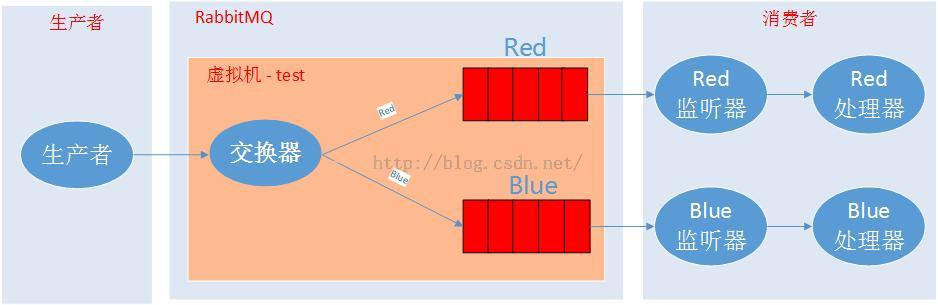

RabbitMQ入门教程 For Java【9】 - 与Spring集成

简介：

​        RabbitMQ在与Spring集成我做了两个项目，一个项目是消息生产者，负责发送消息，另外一个是消息消费者，负责监听消息。大致的流程图如下：



项目环境：

Windows7 64bit

Eclipse Kepler SR2

JDK 1.7

Tomcat 7

RabbitMQ 3.6.0

项目源码地址：

生产者：<https://github.com/chwshuang/spring-rabbitmq-producer>

消费者：<https://github.com/chwshuang/spring-rabbitmq-customer>

# 生产者：

​        与Spring集成的项目使用的是Maven，只需要一个依赖配置就搞定：

```
lt;dependency>  
org.springframework.amqp  
spring-rabbit  
1.3.5.RELEASE  
lt;/dependency>  
```

​        消息生产者在Spring的配置也比较简单，只需要一个连接工厂和一个连接模版类就搞定了。

​        生产者在Spring中使用时，只需要定义一个服务接口实现类即可。

```
 @Service("rabbitService")  
public class RabbitServiceImpl {private static Logger log = LoggerFactory.getLogger(RabbitServiceImpl.class);  
    @Autowiredprivate RabbitTemplate rabbitTemplate;  

    /**  
     * 发送消息  
     * @param msg 消息内容  
     * @param routingKey 路由关键字  
     * void  
     */public void setMessage(String msg, String routingKey) {  
        rabbitTemplate.convertAndSend(routingKey, msg);  
        log.info("rabbitmq--发送消息完成: routingKey[{}]-msg[{}]", routingKey, msg);  
    }  
}  
```

生产者端还需要创建一个测试页面，通过Ajax技术发送消息到生产者端的控制层，由控制层调用消息服务层发送消息。

```
<%@ page contentType="text/html;charset=UTF-8" language="java"%><!DOCTYPE html><html><head><meta charset="UTF-8"><script src="http://cdn.bootcss.com/jquery/1.11.3/jquery.min.js"></script><title>测试</title><script type="text/javascript">function sendMsg(){  
     var t = $("#type").val();  
     //alert(t);  
     $.post('/producer/rabbit/setMessage',{msg:'hello world '+t+' rabbit!',type:t}, function(result){  
         if(result.success){  
             //alert("发送成功");  
         }else{  
             alert("发送失败");  
         }  
     },'json');  
 }  
</script></head><body><h1>发送消息</h1><hr><select id="type" ><option selected="selected" value="red">red</option><option value="blue">blue</option></select><button id="send" onclick="sendMsg()" value="发送消息" type="button" title="send">发送</button></body></html>  
```

# 消费者：

​        RabbitMQ的消息消费者需要监听消息，以及处理收到的消息，所以需要配置一个监听器，声明一个需要监听的队列，和一个消息处理器。消费者端与spring集成的侵入较少。

```
<pre name="code" class="plain">   <!-- ========================================RabbitMQ========================================= --><!-- 连接工厂 --><rabbit:connection-factory id="connectionFactory" host="192.168.5.198" publisher-confirms="true" virtual-host="test" username="test" password="1234" /><!-- 监听器 --><rabbit:listener-container connection-factory="connectionFactory"><!-- queues是队列名称，可填多个，用逗号隔开， method是ref指定的Bean调用Invoke方法执行的方法名称 --><rabbit:listener queues="red" method="onMessage" ref="redQueueListener" /><rabbit:listener queues="blue" method="onMessage" ref="blueQueueListener" /></rabbit:listener-container><!-- 队列声明 --><rabbit:queue name="red" durable="true" /><!-- 队列声明 --><rabbit:queue name="blue" durable="true" /><!-- 红色监听处理器 --><bean id="redQueueListener" class="com.aitongyi.customer.RedQueueListener" /><!-- 蓝色监听处理器 --><bean id="blueQueueListener" class="com.aitongyi.customer.BlueQueueListener" />  
```

​        消息处理器可以只是一个通过spring管理的普通Bean对象，需要有一个在xml中定义method同名的方法

```
public class RedQueueListener{  
    private static Logger log = LoggerFactory.getLogger(RedQueueListener.class);  
    /**  
     * 处理消息  
     * @param message  
     * void  
     */public void onMessage(String message) {  
        log.info("RedQueueListener--receved:"  + message);  
    }  
}  
```

# RabbitMQ创建消息环境

​        在项目开发完成后，我们需要在RabbitMQ中创建vhost，user、queues，这样，消费者在启动的时候，登录、声明虚拟机、队列就不会报错。

\1. 创建test虚拟机，然后点击Name标签，进入虚拟机，添加权限


\2. 进入【Admin】菜单【Users】标签创建用户，然后点击用户名称进入详情设置权限


\3. 进入【Queues】菜单，创建队列


# 执行测试：

将生产者和消费者项目添加到Tomcat中，然后启动，在浏览器输入【[http://localhost:8080/producer/test.jsp】,进入测试页面，分别发送红色、蓝色的消息到队列，消费者端会显示接收日志](http://localhost:8080/producer/test.jsp%E3%80%91,%E8%BF%9B%E5%85%A5%E6%B5%8B%E8%AF%95%E9%A1%B5%E9%9D%A2%EF%BC%8C%E5%88%86%E5%88%AB%E5%8F%91%E9%80%81%E7%BA%A2%E8%89%B2%E3%80%81%E8%93%9D%E8%89%B2%E7%9A%84%E6%B6%88%E6%81%AF%E5%88%B0%E9%98%9F%E5%88%97%EF%BC%8C%E6%B6%88%E8%B4%B9%E8%80%85%E7%AB%AF%E4%BC%9A%E6%98%BE%E7%A4%BA%E6%8E%A5%E6%94%B6%E6%97%A5%E5%BF%97)


生产者端日志

```
2016-01-25 18:09:26 722 [INFO] c.a.p.c.RabbitController - rabbitmq--收到待发送消息: type[blue]-msg[hello world blue rabbit!]  
2016-01-25 18:09:26 723 [INFO] c.a.p.s.RabbitServiceImpl - rabbitmq--发送消息完成: routingKey[blue]-msg[hello world blue rabbit!]  
2016-01-25 18:09:28 715 [INFO] c.a.p.c.RabbitController - rabbitmq--收到待发送消息: type[red]-msg[hello world red rabbit!]  
2016-01-25 18:09:28 716 [INFO] c.a.p.s.RabbitServiceImpl - rabbitmq--发送消息完成: routingKey[red]-msg[hello world red rabbit!]
```

消费者端日志

```
2016-01-25 18:09:26 727 [INFO] c.a.c.BlueQueueListener - BlueQueueListener Receved:hello world blue rabbit!  
2016-01-25 18:09:28 719 [INFO] c.a.c.RedQueueListener - RedQueueListener Receved:hello world red rabbit! 
```

上一篇：[【7】 - Window下的安装与配](http://www.kancloud.cn/digest/rabbitmq-for-java/122044)

来源： <http://www.kancloud.cn/digest/rabbitmq-for-java/122045>