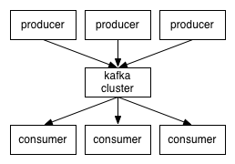
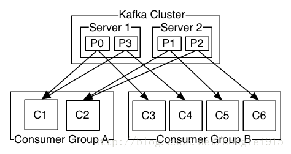

# Kafka入门经典教程

问题导读

1.Kafka独特设计在什么地方？
2.Kafka如何搭建及创建topic、发送消息、消费消息？
3.如何书写Kafka程序？
4.数据传输的事务定义有哪三种？
5.Kafka判断一个节点是否活着有哪两个条件？
6.producer是否直接将数据发送到broker的leader(主节点)？
7.Kafa consumer是否可以消费指定分区消息？
8.Kafka消息是采用Pull模式，还是Push模式？
9.Procuder API有哪两种？
10.Kafka存储在硬盘上的消息格式是什么？


## 一、基本概念

### 介绍

Kafka是一个分布式的、可分区的、可复制的消息系统。它提供了普通消息系统的功能，但具有自己独特的设计。

这个独特的设计是什么样的呢？

首先让我们看几个基本的消息系统术语：
Kafka将消息以topic为单位进行归纳。
将向Kafka topic发布消息的程序成为producers.
将预订topics并消费消息的程序成为consumer.
Kafka以集群的方式运行，可以由一个或多个服务组成，每个服务叫做一个broker.
producers通过网络将消息发送到Kafka集群，集群向消费者提供消息，如下图所示：

 

客户端和服务端通过TCP协议通信。Kafka提供了Java客户端，并且对多种语言都提供了支持。

### Topics 和Logs

先来看一下Kafka提供的一个抽象概念:topic.
一个topic是对一组消息的归纳。对每个topic，Kafka 对它的日志进行了分区，如下图所示：


每个分区都由一系列有序的、不可变的消息组成，这些消息被连续的追加到分区中。分区中的每个消息都有一个连续的序列号叫做offset,用来在分区中唯一的标识这个消息。
在一个可配置的时间段内，Kafka集群保留所有发布的消息，不管这些消息有没有被消费。比如，如果消息的保存策略被设置为2天，那么在一个消息被发布的两天时间内，它都是可以被消费的。之后它将被丢弃以释放空间。Kafka的性能是和数据量无关的常量级的，所以保留太多的数据并不是问题。

实际上每个consumer唯一需要维护的数据是消息在日志中的位置，也就是offset.这个offset有consumer来维护：一般情况下随着consumer不断的读取消息，这offset的值不断增加，但其实consumer可以以任意的顺序读取消息，比如它可以将offset设置成为一个旧的值来重读之前的消息。

以上特点的结合，使Kafka consumers非常的轻量级：它们可以在不对集群和其他consumer造成影响的情况下读取消息。你可以使用命令行来"tail"消息而不会对其他正在消费消息的consumer造成影响。

将日志分区可以达到以下目的：首先这使得每个日志的数量不会太大，可以在单个服务上保存。另外每个分区可以单独发布和消费，为并发操作topic提供了一种可能。

### 分布式

每个分区在Kafka集群的若干服务中都有副本，这样这些持有副本的服务可以共同处理数据和请求，副本数量是可以配置的。副本使Kafka具备了容错能力。
每个分区都由一个服务器作为“leader”，零或若干服务器作为“followers”,leader负责处理消息的读和写，followers则去复制leader.如果leader down了，followers中的一台则会自动成为leader。集群中的每个服务都会同时扮演两个角色：作为它所持有的一部分分区的leader，同时作为其他分区的followers，这样集群就会据有较好的负载均衡。

### Producers

Producer将消息发布到它指定的topic中,并负责决定发布到哪个分区。通常简单的由负载均衡机制随机选择分区，但也可以通过特定的分区函数选择分区。使用的更多的是第二种。

### Consumers

发布消息通常有两种模式：队列模式（queuing）和发布-订阅模式(publish-subscribe)。队列模式中，consumers可以同时从服务端读取消息，每个消息只被其中一个consumer读到；发布-订阅模式中消息被广播到所有的consumer中。Consumers可以加入一个consumer 组，共同竞争一个topic，topic中的消息将被分发到组中的一个成员中。同一组中的consumer可以在不同的程序中，也可以在不同的机器上。如果所有的consumer都在一个组中，这就成为了传统的队列模式，在各consumer中实现负载均衡。如果所有的consumer都不在不同的组中，这就成为了发布-订阅模式，所有的消息都被分发到所有的consumer中。更常见的是，每个topic都有若干数量的consumer组，每个组都是一个逻辑上的“订阅者”，为了容错和更好的稳定性，每个组由若干consumer组成。这其实就是一个发布-订阅模式，只不过订阅者是个组而不是单个consumer。

 

由两个机器组成的集群拥有4个分区 (P0-P3) 2个consumer组. A组有两个consumerB组有4个

**相比传统的消息系统，Kafka可以很好的保证有序性。**
传统的队列在服务器上保存有序的消息，如果多个consumers同时从这个服务器消费消息，服务器就会以消息存储的顺序向consumer分发消息。虽然服务器按顺序发布消息，但是消息是被异步的分发到各consumer上，<u>所以</u>当消息到达时可能已经失去了原来的顺序，这意味着并发消费将导致顺序错乱。为了避免故障，这样的消息系统通常使用“专用consumer”的概念，其实就是只允许一个消费者消费消息，当然这就意味着失去了并发性。

在这方面Kafka做的更好，通过分区的概念，Kafka可以在多个consumer组并发的情况下提供较好的有序性和负载均衡。将每个分区分只分发给一个consumer组，这样一个分区就只被这个组的一个consumer消费，就可以顺序的消费这个分区的消息。因为有多个分区，依然可以在多个consumer组之间进行负载均衡。注意consumer组的数量不能多于分区的数量，也就是有多少分区就允许多少并发消费。

Kafka只能保证一个分区之内消息的有序性，在不同的分区之间是不可以的，这已经可以满足大部分应用的需求。如果需要topic中所有消息的有序性，那就只能让这个topic只有一个分区，当然也就只有一个consumer组消费它。

## 二、环境搭建

### Step 1: 下载Kafka

点击下载最新的版本并解压.

> tar -xzf kafka_2.9.2-0.8.1.1.tgz
> cd kafka_2.9.2-0.8.1.1复制代码

### Step 2: 启动服务

Kafka用到了Zookeeper，所有首先启动Zookper，下面简单的启用一个单实例的Zookkeeper服务。可以在命令的结尾加个&符号，这样就可以启动后离开控制台。
> bin/zookeeper-server-start.sh config/zookeeper.properties &
> [2013-04-22 15:01:37,495] INFO Reading configuration from: config/zookeeper.properties (org.apache.zookeeper.server.quorum.QuorumPeerConfig)
> ...复制代码

现在启动Kafka:
> bin/kafka-server-start.sh config/server.properties
> [2013-04-22 15:01:47,028] INFO Verifying properties (kafka.utils.VerifiableProperties)
> [2013-04-22 15:01:47,051] INFO Property socket.send.buffer.bytes is overridden to 1048576 (kafka.utils.VerifiableProperties)
> ...复制代码

### Step 3: 创建 topic

创建一个叫做“test”的topic，它只有一个分区，一个副本。
> bin/kafka-topics.sh --create --zookeeper localhost:2181 --replication-factor 1 --partitions 1 --topic test复制代码

可以通过list命令查看创建的topic:
> bin/kafka-topics.sh --list --zookeeper localhost:2181
> test复制代码

除了手动创建topic，还可以配置broker让它自动创建topic.

### Step 4:发送消息.

Kafka 使用一个简单的命令行producer，从文件中或者从标准输入中读取消息并发送到服务端。默认的每条命令将发送一条消息。

运行producer并在控制台中输一些消息，这些消息将被发送到服务端：
> bin/kafka-console-producer.sh --broker-list localhost:9092 --topic test 
> This is a messageThis is another message复制代码

ctrl+c可以退出发送。

### Step 5: 启动consumer

Kafka also has a command line consumer that will dump out messages to standard output.
Kafka也有一个命令行consumer可以读取消息并输出到标准输出：
> bin/kafka-console-consumer.sh --zookeeper localhost:2181 --topic test --from-beginning
> This is a message
> This is another message复制代码

你在一个终端中运行consumer命令行，另一个终端中运行producer命令行，就可以在一个终端输入消息，另一个终端读取消息。
这两个命令都有自己的可选参数，可以在运行的时候不加任何参数可以看到帮助信息。

### Step 6: 搭建一个多个broker的集群

刚才只是启动了单个broker，现在启动有3个broker组成的集群，这些broker节点也都是在本机上的：
首先为每个节点编写配置文件：

> cp config/server.properties config/server-1.properties
> cp config/server.properties config/server-2.properties复制代码

在拷贝出的新文件中添加以下参数：
config/server-1.properties:
    broker.id=1
    port=9093
    log.dir=/tmp/kafka-logs-1复制代码

config/server-2.properties:
    broker.id=2
    port=9094
    log.dir=/tmp/kafka-logs-2复制代码

broker.id在集群中唯一的标注一个节点，因为在同一个机器上，所以必须制定不同的端口和日志文件，避免数据被覆盖。

We already have Zookeeper and our single node started, so we just need to start the two new nodes:
刚才已经启动可Zookeeper和一个节点，现在启动另外两个节点：
> bin/kafka-server-start.sh config/server-1.properties &
> ...
> bin/kafka-server-start.sh config/server-2.properties &
> ...复制代码

创建一个拥有3个副本的topic:
> bin/kafka-topics.sh --create --zookeeper localhost:2181 --replication-factor 3 --partitions 1 --topic my-replicated-topic复制代码

现在我们搭建了一个集群，怎么知道每个节点的信息呢？运行“"describe topics”命令就可以了：
> bin/kafka-topics.sh --describe --zookeeper localhost:2181 --topic my-replicated-topic复制代码
> Topic:my-replicated-topic       PartitionCount:1        ReplicationFactor:3     Configs:
>         Topic: my-replicated-topic      Partition: 0    Leader: 1       Replicas: 1,2,0 Isr: 1,2,0复制代码

下面解释一下这些输出。第一行是对所有分区的一个描述，然后每个分区都会对应一行，因为我们只有一个分区所以下面就只加了一行。
**leader**：负责处理消息的读和写，leader是从所有节点中随机选择的.
**replicas**：列出了所有的副本节点，不管节点是否在服务中.
**isr**：是正在服务中的节点.
在我们的例子中，节点1是作为leader运行。
向topic发送消息：

> bin/kafka-console-producer.sh --broker-list localhost:9092 --topic my-replicated-topic复制代码
> ...
> my test message 1my test message 2^C复制代码

消费这些消息：
> bin/kafka-console-consumer.sh --zookeeper localhost:2181 --from-beginning --topic my-replicated-topic复制代码
> ...
> my test message 1
> my test message 2
> ^C复制代码

测试一下容错能力.Broker 1作为leader运行，现在我们kill掉它：
> ps | grep server-1.properties7564 ttys002    0:15.91 /System/Library/Frameworks/JavaVM.framework/Versions/1.6/Home/bin/java...
> kill -9 7564复制代码

另外一个节点被选做了leader,node 1 不再出现在 in-sync 副本列表中：
> bin/kafka-topics.sh --describe --zookeeper localhost:2181 --topic my-replicated-topic
> Topic:my-replicated-topic       PartitionCount:1        ReplicationFactor:3     Configs:
>         Topic: my-replicated-topic      Partition: 0    Leader: 2       Replicas: 1,2,0 Isr: 2,0复制代码

虽然最初负责续写消息的leader down掉了，但之前的消息还是可以消费的：
> bin/kafka-console-consumer.sh --zookeeper localhost:2181 --from-beginning --topic my-replicated-topic
> ...
> my test message 1
> my test message 2复制代码


看来Kafka的容错机制还是不错的。

## 三、搭建Kafka开发环境

我们搭建了kafka的服务器，并可以使用Kafka的命令行工具创建topic，发送和接收消息。下面我们来搭建kafka的开发环境。
添加依赖

搭建开发环境需要引入kafka的jar包，一种方式是将Kafka安装包中lib下的jar包加入到项目的classpath中，这种比较简单了。不过我们使用另一种更加流行的方式：使用maven管理jar包依赖。
创建好maven项目后，在pom.xml中添加以下依赖：

<dependency>
        <groupId> org.apache.kafka</groupId >
        <artifactId> kafka_2.10</artifactId >
        <version> 0.8.0</ version>
</dependency>复制代码
添加依赖后你会发现有两个jar包的依赖找不到。没关系我都帮你想好了，点击这里下载这两个jar包，解压后你有两种选择，第一种是使用mvn的install命令将jar包安装到本地仓库，另一种是直接将解压后的文件夹拷贝到mvn本地仓库的com文件夹下，比如我的本地仓库是d:\mvn,完成后我的目录结构是这样的：

 

### 配置程序

首先是一个充当配置文件作用的接口,配置了Kafka的各种连接参数：

```
package com.sohu.kafkademon;
public interface KafkaProperties
{
    final static String zkConnect = "10.22.10.139:2181";
    final static String groupId = "group1";
    final static String topic = "topic1";
    final static String kafkaServerURL = "10.22.10.139";
    final static int kafkaServerPort = 9092;
    final static int kafkaProducerBufferSize = 64 * 1024;
    final static int connectionTimeOut = 20000;
    final static int reconnectInterval = 10000;
    final static String topic2 = "topic2";
    final static String topic3 = "topic3";
    final static String clientId = "SimpleConsumerDemoClient";
}
```


### producer

```
package com.sohu.kafkademon;
import java.util.Properties;
import kafka.producer.KeyedMessage;
import kafka.producer.ProducerConfig;
/**
* @author leicui bourne_cui@163.com
*/
public class KafkaProducer extends Thread
{
    private final kafka.javaapi.producer.Producer<Integer, String> producer;
    private final String topic;
    private final Properties props = new Properties();
    public KafkaProducer(String topic)
    {
        props.put("serializer.class", "kafka.serializer.StringEncoder");
        props.put("metadata.broker.list", "10.22.10.139:9092");
        producer = new kafka.javaapi.producer.Producer<Integer, String>(new ProducerConfig(props));
        this.topic = topic;
    }
    @Override
    public void run() {
        int messageNo = 1;
        while (true)
        {
            String messageStr = new String("Message_" + messageNo);
            System.out.println("Send:" + messageStr);
            producer.send(new KeyedMessage<Integer, String>(topic, messageStr));
            messageNo++;
            try {
                sleep(3000);
            } catch (InterruptedException e) {
                // TODO Auto-generated catch block
                e.printStackTrace();
            }
        }
    }
}
```


### consumer

```
package com.sohu.kafkademon;
import java.util.HashMap;
import java.util.List;
import java.util.Map;
import java.util.Properties;
import kafka.consumer.ConsumerConfig;
import kafka.consumer.ConsumerIterator;
import kafka.consumer.KafkaStream;
import kafka.javaapi.consumer.ConsumerConnector;
/**
* @author leicui bourne_cui@163.com
*/
public class KafkaConsumer extends Thread
{
    private final ConsumerConnector consumer;
    private final String topic;
    public KafkaConsumer(String topic)
    {
        consumer = kafka.consumer.Consumer.createJavaConsumerConnector(
                createConsumerConfig());
        this.topic = topic;
    }
    private static ConsumerConfig createConsumerConfig()
    {
        Properties props = new Properties();
        props.put("zookeeper.connect", KafkaProperties.zkConnect);
        props.put("group.id", KafkaProperties.groupId);
        props.put("zookeeper.session.timeout.ms", "40000");
        props.put("zookeeper.sync.time.ms", "200");
        props.put("auto.commit.interval.ms", "1000");
        return new ConsumerConfig(props);
    }
    @Override
    public void run() {
        Map<String, Integer> topicCountMap = new HashMap<String, Integer>();
        topicCountMap.put(topic, new Integer(1));
        Map<String, List<KafkaStream<byte[], byte[]>>> consumerMap = consumer.createMessageStreams(topicCountMap);
        KafkaStream<byte[], byte[]> stream = consumerMap.get(topic).get(0);
        ConsumerIterator<byte[], byte[]> it = stream.iterator();
        while (it.hasNext()) {
            System.out.println("receive：" + new String(it.next().message()));
            try {
                sleep(3000);
            } catch (InterruptedException e) {
                e.printStackTrace();
            }
        }
    }
}
```


### 简单的发送接收

运行下面这个程序，就可以进行简单的发送接收消息了：
```
package com.sohu.kafkademon;
/**
* @author leicui bourne_cui@163.com
*/
public class KafkaConsumerProducerDemo
{
    public static void main(String[] args)
    {
        KafkaProducer producerThread = new KafkaProducer(KafkaProperties.topic);
        producerThread.start();
        KafkaConsumer consumerThread = new KafkaConsumer(KafkaProperties.topic);
        consumerThread.start();
    }
}
```

### 高级别的consumer

下面是比较负载的发送接收的程序：
```
package com.sohu.kafkademon;
import java.util.HashMap;
import java.util.List;
import java.util.Map;
import java.util.Properties;
import kafka.consumer.ConsumerConfig;
import kafka.consumer.ConsumerIterator;
import kafka.consumer.KafkaStream;
import kafka.javaapi.consumer.ConsumerConnector;
/**
* @author leicui bourne_cui@163.com
*/
public class KafkaConsumer extends Thread
{
    private final ConsumerConnector consumer;
    private final String topic;
    public KafkaConsumer(String topic)
    {
        consumer = kafka.consumer.Consumer.createJavaConsumerConnector(
                createConsumerConfig());
        this.topic = topic;
    }
    private static ConsumerConfig createConsumerConfig()
    {
        Properties props = new Properties();
        props.put("zookeeper.connect", KafkaProperties.zkConnect);
        props.put("group.id", KafkaProperties.groupId);
        props.put("zookeeper.session.timeout.ms", "40000");
        props.put("zookeeper.sync.time.ms", "200");
        props.put("auto.commit.interval.ms", "1000");
        return new ConsumerConfig(props);
    }
    @Override
    public void run() {
        Map<String, Integer> topicCountMap = new HashMap<String, Integer>();
        topicCountMap.put(topic, new Integer(1));
        Map<String, List<KafkaStream<byte[], byte[]>>> consumerMap = consumer.createMessageStreams(topicCountMap);
        KafkaStream<byte[], byte[]> stream = consumerMap.get(topic).get(0);
        ConsumerIterator<byte[], byte[]> it = stream.iterator();
        while (it.hasNext()) {
            System.out.println("receive：" + new String(it.next().message()));
            try {
                sleep(3000);
            } catch (InterruptedException e) {
                e.printStackTrace();
            }
        }
    }
}
```

## 四、数据持久化


不要畏惧文件系统!

Kafka大量依赖文件系统去存储和缓存消息。对于硬盘有个传统的观念是硬盘总是很慢，这使很多人怀疑基于文件系统的架构能否提供优异的性能。实际上硬盘的快慢完全取决于使用它的方式。设计良好的硬盘架构可以和内存一样快。

在6块7200转的SATA RAID-5磁盘阵列的线性写速度差不多是600MB/s，但是随即写的速度却是100k/s，差了差不多6000倍。现代的操作系统都对次做了大量的优化，使用了 read-ahead 和 write-behind的技巧，读取的时候成块的预读取数据，写的时候将各种微小琐碎的逻辑写入组织合并成一次较大的物理写入。对此的深入讨论可以查看这里，它们发现线性的访问磁盘，很多时候比随机的内存访问快得多。

为了提高性能，现代操作系统往往使用内存作为磁盘的缓存，现代操作系统乐于把所有空闲内存用作磁盘缓存，虽然这可能在缓存回收和重新分配时牺牲一些性能。所有的磁盘读写操作都会经过这个缓存，这不太可能被绕开除非直接使用I/O。所以虽然每个程序都在自己的线程里只缓存了一份数据，但在操作系统的缓存里还有一份，这等于存了两份数据。

**另外再来讨论一下JVM,以下两个事实是众所周知的：**

•Java对象占用空间是非常大的，差不多是要存储的数据的两倍甚至更高。

•随着堆中数据量的增加，垃圾回收回变的越来越困难。

基于以上分析，如果把数据缓存在内存里，因为需要存储两份，不得不使用两倍的内存空间，Kafka基于JVM，又不得不将空间再次加倍,再加上要避免GC带来的性能影响，在一个32G内存的机器上，不得不使用到28-30G的内存空间。并且当系统重启的时候，又必须要将数据刷到内存中（ 10GB 内存差不多要用10分钟），就算使用冷刷新（不是一次性刷进内存，而是在使用数据的时候没有就刷到内存）也会导致最初的时候新能非常慢。但是使用文件系统，即使系统重启了，也不需要刷新数据。使用文件系统也简化了维护数据一致性的逻辑。

所以与传统的将数据缓存在内存中然后刷到硬盘的设计不同，Kafka直接将数据写到了文件系统的日志中。

### 常量时间的操作效率

在大多数的消息系统中，数据持久化的机制往往是为每个cosumer提供一个B树或者其他的随机读写的数据结构。B树当然是很棒的，但是也带了一些代价：比如B树的复杂度是O(log N)，O(log N)通常被认为就是常量复杂度了，但对于硬盘操作来说并非如此。磁盘进行一次搜索需要10ms，每个硬盘在同一时间只能进行一次搜索，这样并发处理就成了问题。虽然存储系统使用缓存进行了大量优化，但是对于树结构的性能的观察结果却表明，它的性能往往随着数据的增长而线性下降，数据增长一倍，速度就会降低一倍。

直观的讲，对于主要用于日志处理的消息系统，数据的持久化可以简单的通过将数据追加到文件中实现，读的时候从文件中读就好了。这样做的好处是读和写都是 O(1) 的，并且读操作不会阻塞写操作和其他操作。这样带来的性能优势是很明显的，因为性能和数据的大小没有关系了。

既然可以使用几乎没有容量限制（相对于内存来说）的硬盘空间建立消息系统，就可以在没有性能损失的情况下提供一些一般消息系统不具备的特性。比如，一般的消息系统都是在消息被消费后立即删除，Kafka却可以将消息保存一段时间（比如一星期），这给consumer提供了很好的机动性和灵活性，这点在今后的文章中会有详述。


## 五、消息传输的事务定义

之前讨论了consumer和producer是怎么工作的，现在来讨论一下数据传输方面。数据传输的事务定义通常有以下三种级别：

1. 最多一次: 消息不会被重复发送，最多被传输一次，但也有可能一次不传输。
2. 最少一次: 消息不会被漏发送，最少被传输一次，但也有可能被重复传输.
3. 精确的一次（Exactly once）: 不会漏传输也不会重复传输,每个消息都传输被一次而且仅仅被传输一次，这是大家所期望的。

大多数消息系统声称可以做到“精确的一次”，但是仔细阅读它们的的文档可以看到里面存在误导，比如没有说明当consumer或producer失败时怎么样，或者当有多个consumer并行时怎么样，或写入硬盘的数据丢失时又会怎么样。kafka的做法要更先进一些。当发布消息时，Kafka有一个“committed”的概念，一旦消息被提交了，只要消息被写入的分区的所在的副本broker是活动的，数据就不会丢失。关于副本的活动的概念，下节文档会讨论。现在假设broker是不会down的。

如果producer发布消息时发生了网络错误，但又不确定实在提交之前发生的还是提交之后发生的，这种情况虽然不常见，但是必须考虑进去，现在Kafka版本还没有解决这个问题，将来的版本正在努力尝试解决。

并不是所有的情况都需要“精确的一次”这样高的级别，Kafka允许producer灵活的指定级别。比如producer可以指定必须等待消息被提交的通知，或者完全的异步发送消息而不等待任何通知，或者仅仅等待leader声明它拿到了消息（followers没有必要）。

现在从consumer的方面考虑这个问题，所有的副本都有相同的日志文件和相同的offset，consumer维护自己消费的消息的offset，如果consumer不会崩溃当然可以在内存中保存这个值，当然谁也不能保证这点。如果consumer崩溃了，会有另外一个consumer接着消费消息，它需要从一个合适的offset继续处理。这种情况下可以有以下选择：

1. consumer可以先读取消息，然后将offset写入日志文件中，然后再处理消息。这存在一种可能就是在存储offset后还没处理消息就crash了，新的consumer继续从这个offset处理，那么就会有些消息永远不会被处理，这就是上面说的“最多一次”。
2. consumer可以先读取消息，处理消息，最后记录offset，当然如果在记录offset之前就crash了，新的consumer会重复的消费一些消息，这就是上面说的“最少一次”。
3. “精确一次”可以通过将提交分为两个阶段来解决：保存了offset后提交一次，消息处理成功之后再提交一次。但是还有个更简单的做法：将消息的offset和消息被处理后的结果保存在一起。比如用Hadoop ETL处理消息时，将处理后的结果和offset同时保存在HDFS中，这样就能保证消息和offser同时被处理了。


## 六、性能优化

Kafka在提高效率方面做了很大努力。Kafka的一个主要使用场景是处理网站活动日志，吞吐量是非常大的，每个页面都会产生好多次写操作。读方面，假设每个消息只被消费一次，读的量的也是很大的，Kafka也尽量使读的操作更轻量化。

我们之前讨论了磁盘的性能问题，线性读写的情况下影响磁盘性能问题大约有两个方面：太多的琐碎的I/O操作和太多的字节拷贝。I/O问题发生在客户端和服务端之间，也发生在服务端内部的持久化的操作中。

**消息集（message set）**
为了避免这些问题，Kafka建立了“消息集（message set）”的概念，将消息组织到一起，作为处理的单位。以消息集为单位处理消息，比以单个的消息为单位处理，会提升不少性能。Producer把消息集一块发送给服务端，而不是一条条的发送；服务端把消息集一次性的追加到日志文件中，这样减少了琐碎的I/O操作。consumer也可以一次性的请求一个消息集。

另外一个性能优化是在字节拷贝方面。在低负载的情况下这不是问题，但是在高负载的情况下它的影响还是很大的。为了避免这个问题，Kafka使用了标准的二进制消息格式，这个格式可以在producer,broker和producer之间共享而无需做任何改动。

**zero copy**
Broker维护的消息日志仅仅是一些目录文件，消息集以固定队的格式写入到日志文件中，这个格式producer和consumer是共享的，这使得Kafka可以一个很重要的点进行优化：消息在网络上的传递。现代的unix操作系统提供了高性能的将数据从页面缓存发送到socket的系统函数，在linux中，这个函数是sendfile.

为了更好的理解sendfile的好处，我们先来看下一般将数据从文件发送到socket的数据流向：
操作系统把数据从文件拷贝内核中的页缓存中应用程序从页缓存从把数据拷贝自己的内存缓存中应用程序将数据写入到内核中socket缓存中操作系统把数据从socket缓存中拷贝到网卡接口缓存，从这里发送到网络上。

这显然是低效率的，有4次拷贝和2次系统调用。Sendfile通过直接将数据从页面缓存发送网卡接口缓存，避免了重复拷贝，大大的优化了性能。
在一个多consumers的场景里，数据仅仅被拷贝到页面缓存一次而不是每次消费消息的时候都重复的进行拷贝。这使得消息以近乎网络带宽的速率发送出去。这样在磁盘层面你几乎看不到任何的读操作，因为数据都是从页面缓存中直接发送到网络上去了。
这篇文章详细介绍了sendfile和zero-copy技术在Java方面的应用。

**数据压缩**
很多时候，性能的瓶颈并非CPU或者硬盘而是网络带宽，对于需要在数据中心之间传送大量数据的应用更是如此。当然用户可以在没有Kafka支持的情况下各自压缩自己的消息，但是这将导致较低的压缩率，因为相比于将消息单独压缩，将大量文件压缩在一起才能起到最好的压缩效果。
Kafka采用了端到端的压缩：因为有“消息集”的概念，客户端的消息可以一起被压缩后送到服务端，并以压缩后的格式写入日志文件，以压缩的格式发送到consumer，消息从producer发出到consumer拿到都被是压缩的，只有在consumer使用的时候才被解压缩，所以叫做“端到端的压缩”。
Kafka支持GZIP和Snappy压缩协议。更详细的内容可以查看这里。


## 七、Producer和Consumer

### Kafka Producer消息发送

producer直接将数据发送到broker的leader(主节点)，不需要在多个节点进行分发。为了帮助producer做到这点，所有的Kafka节点都可以及时的告知:哪些节点是活动的，目标topic目标分区的leader在哪。这样producer就可以直接将消息发送到目的地了。

客户端控制消息将被分发到哪个分区。可以通过负载均衡随机的选择，或者使用分区函数。Kafka允许用户实现分区函数，指定分区的key，将消息hash到不同的分区上(当然有需要的话，也可以覆盖这个分区函数自己实现逻辑).比如如果你指定的key是user id，那么同一个用户发送的消息都被发送到同一个分区上。经过分区之后，consumer就可以有目的的消费某个分区的消息。

异步发送
批量发送可以很有效的提高发送效率。Kafka producer的异步发送模式允许进行批量发送，先将消息缓存在内存中，然后一次请求批量发送出去。这个策略可以配置的，比如可以指定缓存的消息达到某个量的时候就发出去，或者缓存了固定的时间后就发送出去（比如100条消息就发送，或者每5秒发送一次）。这种策略将大大减少服务端的I/O次数。

既然缓存是在producer端进行的，那么当producer崩溃时，这些消息就会丢失。Kafka0.8.1的异步发送模式还不支持回调，就不能在发送出错时进行处理。Kafka 0.9可能会增加这样的回调函数。见Proposed Producer API.

### Kafka Consumer

Kafa consumer消费消息时，向broker发出"fetch"请求去消费特定分区的消息。consumer指定消息在日志中的偏移量（offset），就可以消费从这个位置开始的消息。customer拥有了offset的控制权，可以向后回滚去重新消费之前的消息，这是很有意义的。

#### 推还是拉？

Kafka最初考虑的问题是，customer应该从brokes拉取消息还是brokers将消息推送到consumer，也就是pull还push。在这方面，Kafka遵循了一种大部分消息系统共同的传统的设计：producer将消息推送到broker，consumer从broker拉取消息。

一些消息系统比如Scribe和Apache Flume采用了push模式，将消息推送到下游的consumer。这样做有好处也有坏处：由broker决定消息推送的速率，对于不同消费速率的consumer就不太好处理了。消息系统都致力于让consumer以最大的速率最快速的消费消息，但不幸的是，push模式下，当broker推送的速率远大于consumer消费的速率时，consumer恐怕就要崩溃了。最终Kafka还是选取了传统的pull模式。

Pull模式的另外一个好处是consumer可以自主决定是否批量的从broker拉取数据。Push模式必须在不知道下游consumer消费能力和消费策略的情况下决定是立即推送每条消息还是缓存之后批量推送。如果为了避免consumer崩溃而采用较低的推送速率，将可能导致一次只推送较少的消息而造成浪费。Pull模式下，consumer就可以根据自己的消费能力去决定这些策略。

Pull有个缺点是，如果broker没有可供消费的消息，将导致consumer不断在循环中轮询，直到新消息到t达。为了避免这点，Kafka有个参数可以让consumer阻塞知道新消息到达(当然也可以阻塞知道消息的数量达到某个特定的量这样就可以批量发送)。

#### 消费状态跟踪

对消费消息状态的记录也是很重要的。
大部分消息系统在broker端的维护消息被消费的记录：一个消息被分发到consumer后broker就马上进行标记或者等待customer的通知后进行标记。这样也可以在消息在消费后立马就删除以减少空间占用。

**但是这样会不会有什么问题呢？**如果一条消息发送出去之后就立即被标记为消费过的，一旦consumer处理消息时失败了（比如程序崩溃）消息就丢失了。为了解决这个问题，很多消息系统提供了另外一个个功能：当消息被发送出去之后仅仅被标记为已发送状态，当接到consumer已经消费成功的通知后才标记为已被消费的状态。这虽然解决了消息丢失的问题，但产生了新问题，首先如果consumer处理消息成功了但是向broker发送响应时失败了，这条消息将被消费两次。第二个问题时，broker必须维护每条消息的状态，并且每次都要先锁住消息然后更改状态然后释放锁。这样麻烦又来了，且不说要维护大量的状态数据，比如如果消息发送出去但没有收到消费成功的通知，这条消息将一直处于被锁定的状态，
Kafka采用了不同的策略。Topic被分成了若干分区，每个分区在同一时间只被一个consumer消费。这意味着每个分区被消费的消息在日志中的位置仅仅是一个简单的整数：offset。这样就很容易标记每个分区消费状态就很容易了，仅仅需要一个整数而已。这样消费状态的跟踪就很简单了。

这带来了另外一个好处：consumer可以把offset调成一个较老的值，去重新消费老的消息。这对传统的消息系统来说看起来有些不可思议，但确实是非常有用的，谁规定了一条消息只能被消费一次呢？consumer发现解析数据的程序有bug，在修改bug后再来解析一次消息，看起来是很合理的额呀！

#### 离线处理消息

高级的数据持久化允许consumer每个隔一段时间批量的将数据加载到线下系统中比如Hadoop或者数据仓库。这种情况下，Hadoop可以将加载任务分拆，拆成每个broker或每个topic或每个分区一个加载任务。Hadoop具有任务管理功能，当一个任务失败了就可以重启而不用担心数据被重新加载，只要从上次加载的位置继续加载消息就可以了。


## 八、主从同步


Kafka允许topic的分区拥有若干副本，这个数量是可以配置的，你可以为每个topci配置副本的数量。Kafka会自动在每个个副本上备份数据，所以当一个节点down掉时数据依然是可用的。

Kafka的副本功能不是必须的，你可以配置只有一个副本，这样其实就相当于只有一份数据。
创建副本的单位是topic的分区，每个分区都有一个leader和零或多个followers.所有的读写操作都由leader处理，一般分区的数量都比broker的数量多的多，各分区的leader均匀的分布在brokers中。所有的followers都复制leader的日志，日志中的消息和顺序都和leader中的一致。flowers向普通的consumer那样从leader那里拉取消息并保存在自己的日志文件中。

许多分布式的消息系统自动的处理失败的请求，它们对一个节点是否

着（alive）”有着清晰的定义。**Kafka判断一个节点是否活着有两个条件**：
节点必须可以维护和ZooKeeper的连接，Zookeeper通过心跳机制检查每个节点的连接。如果节点是个follower,他必须能及时的同步leader的写操作，延时不能太久。
符合以上条件的节点准确的说应该是“同步中的（in sync）”，而不是模糊的说是“活着的”或是“失败的”。Leader会追踪所有“同步中”的节点，一旦一个down掉了，或是卡住了，或是延时太久，leader就会把它移除。至于延时多久算是“太久”，是由参数replica.lag.max.messages决定的，怎样算是卡住了，怎是由参数replica.lag.time.max.ms决定的。 

只有当消息被所有的副本加入到日志中时，才算是“committed”，只有committed的消息才会发送给consumer，这样就不用担心一旦leader down掉了消息会丢失。Producer也可以选择是否等待消息被提交的通知，这个是由参数request.required.acks决定的。
Kafka保证只要有一个“同步中”的节点，“committed”的消息就不会丢失。

### Leader的选择

Kafka的核心是日志文件，日志文件在集群中的同步是分布式数据系统最基础的要素。

如果leaders永远不会down的话我们就不需要followers了！一旦leader down掉了，需要在followers中选择一个新的leader.但是followers本身有可能延时太久或者crash，所以必须选择高质量的follower作为leader.必须保证，一旦一个消息被提交了，但是leader down掉了，新选出的leader必须可以提供这条消息。大部分的分布式系统采用了多数投票法则选择新的leader,对于多数投票法则，就是根据所有副本节点的状况动态的选择最适合的作为leader.Kafka并不是使用这种方法。

Kafaka动态维护了一个同步状态的副本的集合（a set of in-sync replicas），简称ISR，在这个集合中的节点都是和leader保持高度一致的，任何一条消息必须被这个集合中的每个节点读取并追加到日志中了，才回通知外部这个消息已经被提交了。因此这个集合中的任何一个节点随时都可以被选为leader.ISR在ZooKeeper中维护。ISR中有f+1个节点，就可以允许在f个节点down掉的情况下不会丢失消息并正常提供服。ISR的成员是动态的，如果一个节点被淘汰了，当它重新达到“同步中”的状态时，他可以重新加入ISR.这种leader的选择方式是非常快速的，适合kafka的应用场景。

一个邪恶的想法：如果所有节点都down掉了怎么办？Kafka对于数据不会丢失的保证，是基于至少一个节点是存活的，一旦所有节点都down了，这个就不能保证了。
实际应用中，当所有的副本都down掉时，必须及时作出反应。可以有以下两种选择:
等待ISR中的任何一个节点恢复并担任leader。选择所有节点中（不只是ISR）第一个恢复的节点作为leader.
这是一个在可用性和连续性之间的权衡。如果等待ISR中的节点恢复，一旦ISR中的节点起不起来或者数据都是了，那集群就永远恢复不了了。如果等待ISR意外的节点恢复，这个节点的数据就会被作为线上数据，有可能和真实的数据有所出入，因为有些数据它可能还没同步到。Kafka目前选择了第二种策略，在未来的版本中将使这个策略的选择可配置，可以根据场景灵活的选择。
这种窘境不只Kafka会遇到，几乎所有的分布式数据系统都会遇到。

### 副本管理

以上仅仅以一个topic一个分区为例子进行了讨论，但实际上一个Kafka将会管理成千上万的topic分区.Kafka尽量的使所有分区均匀的分布到集群所有的节点上而不是集中在某些节点上，另外主从关系也尽量均衡这样每个几点都会担任一定比例的分区的leader.
优化leader的选择过程也是很重要的，它决定了系统发生故障时的空窗期有多久。Kafka选择一个节点作为“controller”,当发现有节点down掉的时候它负责在游泳分区的所有节点中选择新的leader,这使得Kafka可以批量的高效的管理所有分区节点的主从关系。如果controller down掉了，活着的节点中的一个会备切换为新的controller.


## 九、客户端API

### Kafka Producer APIs

Procuder API有两种：kafka.producer.SyncProducer和kafka.producer.async.AsyncProducer.它们都实现了同一个接口：

```
class Producer {
/* 将消息发送到指定分区 */
publicvoid send(kafka.javaapi.producer.ProducerData<K,V> producerData);
/* 批量发送一批消息 */
publicvoid send(java.util.List<kafka.javaapi.producer.ProducerData<K,V>> producerData);
/* 关闭producer */
publicvoid close();
}
```


**Producer API提供了以下功能：**

- 可以将多个消息缓存到本地队列里，然后异步的批量发送到broker，可以通过参数producer.type=async做到。缓存的大小可以通过一些参数指定：queue.time和batch.size。一个后台线程（(kafka.producer.async.ProducerSendThread）从队列中取出数据并让kafka.producer.EventHandler将消息发送到broker，也可以通过参数event.handler定制handler，在producer端处理数据的不同的阶段注册处理器，比如可以对这一过程进行日志追踪，或进行一些监控。只需实现kafka.producer.async.CallbackHandler接口，并在callback.handler中配置。

- 自己编写Encoder来序列化消息，只需实现下面这个接口。默认的Encoder是kafka.serializer.DefaultEncoder。

  ```
  interface Encoder<T> {
  public Message toMessage(T data);
  }
  ```

- 提供了基于Zookeeper的broker自动感知能力，可以通过参数zk.connect实现。如果不使用Zookeeper，也可以使用broker.list参数指定一个静态的brokers列表，这样消息将被随机的发送到一个broker上，一旦选中的broker失败了，消息发送也就失败了。

- 通过分区函数kafka.producer.Partitioner类对消息分区。

  ```
  interface Partitioner<T> {
  int partition(T key, int numPartitions);
  }
  ```


- 分区函数有两个参数：key和可用的分区数量，从分区列表中选择一个分区并返回id。默认的分区策略是hash(key)%numPartitions.如果key是null,就随机的选择一个。可以通过参数partitioner.class定制分区函数。


### KafKa Consumer APIs

Consumer API有两个级别。低级别的和一个指定的broker保持连接，并在接收完消息后关闭连接，这个级别是无状态的，每次读取消息都带着offset。
高级别的API隐藏了和brokers连接的细节，在不必关心服务端架构的情况下和服务端通信。还可以自己维护消费状态，并可以通过一些条件指定订阅特定的topic,比如白名单黑名单或者正则表达式。

**低级别的API**
```
class SimpleConsumer {
/*向一个broker发送读取请求并得到消息集 */
public ByteBufferMessageSet fetch(FetchRequest request);
/*向一个broker发送读取请求并得到一个相应集 */
public MultiFetchResponse multifetch(List<FetchRequest> fetches);
/**
* 得到指定时间之前的offsets
* 返回值是offsets列表，以倒序排序
* @param time: 时间，毫秒,
* 如果指定为OffsetRequest$.MODULE$.LATIEST_TIME(), 得到最新的offset.
* 如果指定为OffsetRequest$.MODULE$.EARLIEST_TIME(),得到最老的offset.
*/
publiclong[] getOffsetsBefore(String topic, int partition, long time, int maxNumOffsets);
}
```

低级别的API是高级别API实现的基础，也是为了一些对维持消费状态有特殊需求的场景，比如Hadoop consumer这样的离线consumer。

**高级别的API**
```
/* 创建连接 */
ConsumerConnector connector = Consumer.create(consumerConfig);
interface ConsumerConnector {
/**
* 这个方法可以得到一个流的列表，每个流都是MessageAndMetadata的迭代，通过MessageAndMetadata可以拿到消息和其他的元数据（目前之后topic）
* Input: a map of <topic, #streams>
* Output: a map of <topic, list of message streams>
*/
public Map<String,List<KafkaStream>> createMessageStreams(Map<String,Int> topicCountMap);
/**
* 你也可以得到一个流的列表，它包含了符合TopicFiler的消息的迭代，
* 一个TopicFilter是一个封装了白名单或黑名单的正则表达式。
*/
public List<KafkaStream> createMessageStreamsByFilter(
TopicFilter topicFilter, int numStreams);
/* 提交目前消费到的offset */
public commitOffsets()
/* 关闭连接 */
public shutdown()
}
```

这个API围绕着由KafkaStream实现的迭代器展开，每个流代表一系列从一个或多个分区多和broker上汇聚来的消息，每个流由一个线程处理，所以客户端可以在创建的时候通过参数指定想要几个流。一个流是多个分区多个broker的合并，但是每个分区的消息只会流向一个流。

每调用一次createMessageStreams都会将consumer注册到topic上，这样consumer和brokers之间的负载均衡就会进行调整。API鼓励每次调用创建更多的topic流以减少这种调整。createMessageStreamsByFilter方法注册监听可以感知新的符合filter的tipic。

## 十、消息和日志


消息由一个固定长度的头部和可变长度的字节数组组成。头部包含了一个版本号和CRC32校验码。
```
/**
* 具有N个字节的消息的格式如下
*
* 如果版本号是0
*
* 1. 1个字节的 "magic" 标记
*
* 2. 4个字节的CRC32校验码
*
* 3. N - 5个字节的具体信息
*
* 如果版本号是1
*
* 1. 1个字节的 "magic" 标记
*
* 2.1个字节的参数允许标注一些附加的信息比如是否压缩了，解码类型等
*
* 3.4个字节的CRC32校验码
*
* 4. N - 6 个字节的具体信息
*
*/
```

**日志**一个叫做“my_topic”且有两个分区的的topic,它的日志有两个文件夹组成，my_topic_0和my_topic_1,每个文件夹里放着具体的数据文件，每个数据文件都是一系列的日志实体，每个日志实体有一个4个字节的整数N标注消息的长度，后边跟着N个字节的消息。每个消息都可以由一个64位的整数offset标注，offset标注了这条消息在发送到这个分区的消息流中的起始位置。每个日志文件的名称都是这个文件第一条日志的offset.所以第一个日志文件的名字就是00000000000.kafka.所以每相邻的两个文件名字的差就是一个数字S,S差不多就是配置文件中指定的日志文件的最大容量。
消息的格式都由一个统一的接口维护，所以消息可以在producer,broker和consumer之间无缝的传递。存储在硬盘上的消息格式如下所示：

1. 消息长度: 4 bytes (value: 1+4+n)
2. 版本号: 1 byte
3. CRC校验码: 4 bytes
4. 具体的消息: n bytes


**写操作**消息被不断的追加到最后一个日志的末尾，当日志的大小达到一个指定的值时就会产生一个新的文件。对于写操作有两个参数，一个规定了消息的数量达到这个值时必须将数据刷新到硬盘上，另外一个规定了刷新到硬盘的时间间隔，这对数据的持久性是个保证，在系统崩溃的时候只会丢失一定数量的消息或者一个时间段的消息。

**读操作**
读操作需要两个参数：一个64位的offset和一个S字节的最大读取量。S通常比单个消息的大小要大，但在一些个别消息比较大的情况下，S会小于单个消息的大小。这种情况下读操作会不断重试，每次重试都会将读取量加倍，直到读取到一个完整的消息。可以配置单个消息的最大值，这样服务器就会拒绝大小超过这个值的消息。也可以给客户端指定一个尝试读取的最大上限，避免为了读到一个完整的消息而无限次的重试。
在实际执行读取操纵时，首先需要定位数据所在的日志文件，然后根据offset计算出在这个日志中的offset(前面的的offset是整个分区的offset),然后在这个offset的位置进行读取。定位操作是由二分查找法完成的，Kafka在内存中为每个文件维护了offset的范围。

下面是发送给consumer的结果的格式：

```
MessageSetSend (fetch result)

total length     : 4 bytes
error code       : 2 bytes
message 1        : x bytes
...
message n        : x bytes
MultiMessageSetSend (multiFetch result)

total length       : 4 bytes
error code         : 2 bytes
messageSetSend 1
...
messageSetSend n
```

**删除**
日志管理器允许定制删除策略。目前的策略是删除修改时间在N天之前的日志（按时间删除），也可以使用另外一个策略：保留最后的N GB数据的策略(按大小删除)。为了避免在删除时阻塞读操作，采用了copy-on-write形式的实现，删除操作进行时，读取操作的二分查找功能实际是在一个静态的快照副本上进行的，这类似于Java的CopyOnWriteArrayList。

**可靠性保证**
日志文件有一个可配置的参数M，缓存超过这个数量的消息将被强行刷新到硬盘。一个日志矫正线程将循环检查最新的日志文件中的消息确认每个消息都是合法的。合法的标准为：所有文件的大小的和最大的offset小于日志文件的大小，并且消息的CRC32校验码与存储在消息实体中的校验码一致。如果在某个offset发现不合法的消息，从这个offset到下一个合法的offset之间的内容将被移除。
有两种情况必须考虑：
1，当发生崩溃时有些数据块未能写入。
2，写入了一些空白数据块。第二种情况的原因是，对于每个文件，操作系统都有一个inode（inode是指在许多“类Unix文件系统”中的一种数据结构。每个inode保存了文件系统中的一个文件系统对象,包括文件、目录、大小、设备文件、socket、管道, 等等），但无法保证更新inode和写入数据的顺序，当inode保存的大小信息被更新了，但写入数据时发生了崩溃，就产生了空白数据块。CRC校验码可以检查这些块并移除，当然因为崩溃而未写入的数据块也就丢失了。

来源： <http://www.aboutyun.com/thread-12882-1-1.html> 