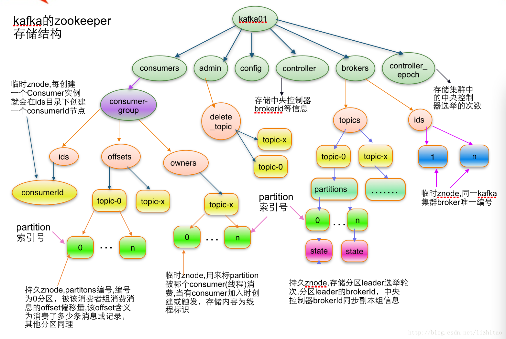
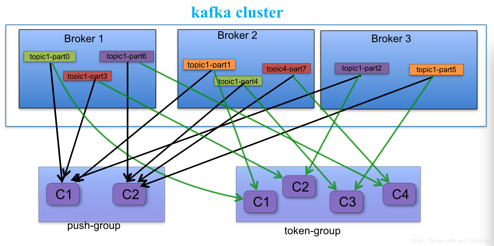

*摘要* apache kafka系列之在zookeeper中存储结构

*目录[-]*

[2.partition状态信息](http://my.oschina.net/u/1419751/blog/360060?fromerr=x2HWVGCT#OSC_h1_1)

[3. Broker注册信息](http://my.oschina.net/u/1419751/blog/360060?fromerr=x2HWVGCT#OSC_h1_2)

[4. Controller epoch: ](http://my.oschina.net/u/1419751/blog/360060?fromerr=x2HWVGCT#OSC_h1_3)

[5. Controller注册信息:](http://my.oschina.net/u/1419751/blog/360060?fromerr=x2HWVGCT#OSC_h1_4)

[6. Consumer注册信息:](http://my.oschina.net/u/1419751/blog/360060?fromerr=x2HWVGCT#OSC_h1_5)

[7. Consumer owner:](http://my.oschina.net/u/1419751/blog/360060?fromerr=x2HWVGCT#OSC_h1_6)

[8. Consumer offset:](http://my.oschina.net/u/1419751/blog/360060?fromerr=x2HWVGCT#OSC_h1_7)

[](http://static.oschina.net/uploads/img/201412/24154608_GtlH.jpg)

1.topic注册信息

/brokers/topics/[topic] :

存储某个topic的partitions所有分配信息

# 2.partition状态信息

/brokers/topics/[topic]/partitions/[0...N]  其中[0..N]表示partition索引号

/brokers/topics/[topic]/partitions/[partitionId]/state

# 3. Broker注册信息

/brokers/ids/[0...N]                 

每个broker的配置文件中都需要指定一个数字类型的id(全局不可重复),此节点为临时znode(EPHEMERAL)

# 4. Controller epoch: 

/controller_epoch -> int (epoch)   

此值为一个数字,kafka集群中第一个broker第一次启动时为1，以后只要集群中center controller中央控制器所在broker变更或挂掉，就会重新选举新的center controller，每次center controller变更controller_epoch值就会 + 1; 

# 5. Controller注册信息:

/controller -> int (broker id of the controller)  存储center controller中央控制器所在kafka broker的信息

Consumer and Consumer group概念: 

> [](http://static.oschina.net/uploads/img/201412/24154608_yl1d.jpg)

> a.每个consumer客户端被创建时,会向zookeeper注册自己的信息;
>
> b.此作用主要是为了"负载均衡".
>
> c.同一个Consumer Group中的Consumers，Kafka将相应Topic中的每个消息只发送给其中一个Consumer。
>
> d.Consumer Group中的每个Consumer读取Topic的一个或多个Partitions，并且是唯一的Consumer；
>
> e.一个Consumer group的多个consumer的所有线程依次有序地消费一个topic的所有partitions,如果Consumer group中所有consumer总线程大于partitions数量，则会出现空闲情况;
>
> > 举例说明：
>
> > kafka集群中创建一个topic为report-log   4 partitions 索引编号为0,1,2,3
>
> > 假如有目前有三个消费者node：注意-->一个consumer中一个消费线程可以消费一个或多个partition.
>
> > 如果每个consumer创建一个consumer thread线程,各个node消费情况如下，node1消费索引编号为0,1分区，node2费索引编号为2,node3费索引编号为3
>
> > 如果每个consumer创建2个consumer thread线程，各个node消费情况如下(是从consumer node先后启动状态来确定的)，node1消费索引编号为0,1分区；node2费索引编号为2,3；node3为空闲状态
>
> 总结
>
> ：
>
> 从以上可知，Consumer Group中各个consumer是根据先后启动的顺序有序消费一个topic的所有partitions的。
>
> 如果Consumer Group中所有consumer的总线程数大于partitions数量，则可能consumer thread或consumer会出现空闲状态。

> 

> **Consumer均衡算法** 
> 当一个group中,有consumer加入或者离开时,会触发partitions均衡.均衡的最终目的,是提升topic的并发消费能力. 
> 1) 假如topic1,具有如下partitions: P0,P1,P2,P3 
> 2) 加入group中,有如下consumer: C0,C1 
> 3) 首先根据partition索引号对partitions排序: P0,P1,P2,P3 
> 4) 根据(consumer.id + '-'+ thread序号)排序: C0,C1 
> 5) 计算倍数: M = [P0,P1,P2,P3].size / [C0,C1].size,本例值M=2(向上取整) 
> 6) 然后依次分配partitions: C0 = [P0,P1],C1=[P2,P3],即Ci = [P(i * M),P((i + 1) * M -1)]

# 6. Consumer注册信息:

每个consumer都有一个唯一的ID(consumerId可以通过配置文件指定,也可以由系统生成),此id用来标记消费者信息.

/consumers/[groupId]/ids/[consumerIdString]

是一个临时的znode,此节点的值为请看consumerIdString产生规则,即表示此consumer目前所消费的topic + partitions列表.

consumerId产生规则：

   String**consumerUuid** = null;
​    if(config.consumerId!=null && config.consumerId)
​      consumerUuid = consumerId;
​    else {
​      String **uuid** = UUID.randomUUID()
​      consumerUuid = "%s-%d-%s".format(
​        InetAddress.getLocalHost.getHostName, System.currentTimeMillis,
​        uuid.getMostSignificantBits().toHexString.substring(0,8));

​     }
​     String **consumerIdString** = config.groupId + "_" + consumerUuid;

| `Schema:```{"version": 版本编号默认为1,"subscription": { //订阅topic列表"topic名称": consumer中topic消费者线程数},"pattern": "static","timestamp": "consumer启动时的时间戳"}`` `Example:`{"version": 1,"subscription": {"open_platform_opt_push_plus1": 5},"pattern": "static","timestamp": "1411294187842"} |
| ---------------------------------------- |
|                                          |

# 7. Consumer owner:

/consumers/[groupId]/owners/[topic]/[partitionId] -> consumerIdString + threadId索引编号

当consumer启动时,所触发的操作:

a) 首先进行"Consumer Id注册";

b) 然后在"Consumer id 注册"节点下注册一个watch用来监听当前group中其他consumer的"**退出**"和"**加入**";只要此znode path下节点列表变更,都会触发此group下consumer的负载均衡.(比如一个consumer失效,那么其他consumer接管partitions).

c) 在"Broker id 注册"节点下,注册一个watch用来监听broker的存活情况;如果broker列表变更,将会触发所有的groups下的consumer重新balance.

# 8. Consumer offset:

/consumers/[groupId]/offsets/[topic]/[partitionId] -> long (offset)

用来跟踪每个consumer目前所消费的partition中最大的offset

此znode为持久节点,可以看出offset跟group_id有关,以表明当消费者组(consumer group)中一个消费者失效,

重新触发balance,其他consumer可以继续消费.

\9. Re-assign partitions

/admin/reassign_partitions

 

\10. Preferred replication election

/admin/preferred_replica_election

 

 

\11. 删除topics
/admin/delete_topics

Topic配置

/config/topics/[topic_name]

例子

来源： <http://my.oschina.net/u/1419751/blog/360060?fromerr=x2HWVGCT>