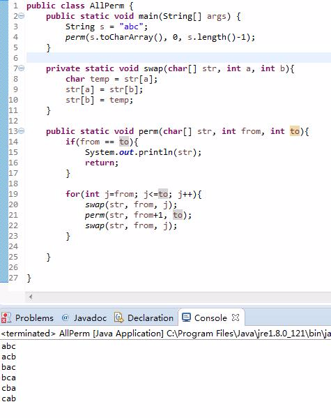
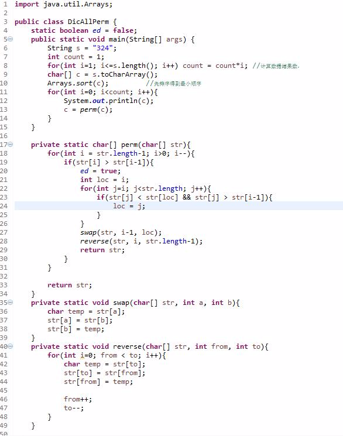
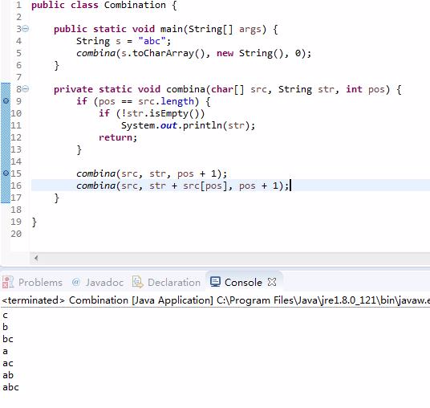
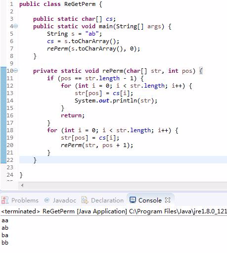

# Java实现全排列、组合算法

程序员面试 2017-04-09 13:40

# 全排列

## 解法一：

输入一串字符，然后对字符进行全排列，如“abc”,全排列结果为："abc","acb","bac","bca","cab","cba".

分析：从字符串中选择一个作为第一个字符，然后对剩下的字符串进行全排列，如此递归下去，直到打印出全部排列。如："abc"：

1、选a作为第一个字符：”abc“，”acb“；

2、选b作为第一个字符：”bac“，”bca“；

3、选c作为第一个字符：”cab“，”cba“；

参考代码如下：

```
/**
 * <B>Description:</B> 递归实现全排列算法 <br>
 * <B>Create on:</B> 2017/6/2 18:39 <br>
 *
 * @author xiangyu.ye
 * @version 1.0
 */
public class AllPerm {
    public static void main(String[] args) {
        String s = "abc";
        perm(s.toCharArray(), 0, s.length() - 1);
    }
    private static void swap(char[] str, int a, int b) {
        char temp = str[a];
        str[a] = str[b];
        str[b] = temp;
    }
    private static void perm(char[] str, int from, int to) {
        if (from == to) {
            System.out.println(str);
            return;
        }
        for (int i = from; i <= to; i++) {
            swap(str, from, to);
            perm(str, from + 1, to);
            swap(str, from, i);
        }
    }
}
```



## 解法二：

这种解法是将字符串从小大倒排序，以此得到整体的最小顺，然后找到次小顺序，直到得到最大顺序，也就是从大到小的顺序，如：”23415“，最小顺序是:"12345",次小顺序是：”12354“，........直到最大顺序：”54321“。这里重点是找到某个顺序值得下一个顺序。找下一个顺序的算法如下：假设到了”21543“，从后往前找到i-1位置小于i位置的下标，1<5,所以要找的下表pos=1，将下标为1的数字1,和它后面最小的且大于它的数替换，”21543”--->"23541",然后再将下标1后面的字符串翻转得到："23145"，这就得到了“21543”下一个顺序值“23145”，如此下去，直到输出所有结果。

参考代码如下：



排列算法的结果总共有n!个，所以时间复杂度至少n!级别。

# 组合算法

组合算法代码比较简单，可以读代码理解：

```
/**
 * <B>Description:</B> 组合算法 <br>
 * <B>Create on:</B> 2017/6/2 18:39 <br>
 *
 * @author xiangyu.ye
 * @version 1.0
 */
public class Combination {
    public static void main(String[] args) {
        String s = "abc";
        combina(s.toCharArray(), new String(), 0);
    }
    private static void combina(char[] src, String str, int pos) {
        if (pos == src.length){
            if (!str.isEmpty())
                System.out.println(str);
            return;
        }
        combina(src,str,pos+1);
        combina(src,str+src[pos],pos+1);
    }
}
```



# 放回全排列

放回全排列就是类似于三个筛子总共有6*6*6=216中结果。使用递归思想解决，代码比较简洁。

参考代码如下：



来源： <http://www.toutiao.com/a6406868575688540417/?tt_from=weixin&utm_campaign=client_share&app=news_article&utm_source=weixin&iid=8903461006&utm_medium=toutiao_android&wxshare_count=1>