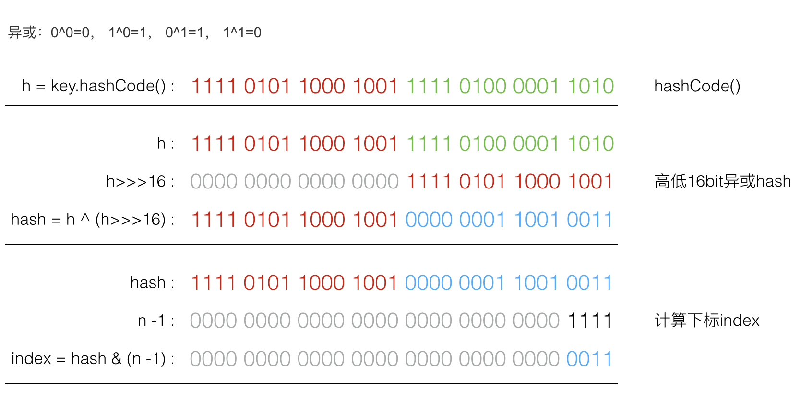
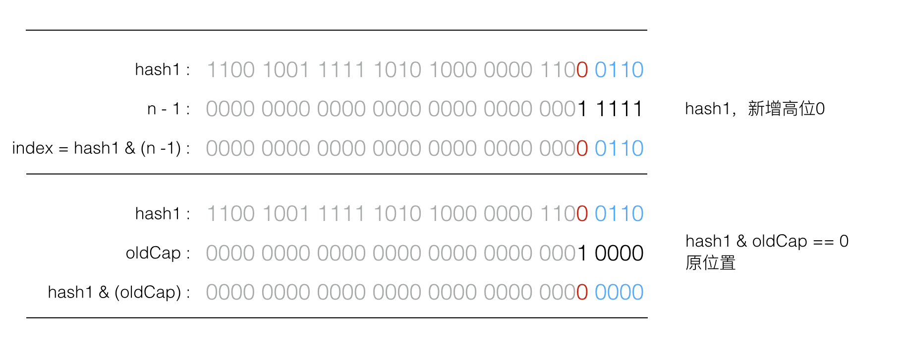
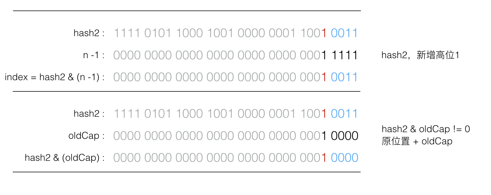

# HashMap jdk8和jdk7中的实现详解和总结

 

*摘要：* 大热的《阿里巴巴Java开发规约》中有提到： 【推荐】集合初始化时，指定集合初始值大小。说明：HashMap使用如下构造方法进行初始化，如果暂时无法确定集合大小，那么指定默认值（16）即可： public HashMap (int initialCapacity) { this(initialCapacity, DEFAULT_LOAD_FACTOR); } 看到代码规约这一条的时候，我觉得是不是有点太 low 了，身为开发，大家都知道 HashMap 的原理。

大热的[《阿里巴巴Java开发规约》](https://github.com/alibaba/p3c/)中有提到：

> 【推荐】集合初始化时，指定集合初始值大小。
> 说明：HashMap使用如下构造方法进行初始化，如果暂时无法确定集合大小，那么指定默认值（16）即可：

```
public HashMap (int initialCapacity) {
    this(initialCapacity, DEFAULT_LOAD_FACTOR);
}
```

看到代码规约这一条的时候，我觉得是不是有点太 low 了，身为开发，大家都知道 HashMap 的原理。

什么？这个要通过插件监测？没必要吧，哪个开发不知道默认大小，何时 resize 啊，然后我和孤尽打赌随机咨询几位同学以下几个问题：

1. HashMap 默认bucket数组多大？
2. 如果new HashMap<>(19)，bucket数组多大？
3. HashMap 什么时候开辟bucket数组占用内存？
4. HashMap 何时扩容？

抽样调查的结果出乎我的意料：

1. HashMap 默认bucket数组多大？（答案是16，大概一半的同学答错）
2. 如果new HashMap<>(19)，bucket数组多大？（答案是32，大多被咨询同学都不太了解这个点）
3. HashMap 什么时候开辟bucket数组占用内存？（答案是第一次 put 时，一半同学认为是 new 的时候）
4. HashMap 何时扩容？（答案是put的元素达到容量乘负载因子的时候，默认16*0.75，有1/4同学中枪）

HashMap 是写代码时最常用的集合类之一，看来大家也不是全都很了解。孤尽乘胜追击又抛出问题：JDK8中 HashMap 和之前 HashMap 有什么不同？

我知道 JDK8 中 HashMap 引入了红黑树来处理哈希碰撞，具体细节和源代码并没有仔细翻过，看来是时候对比翻看下 JDK8 和 JDK7 的 HashMap 源码了。

通过对比翻看源码，先说下结论：

1. HashMap 在 new 后并不会立即分配bucket数组，而是第一次 put 时初始化，类似 ArrayList 在第一次 add 时分配空间。
2. HashMap 的 bucket 数组大小一定是2的幂，如果 new 的时候指定了容量且不是2的幂，实际容量会是最接近(大于)指定容量的2的幂，比如 new HashMap<>(19)，比19大且最接近的2的幂是32，实际容量就是32。
3. HashMap 在 put 的元素数量大于 Capacity *LoadFactor（默认16 *0.75） 之后会进行扩容。
4. JDK8在哈希碰撞的链表长度达到TREEIFY_THRESHOLD（默认8)后，会把该链表转变成树结构，提高了性能。
5. JDK8在 resize 的时候，通过巧妙的设计，减少了 rehash 的性能消耗。

# 存储结构

JDK7 中的 HashMap 还是采用大家所熟悉的数组+链表的结构来存储数据。

JDK8 中的 HashMap 采用了数组+链表或树的结构来存储数据。

# 重要参数

HashMap中有两个重要的参数，容量(Capacity) 和 负载因子(Load factor)

> - **Initial capacity** The capacity is the number of buckets in the hash table, The initial capacity is simply the capacity at the time the hash table is created.
> - **Load factor** The load factor is a measure of how full the hash table is allowed to get before its capacity is automatically increased.

Initial capacity 决定 bucket 的大小，Load factor 决定 bucket 内数据填充比例，基于这两个参数的乘积，HashMap 内部由 threshold 这个变量来表示 HashMap 能放入的元素个数。

- Capacity 就是 HashMap 中数组的 length
- loadFactor 一般都是使用默认的0.75
- threshold 决定能放入的数据量，一般情况下等于 Capacity * LoadFactor

以上参数在 JDK7 和 JDK8中是一致的，接下来会根据实际代码分析。

# JDK8 中的 HashMap 实现

## new

HashMap 的bucket数组并不会在new 的时候分配，而是在第一次 put 的时候通过 resize() 函数进行分配。

JDK8中 HashMap 的bucket数组大小肯定是2的幂，对于2的幂大小的 bucket，计算下标只需要 hash 后按位与 n-1，比%模运算取余要快。如果你通过 HashMap(int initialCapacity) 构造器传入initialCapacity，会先计算出比initialCapacity大的 2的幂存入 threshold，在第一次 put 的 resize() 初始化中会按照这个2的幂初始化数组大小，此后 resize 扩容也都是每次乘2，这么设计的原因后面会详细讲。

```
public HashMap(int initialCapacity, float loadFactor) {
    if (initialCapacity < 0)
        throw new IllegalArgumentException("Illegal initial capacity: " +
                                           initialCapacity);
    if (initialCapacity > MAXIMUM_CAPACITY)
        initialCapacity = MAXIMUM_CAPACITY;
    if (loadFactor <= 0 || Float.isNaN(loadFactor))
        throw new IllegalArgumentException("Illegal load factor: " +
                                           loadFactor);
    this.loadFactor = loadFactor;
    // 比initialCapacity大的2的 N 次方，先存在threshold中，resize() 中会处理
    this.threshold = tableSizeFor(initialCapacity);
}

/**
 * Returns a power of two size for the given target capacity.
 */
static final int tableSizeFor(int cap) {
    int n = cap - 1;
    n |= n >>> 1;
    n |= n >>> 2;
    n |= n >>> 4;
    n |= n >>> 8;
    n |= n >>> 16;
    return (n < 0) ? 1 : (n >= MAXIMUM_CAPACITY) ? MAXIMUM_CAPACITY : n + 1;
}
```

## hash

JKD8 中put 和 get 时，对 key 的 hashCode 先用 hash 函数散列下，再计算下标：



具体 hash 代码如下：

```
static final int hash(Object key) {
    int h;
    return (key == null) ? 0 : (h = key.hashCode()) ^ (h >>> 16);
}
```

由于 h>>>16，高16bit 补0，一个数和0异或不变，所以 hash 函数大概的作用就是：高16bit不变，低16bit和高16bit做了一个异或，目的是减少碰撞。

按照函数注释，因为bucket数组大小是2的幂，计算下标`index = (table.length - 1) & hash `，如果不做 hash 处理，相当于散列生效的只有几个低 bit 位，为了减少散列的碰撞，设计者综合考虑了速度、作用、质量之后，使用高16bit和低16bit异或来简单处理减少碰撞，而且 JDK8中用了复杂度 O（logn）的树结构来提升碰撞下的性能。具体性能提升可以参考[Java 8：HashMap的性能提升](http://www.importnew.com/14417.html)

## put

put函数的思路大致分以下几步：

1. 对key的hashCode()进行hash后计算数组下标index;
2. 如果当前数组table为null，进行resize()初始化；
3. 如果没碰撞直接放到对应下标的bucket里；
4. 如果碰撞了，且节点已经存在，就替换掉 value；
5. 如果碰撞后发现为树结构，挂载到树上。
6. 如果碰撞后为链表，添加到链表尾，并判断链表如果过长(大于等于TREEIFY_THRESHOLD，默认8)，就把链表转换成树结构；
7. 数据 put 后，如果数据量超过threshold，就要resize。

具体代码如下：

```
public V put(K key, V value) {
    // 对key的hashCode()做hash
    return putVal(hash(key), key, value, false, true);
}

final V putVal(int hash, K key, V value, boolean onlyIfAbsent, boolean evict) {
    Node<K,V>[] tab; Node<K,V> p; int n, i;
    // 初始 tab 为 null，resize 初始化
    if ((tab = table) == null || (n = tab.length) == 0)
        n = (tab = resize()).length;
    // 计算下标index，没碰撞，直接放
    if ((p = tab[i = (n - 1) & hash]) == null)
        tab[i] = newNode(hash, key, value, null);
    else {
        Node<K,V> e; K k;
        // 碰撞，节点已经存在
        if (p.hash == hash && ((k = p.key) == key || (key != null && key.equals(k))))
            e = p;
        // 碰撞，树结构
        else if (p instanceof TreeNode)
            e = ((TreeNode<K,V>)p).putTreeVal(this, tab, hash, key, value);
        // 碰撞，链表
        else {
            for (int binCount = 0; ; ++binCount) {
                if ((e = p.next) == null) {
                    p.next = newNode(hash, key, value, null);
                    // 链表过长，转换成树结构
                    if (binCount >= TREEIFY_THRESHOLD - 1) // -1 for 1st
                        treeifyBin(tab, hash);
                    break;
                }
                if (e.hash == hash &&
                    ((k = e.key) == key || (key != null && key.equals(k))))
                    break;
                p = e;
            }
        }
        // 节点已存在，替换value
        if (e != null) { // existing mapping for key
            V oldValue = e.value;
            if (!onlyIfAbsent || oldValue == null)
                e.value = value;
            afterNodeAccess(e);
            return oldValue;
        }
    }
    ++modCount;
    // 超过threshold，进行resize扩容
    if (++size > threshold)
        resize();
    afterNodeInsertion(evict);
    return null;
}

final void treeifyBin(Node<K,V>[] tab, int hash) {
    int n, index; Node<K,V> e;
    // 数量大于 64 才会发生转换，避免初期，多个键值对恰好放入同一个链表中而导致不必要的转化
    if (tab == null || (n = tab.length) < MIN_TREEIFY_CAPACITY)
        resize();
    else if ((e = tab[index = (n - 1) & hash]) != null) {
        TreeNode<K,V> hd = null, tl = null;
        do {
            TreeNode<K,V> p = replacementTreeNode(e, null);
            if (tl == null)
                hd = p;
            else {
                p.prev = tl;
                tl.next = p;
            }
            tl = p;
        } while ((e = e.next) != null);
        if ((tab[index] = hd) != null)
            hd.treeify(tab);
    }
}
```

## resize

resize()用来第一次初始化，或者 put 之后数据超过了threshold后扩容，resize的注释如下：

> Initializes or doubles table size. If null, allocates in accord with initial capacity target held in field threshold. Otherwise, because we are using power-of-two expansion, the elements from each bin must either stay at same index, or move with a power of two offset in the new table.

数组下标计算： `index = (table.length - 1) & hash ` ，由于 table.length 也就是capacity 肯定是2的N次方，使用 & 位运算意味着只是多了最高位，这样就不用重新计算 index，元素要么在原位置，要么在原位置+ oldCapacity。

如果增加的高位为0，resize 后 index 不变，如图所示：


如果增加的高位为1，resize 后 index 增加 oldCap，如图所示：


这个设计的巧妙之处在于，节省了一部分重新计算hash的时间，同时新增的一位为0或1的概率可以认为是均等的，所以在resize 的过程中就将原来碰撞的节点又均匀分布到了两个bucket里。

```java
final Node<K,V>[] resize() {
    Node<K,V>[] oldTab = table;
    int oldCap = (oldTab == null) ? 0 : oldTab.length;
    int oldThr = threshold;
    int newCap, newThr = 0;
    // oldCap > 0，是扩容而不是初始化
    if (oldCap > 0) {
        // 超过最大值就不再扩充了，并且把阈值增大到Integer.MAX_VALUE
        if (oldCap >= MAXIMUM_CAPACITY) {
            threshold = Integer.MAX_VALUE;
            return oldTab;
        }
        // 没超过最大值，就扩充为原来的2倍
        else if ((newCap = oldCap << 1) < MAXIMUM_CAPACITY && oldCap >= DEFAULT_INITIAL_CAPACITY)
            newThr = oldThr << 1; // double threshold
    }
    // oldCap 为0，oldThr 不为0，第一次初始化 table，一般是通过带参数的构造器
    else if (oldThr > 0) // initial capacity was placed in threshold
        newCap = oldThr;
    // oldCap 和 oldThr 都为0的初始化，一般是通过无参构造器生成，用默认值
    else {               // zero initial threshold signifies using defaults
        newCap = DEFAULT_INITIAL_CAPACITY;
        newThr = (int)(DEFAULT_LOAD_FACTOR * DEFAULT_INITIAL_CAPACITY);
    }
    // 如果到这里 newThr 还没计算，则计算新的阈值threshold
    if (newThr == 0) {
        float ft = (float)newCap * loadFactor;
        newThr = (newCap < MAXIMUM_CAPACITY && ft < (float)MAXIMUM_CAPACITY ? (int)ft : Integer.MAX_VALUE);
    }
    threshold = newThr;
    @SuppressWarnings({"rawtypes","unchecked"})
        Node<K,V>[] newTab = (Node<K,V>[])new Node[newCap];
    table = newTab;
    if (oldTab != null) {
        // 把每个bucket都移动到新的buckets中
        for (int j = 0; j < oldCap; ++j) {
            Node<K,V> e;
            if ((e = oldTab[j]) != null) {
                oldTab[j] = null;
                if (e.next == null)
                    newTab[e.hash & (newCap - 1)] = e;
                else if (e instanceof TreeNode)
                    ((TreeNode<K,V>)e).split(this, newTab, j, oldCap);
                else { // preserve order
                    Node<K,V> loHead = null, loTail = null;
                    Node<K,V> hiHead = null, hiTail = null;
                    Node<K,V> next;
                    do {
                        next = e.next;
                        // 原索引（e.hash 和类似 0010000 按位与，结果为0，说明原高位为0）
                        if ((e.hash & oldCap) == 0) {
                            if (loTail == null)
                                loHead = e;
                            else
                                loTail.next = e;
                            loTail = e;
                        }
                        // 原索引+oldCap
                        else {
                            if (hiTail == null)
                                hiHead = e;
                            else
                                hiTail.next = e;
                            hiTail = e;
                        }
                    } while ((e = next) != null);
                    // 原索引放到bucket里
                    if (loTail != null) {
                        loTail.next = null;
                        newTab[j] = loHead;
                    }
                    // 原索引+oldCap放到bucket里
                    if (hiTail != null) {
                        hiTail.next = null;
                        newTab[j + oldCap] = hiHead;
                    }
                }
            }
        }
    }
    return newTab;
}
```

# JDK7 中的 HashMap 实现

## new

JDK7 里 HashMap的bucket数组也不会在new 的时候分配，也是在第一次 put 的时候通过 inflateTable() 函数进行分配。

JDK7中 HashMap 的bucket数组大小也一定是2的幂，同样有计算下标简便的优点。如果你通过 HashMap(int initialCapacity) 构造器传入initialCapacity，会先存入 threshold，在第一次 put 时调用 inflateTable() 初始化，会计算出比initialCapacity大的2的幂作为初始化数组的大小，此后 resize 扩容也都是每次乘2。

```
public HashMap(int initialCapacity, float loadFactor) {
    if (initialCapacity < 0)
        throw new IllegalArgumentException("Illegal initial capacity: " +
                                           initialCapacity);
    if (initialCapacity > MAXIMUM_CAPACITY)
        initialCapacity = MAXIMUM_CAPACITY;
    if (loadFactor <= 0 || Float.isNaN(loadFactor))
        throw new IllegalArgumentException("Illegal load factor: " +
                                           loadFactor);

    this.loadFactor = loadFactor;
    threshold = initialCapacity;
    init();
}

public V put(K key, V value) {
    if (table == EMPTY_TABLE) {
        inflateTable(threshold);
    }
    // ···省略代码
}

// 第一次 put 时，初始化 table
private void inflateTable(int toSize) {
    // Find a power of 2 >= toSize
    int capacity = roundUpToPowerOf2(toSize);

    // threshold 在不超过限制最大值的前提下等于 capacity * loadFactor
    threshold = (int) Math.min(capacity * loadFactor, MAXIMUM_CAPACITY + 1);
    table = new Entry[capacity];
    // 接下来hash 部分分析
    initHashSeedAsNeeded(capacity);
}

```

## hash

JKD7 中，bucket数组下标也是按位与计算，但是 hash 函数与 JDK8稍有不同，代码注释如下：

> Retrieve object hash code and applies a supplemental hash function to the result hash, which defends against poor quality hash functions. This is critical because HashMap uses power-of-two length hash tables, that otherwise encounter collisions for hashCodes that do not differ in lower bits. Note: Null keys always map to hash 0, thus index 0.

- hash为了防止只有 hashCode() 的低 bit 位参与散列容易碰撞，也采用了位移异或，只不过不是高低16bit，而是如下代码中多次位移异或。
- JKD7的 hash 中存在一个开关：hashSeed。开关打开(hashSeed不为0)的时候，对 String 类型的key 采用sun.misc.Hashing.stringHash32的 hash 算法；对非 String 类型的 key，多一次和hashSeed的异或，也可以一定程度上减少碰撞的概率。
- JDK 7u40以后，hashSeed 被移除，在 JDK8中也没有再采用，因为stringHash32()的算法基于MurMur哈希，其中hashSeed的产生使用了Romdum.nextInt()实现。Rondom.nextInt()使用AtomicLong，它的操作是CAS的（Compare And Swap）。这个CAS操作当有多个CPU核心时，会存在许多性能问题。因此，这个替代函数在多核处理器中表现出了糟糕的性能。

具体hash 代码如下所示：

```
final int hash(Object k) {
    int h = hashSeed;
    if (0 != h && k instanceof String) {
        return sun.misc.Hashing.stringHash32((String) k);
    }

    h ^= k.hashCode();

    // This function ensures that hashCodes that differ only by
    // constant multiples at each bit position have a bounded
    // number of collisions (approximately 8 at default load factor).
    h ^= (h >>> 20) ^ (h >>> 12);
    return h ^ (h >>> 7) ^ (h >>> 4);
}

/**
 * 下标计算依然是使用按位与
 */
static int indexFor(int h, int length) {
    // assert Integer.bitCount(length) == 1 : "length must be a non-zero power of 2";
    return h & (length-1);
}

```

hashSeed 默认值是0，也就是默认关闭，任何数字与0异或不变。hashSeed 会在capacity发生变化的时候，通过initHashSeedAsNeeded()函数进行计算。当capacity大于设置值Holder.ALTERNATIVE_HASHING_THRESHOLD后，会通过sun.misc.Hashing.randomHashSeed产生hashSeed 值，这个设定值是通过 JVM的jdk.map.althashing.threshold参数来设置的，具体代码如下：

```
final boolean initHashSeedAsNeeded(int capacity) {
    boolean currentAltHashing = hashSeed != 0;
    boolean useAltHashing = sun.misc.VM.isBooted() &&
            (capacity >= Holder.ALTERNATIVE_HASHING_THRESHOLD);
    boolean switching = currentAltHashing ^ useAltHashing;
    if (switching) {
        hashSeed = useAltHashing
            ? sun.misc.Hashing.randomHashSeed(this)
            : 0;
    }
    return switching;
}

/**
 * holds values which can't be initialized until after VM is booted.
 */
private static class Holder {

    /**
     * Table capacity above which to switch to use alternative hashing.
     */
    static final int ALTERNATIVE_HASHING_THRESHOLD;

    static {
        String altThreshold = java.security.AccessController.doPrivileged(
            new sun.security.action.GetPropertyAction(
                "jdk.map.althashing.threshold"));

        int threshold;
        try {
            threshold = (null != altThreshold)
                    ? Integer.parseInt(altThreshold)
                    : ALTERNATIVE_HASHING_THRESHOLD_DEFAULT;// ALTERNATIVE_HASHING_THRESHOLD_DEFAULT = Integer.MAX_VALUE
            // disable alternative hashing if -1
            if (threshold == -1) {
                threshold = Integer.MAX_VALUE;
            }
            if (threshold < 0) {
                throw new IllegalArgumentException("value must be positive integer.");
            }
        } catch(IllegalArgumentException failed) {
            throw new Error("Illegal value for 'jdk.map.althashing.threshold'", failed);
        }
        ALTERNATIVE_HASHING_THRESHOLD = threshold;
    }
}
```

## put

JKD7 的put相比于 JDK8就要简单一些，碰撞以后只有链表结构。具体代码如下：

```
public V put(K key, V value) {
    // 初始化
    if (table == EMPTY_TABLE) {
        inflateTable(threshold);
    }
    if (key == null)
        return putForNullKey(value);
    // 计算 hash 和下标
    int hash = hash(key);
    int i = indexFor(hash, table.length);
    for (Entry<K,V> e = table[i]; e != null; e = e.next) {
        Object k;
        // 查到相同 key，替换 value
        if (e.hash == hash && ((k = e.key) == key || key.equals(k))) {
            V oldValue = e.value;
            e.value = value;
            e.recordAccess(this);
            return oldValue;
        }
    }

    modCount++;
    // 添加数据
    addEntry(hash, key, value, i);
    return null;
}


void addEntry(int hash, K key, V value, int bucketIndex) {
    // 如果数据量达到threshold，需要 resize 扩容
    if ((size >= threshold) && (null != table[bucketIndex])) {
        resize(2 * table.length);
        hash = (null != key) ? hash(key) : 0;
        bucketIndex = indexFor(hash, table.length);
    }

    createEntry(hash, key, value, bucketIndex);
}

void createEntry(int hash, K key, V value, int bucketIndex) {
    Entry<K,V> e = table[bucketIndex];
    //在链表头部添加新元素
    table[bucketIndex] = new Entry<>(hash, key, value, e);
    size++;
}
```

## resize

JDK7的 resize() 也是扩容两倍，不过扩容过程相对JDK8就要简单许多，由于默认initHashSeedAsNeeded内开关都是关闭状态，所以一般情况下transfer 不需要进行 rehash，能减少一部分开销。代码如下所示：

```java
void resize(int newCapacity) {
    Entry[] oldTable = table;
    int oldCapacity = oldTable.length;
    if (oldCapacity == MAXIMUM_CAPACITY) {
        threshold = Integer.MAX_VALUE;
        return;
    }

    Entry[] newTable = new Entry[newCapacity];
    // 扩容后转移数据，根据initHashSeedAsNeeded判断是否 rehash
    transfer(newTable, initHashSeedAsNeeded(newCapacity));
    table = newTable;
    threshold = (int)Math.min(newCapacity * loadFactor, MAXIMUM_CAPACITY + 1);
}


void transfer(Entry[] newTable, boolean rehash) {
    int newCapacity = newTable.length;
    for (Entry<K,V> e : table) {
        while(null != e) {
            Entry<K,V> next = e.next;
            // 根据之前的分析，默认情况是不需要 rehash 的
            if (rehash) {
                e.hash = null == e.key ? 0 : hash(e.key);
            }
            int i = indexFor(e.hash, newCapacity);
            e.next = newTable[i];
            newTable[i] = e;
            e = next;
        }
    }
}
```

# 总结

1. HashMap 在 new 后并不会立即分配bucket数组，而是第一次 put 时初始化，类似 ArrayList 在第一次 add 时分配空间。
2. HashMap 的 bucket 数组大小一定是2的幂，如果 new 的时候指定了容量且不是2的幂，实际容量会是最接近(大于)指定容量的2的幂，比如 new HashMap<>(19)，比19大且最接近的2的幂是32，实际容量就是32。
3. HashMap 在 put 的元素数量大于 Capacity *LoadFactor（默认16 *0.75） 之后会进行扩容。
4. JDK8处于提升性能的考虑，在哈希碰撞的链表长度达到TREEIFY_THRESHOLD（默认8)后，会把该链表转变成树结构。
5. JDK8在 resize 的时候，通过巧妙的设计，减少了 rehash 的性能消耗。

相对于 JDK7的1000余行代码，JDK8代码量达到了2000余行，对于这个大家最常用的数据结构增加了不少的性能优化。
仔细看完上面的分析和源码，对 HashMap 内部的细节又多了些了解，有空的时候还是多翻翻源码，^_^

[《阿里巴巴Java开发规约》](https://github.com/alibaba/p3c/)自诞生以来，一直处于挑战漩涡的最中心，从这一个规约的小条目，看出来规约也是冰冻三尺，非一日之寒，研读规约，其实能够发现很多看似简单的知识点背后，其实隐藏着非常深的逻辑知识点。

# 参考

- [Java HashMap工作原理及实现](http://yikun.github.io/2015/04/01/Java-HashMap%E5%B7%A5%E4%BD%9C%E5%8E%9F%E7%90%86%E5%8F%8A%E5%AE%9E%E7%8E%B0/)
- [Java 8：HashMap的性能提升](http://www.importnew.com/14417.html)
- [疫苗：JAVA HASHMAP的死循环](http://coolshell.cn/articles/9606.html)


https://yq.aliyun.com/articles/225660?utm_content=m_32797