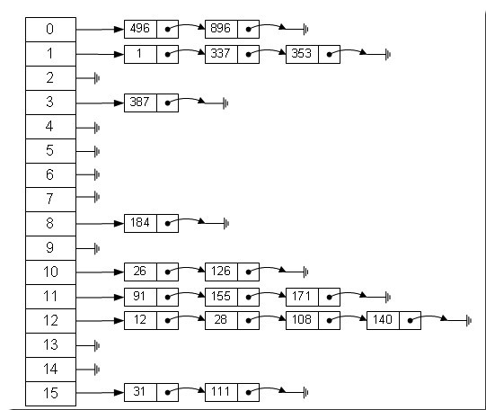

[TOC]


# hash算法 (hashmap 实现原理)

​     Hash ，一般翻译做“ 散列” ，也有直接音译为“ 哈希” 的，就是把任意长度的输入（又叫做预映射， pre-image），通过散列算法，变换成固定长度的输出，该输出就是散列值。这种转换是一种压缩映射，也就是，散列值的空间通常远小于输入的空间，不 同的输入可能会散列成相同的输出，而不可能从散列值来唯一的确定输入值。简单的说就是一种将任意长度的消息压缩到某一固定长度的消息摘要的函数。

HASH 主要用于信息安全领域中加密算法，它把一些不同长度的信息转化成杂乱的128 位的编码, 这些编码值叫做HASH 值. 也可以说，hash 就是找到一种数据内容和数据存放地址之间的映射关系

例如字符串 hello 的哈希算法

```
char* value = "hello";
int key = (((((((27* (int)'h'+27)* (int)'e') + 27) 　* (int)'l') + 27) * (int)'l' +27) * 27 ) + (int)'o' ;
```

  数组的特点是：寻址容易，插入和删除困难；而链表的特点是：寻址困难，插入和删除容易。那么我们能不能综合两者的特性，做出一种寻址容易，插入删除也容易 的数据结构？答案是肯定的，这就是我们要提起的哈希表，哈希表有多种不同的实现方法，我接下来解释的是最常用的一种方法—— 拉链法，我们可以理解为“ 链表 的数组” ，如图：



 

 

 

HashMap其实也是一个线性的数组实现的,所以可以理解为其存储数据的容器就是一个线性数组。这可能让我们很不解，一个线性的数组怎么实现按键值对来存取数据呢？这里HashMap有做一些处理。

​    1.首先HashMap里面实现一个静态内部类Entry 其重要的属性有 key , value, next,从属性key,value我们就能很明显的看出来Entry就是HashMap键值对实现的一个基础bean,我们上面说到HashMap的基 础就是一个线性数组,这个数组就是Entry[]，Map里面的内容都保存在Entry[]里面。

​     2.既然是线性数组，为什么能随机存取？这里HashMap用了一个小算法，大致是这样实现：

 

Java代码

```
存储时:  
  
int hash = key.hashCode();--> 这个hashCode方法这里不详述,只要理解每个key的hash是一个固定的int值  
  
int index = hash % Entry[].length;  
  
Entry[index] = value;  
  
取值时:  
  
int hash = key.hashCode();  
  
int index = hash % Entry[].length;  
  
return Entry[index]  
```

 

到这里我们轻松的理解了HashMap通过键值对实现存取的基本原理

​    3.疑问：如果两个key通过hash % Entry[].length得到的index相同，会不会有覆盖的危险？

这里HashMap里面用到链式数据结构的一个概念.上面我们提到过Entry类里面有一个next属性,作用是指向下一个Entry。打个比方, 第一个键值对A进来,通过计算其key的hash得到的index=0，记做:Entry[0] = A.一会后又进来一个键值对B,通过计算其index也等于0,现在怎么办？HashMap会这样做:B.next = A,Entry[0] = B,如果又进来C,index也等于0,那么C.next = B,Entry[0] = C；这样我们发现index=0的地方其实存取了A,B,C三个键值对,他们通过next这个属性链接在一起。所以疑问不用担心。

到这里为止，HashMap的大致实现，我们应该已经清楚了。

当然HashMap里面也包含一些优化方面的实现，这里也啰嗦一下。

比如：Entry[]的长度一定后，随着map里面数据的越来越长，这样同一个index的链就会很长，会不会影响性能？

HashMap里面设置一个因素（也称为因子），随着map的size越来越大，Entry[]会以一定的规则加长长度。

 

 

解决hash冲突的办法

1）开放定址法（线性探测再散列，二次探测再散列，伪随机探测再散列）

2）再哈希法

3）链地址法

4）建立一 公共溢出区

 

java 中hashmap的解决办法就是采用的链地址法

 

来源： <http://zha-zi.iteye.com/blog/1124484>