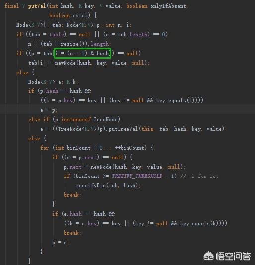
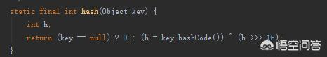

# java中的HashMap中hash函数，只是单纯数学计算吗，这样设计目的是什么呢？

HashMap的hash函数需要衡量两方面：降低hash冲突和尽量减少hash计算性能消耗。

HashMap插入数据时会先计算KEY的hash值，然后根据这个hash值确定数据在table中的下标。计算方法如下，用table的长度减1后与hash值进行位运算与操作，由于hashmap的长度一般不大，所以hash值参与计算的都是后面几位，容易造成冲突。

为了减少这种冲突，HashMap的hash函数，将KEY的hashcode前16位和后16位进行异或计算，这样会有效的降低冲突机率，同时运算量也非常小。代码如下

希望能解答题主的疑惑。

https://www.wukong.com/answer/6512973858973155587/?iid=25004544584&app=news_article&share_ansid=6512973858973155587&tt_from=android_share&utm_medium=toutiao_android&utm_campaign=client_share