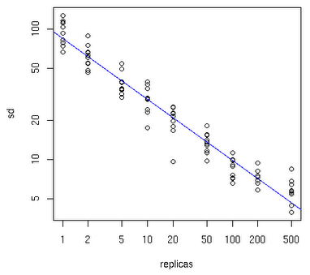

## 一致性hash算法代码示例

使用虚拟节点来改善一致性Hash算法 
为了解决负载不均衡的问题就是引入虚拟节点，其工作原理是：将一个物理节点拆分为多个虚拟节点，并且同一个物理节点的虚拟节点尽量均匀分布在Hash环上。采取这样的方式，就可以有效地解决增加或减少节点时候的负载不均衡的问题。 
至于一个物理节点应该拆分为多少虚拟节点，下面可以先看一张图： 
 
横轴表示需要为每台物理服务器扩展的虚拟节点倍数，纵轴表示的是实际物理服务器数。可以看出，物理服务器很少，需要更大的虚拟节点；反之物理服务器比较多，虚拟节点就可以少一些。比如有10台物理服务器，那么差不多需要为每台服务器增加100~200个虚拟节点才可以达到真正的负载均衡。

一致性Hash算法实现版本2：带虚拟节点 
在理解了使用虚拟节点来改善一致性Hash算法的理论基础之后，就可以尝试开发代码了。编程方面需要考虑的问题是： 
1、一个真实结点如何对应成为多个虚拟节点？ 
2、虚拟节点找到后如何还原为真实结点？ 
这两个问题其实有很多解决办法，我这里使用了一种简单的办法，给每个真实结点后面根据虚拟节点加上后缀再取Hash值，比如"192.168.0.0:111"就把它变成"192.168.0.0:111&&VN0"到"192.168.0.0:111&&VN4"，VN就是Virtual Node的缩写，还原的时候只需要从头截取字符串到"&&"的位置就可以了。 
下面来看一下带虚拟节点的一致性Hash算法的Java代码实现：

```java
import java.util.LinkedList;
import java.util.List;
import java.util.SortedMap;
import java.util.TreeMap;

/**
 * 带虚拟节点的一致性Hash算法
 * @author 五月的仓颉 http://www.cnblogs.com/xrq730/
 */
public class ConsistentHashingWithVirtualNode
{
    /**
     * 待添加入Hash环的服务器列表
     */
    private static String[] servers = {"192.168.0.0:111", "192.168.0.1:111", "192.168.0.2:111",
            "192.168.0.3:111", "192.168.0.4:111"};
    /**
     * 真实结点列表,考虑到服务器上线、下线的场景，即添加、删除的场景会比较频繁，这里使用LinkedList会更好
     */
    private static List<String> realNodes = new LinkedList<String>();
    /**
     * 虚拟节点，key表示虚拟节点的hash值，value表示虚拟节点的名称
     */
    private static SortedMap<Integer, String> virtualNodes = 
            new TreeMap<Integer, String>();
    /**
     * 虚拟节点的数目，这里写死，为了演示需要，一个真实结点对应5个虚拟节点
     */
    private static final int VIRTUAL_NODES = 5;
    static
    {
        // 先把原始的服务器添加到真实结点列表中
        for (int i = 0; i < servers.length; i++)
            realNodes.add(servers[i]);
        // 再添加虚拟节点，遍历LinkedList使用foreach循环效率会比较高
        for (String str : realNodes)
        {
            for (int i = 0; i < VIRTUAL_NODES; i++)
            {
                String virtualNodeName = str + "&&VN" + String.valueOf(i);
                int hash = getHash(virtualNodeName);
                System.out.println("虚拟节点[" + virtualNodeName + "]被添加, hash值为" + hash);
                virtualNodes.put(hash, virtualNodeName);
            }
        }
        System.out.println();
    }
    /**
     * 使用FNV1_32_HASH算法计算服务器的Hash值,这里不使用重写hashCode的方法，最终效果没区别 
     */
    private static int getHash(String str)
    {
        final int p = 16777619;
        int hash = (int)2166136261L;
        for (int i = 0; i < str.length(); i++)
            hash = (hash ^ str.charAt(i)) * p;
        hash += hash << 13;
        hash ^= hash >> 7;
        hash += hash << 3;
        hash ^= hash >> 17;
        hash += hash << 5;
        // 如果算出来的值为负数则取其绝对值
        if (hash < 0)
            hash = Math.abs(hash);
        return hash;
    }
    /**
     * 得到应当路由到的结点
     */
    private static String getServer(String node)
    {
        // 得到带路由的结点的Hash值
        int hash = getHash(node);
        // 得到大于该Hash值的所有Map
        SortedMap<Integer, String> subMap = 
                virtualNodes.tailMap(hash);
        // 第一个Key就是顺时针过去离node最近的那个结点
        Integer i = subMap.firstKey();
        // 返回对应的虚拟节点名称，这里字符串稍微截取一下
        String virtualNode = subMap.get(i);
        return virtualNode.substring(0, virtualNode.indexOf("&&"));
    }
    public static void main(String[] args)
    {
        String[] nodes = {"127.0.0.1:1111", "221.226.0.1:2222", "10.211.0.1:3333"};
        for (int i = 0; i < nodes.length; i++)
            System.out.println("[" + nodes[i] + "]的hash值为" + 
                    getHash(nodes[i]) + ", 被路由到结点[" + getServer(nodes[i]) + "]");
    }
}
```

关注一下运行结果：

```
虚拟节点[192.168.0.0:111&&VN0]被添加, hash值为1686427075
虚拟节点[192.168.0.0:111&&VN1]被添加, hash值为354859081
虚拟节点[192.168.0.0:111&&VN2]被添加, hash值为1306497370
虚拟节点[192.168.0.0:111&&VN3]被添加, hash值为817889914
虚拟节点[192.168.0.0:111&&VN4]被添加, hash值为396663629
虚拟节点[192.168.0.1:111&&VN0]被添加, hash值为1032739288
虚拟节点[192.168.0.1:111&&VN1]被添加, hash值为707592309
虚拟节点[192.168.0.1:111&&VN2]被添加, hash值为302114528
虚拟节点[192.168.0.1:111&&VN3]被添加, hash值为36526861
虚拟节点[192.168.0.1:111&&VN4]被添加, hash值为848442551
虚拟节点[192.168.0.2:111&&VN0]被添加, hash值为1452694222
虚拟节点[192.168.0.2:111&&VN1]被添加, hash值为2023612840
虚拟节点[192.168.0.2:111&&VN2]被添加, hash值为697907480
虚拟节点[192.168.0.2:111&&VN3]被添加, hash值为790847074
虚拟节点[192.168.0.2:111&&VN4]被添加, hash值为2010506136
虚拟节点[192.168.0.3:111&&VN0]被添加, hash值为891084251
虚拟节点[192.168.0.3:111&&VN1]被添加, hash值为1725031739
虚拟节点[192.168.0.3:111&&VN2]被添加, hash值为1127720370
虚拟节点[192.168.0.3:111&&VN3]被添加, hash值为676720500
虚拟节点[192.168.0.3:111&&VN4]被添加, hash值为2050578780
虚拟节点[192.168.0.4:111&&VN0]被添加, hash值为586921010
虚拟节点[192.168.0.4:111&&VN1]被添加, hash值为184078390
虚拟节点[192.168.0.4:111&&VN2]被添加, hash值为1331645117
虚拟节点[192.168.0.4:111&&VN3]被添加, hash值为918790803
虚拟节点[192.168.0.4:111&&VN4]被添加, hash值为1232193678
[127.0.0.1:1111]的hash值为380278925, 被路由到结点[192.168.0.0:111]
[221.226.0.1:2222]的hash值为1493545632, 被路由到结点[192.168.0.0:111]
[10.211.0.1:3333]的hash值为1393836017, 被路由到结点[192.168.0.2:111]
```

从代码运行结果看，每个点路由到的服务器都是Hash值顺时针离它最近的那个服务器节点，没有任何问题。 
通过采取虚拟节点的方法，一个真实结点不再固定在Hash换上的某个点，而是大量地分布在整个Hash环上，这样即使上线、下线服务器，也不会造成整体的负载不均衡。