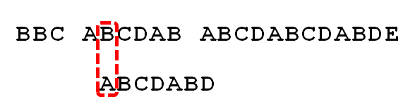

# 字符串匹配的KMP算法

作者： [阮一峰](http://www.ruanyifeng.com/)

日期： [2013年5月 1日](http://www.ruanyifeng.com/blog/2013/05/)

[字符串匹配](http://en.wikipedia.org/wiki/String_searching_algorithm)是计算机的基本任务之一。

举例来说，有一个字符串"BBC ABCDAB ABCDABCDABDE"，我想知道，里面是否包含另一个字符串"ABCDABD"？

许多算法可以完成这个任务，[Knuth-Morris-Pratt算法](http://en.wikipedia.org/wiki/Knuth%E2%80%93Morris%E2%80%93Pratt_algorithm)（简称KMP）是最常用的之一。它以三个发明者命名，起头的那个K就是著名科学家Donald Knuth。

这种算法不太容易理解，网上有很多[解释](http://www.google.com/search?q=Knuth-Morris-Pratt+algorithm)，但读起来都很费劲。直到读到[Jake Boxer](http://jakeboxer.com/blog/2009/12/13/the-knuth-morris-pratt-algorithm-in-my-own-words/)的文章，我才真正理解这种算法。下面，我用自己的语言，试图写一篇比较好懂的KMP算法解释。

1.

首先，字符串"BBC ABCDAB ABCDABCDABDE"的第一个字符与搜索词"ABCDABD"的第一个字符，进行比较。因为B与A不匹配，所以搜索词后移一位。

2.

因为B与A不匹配，搜索词再往后移。

3.

就这样，直到字符串有一个字符，与搜索词的第一个字符相同为止。

4.

接着比较字符串和搜索词的下一个字符，还是相同。

5.

直到字符串有一个字符，与搜索词对应的字符不相同为止。

6.

这时，最自然的反应是，将搜索词整个后移一位，再从头逐个比较。这样做虽然可行，但是效率很差，因为你要把"搜索位置"移到已经比较过的位置，重比一遍。

7.

一个基本事实是，当空格与D不匹配时，你其实知道前面六个字符是"ABCDAB"。KMP算法的想法是，设法利用这个已知信息，不要把"搜索位置"移回已经比较过的位置，继续把它向后移，这样就提高了效率。

8.

怎么做到这一点呢？可以针对搜索词，算出一张《部分匹配表》（Partial Match Table）。这张表是如何产生的，后面再介绍，这里只要会用就可以了。

9.

已知空格与D不匹配时，前面六个字符"ABCDAB"是匹配的。查表可知，最后一个匹配字符B对应的"部分匹配值"为2，因此按照下面的公式算出向后移动的位数：

> 　　移动位数 = 已匹配的字符数 - 对应的部分匹配值

因为 6 - 2 等于4，所以将搜索词向后移动4位。

10.

因为空格与Ｃ不匹配，搜索词还要继续往后移。这时，已匹配的字符数为2（"AB"），对应的"部分匹配值"为0。所以，移动位数 = 2 - 0，结果为 2，于是将搜索词向后移2位。

11.

因为空格与A不匹配，继续后移一位。

12.

逐位比较，直到发现C与D不匹配。于是，移动位数 = 6 - 2，继续将搜索词向后移动4位。

13.

逐位比较，直到搜索词的最后一位，发现完全匹配，于是搜索完成。如果还要继续搜索（即找出全部匹配），移动位数 = 7 - 0，再将搜索词向后移动7位，这里就不再重复了。

14.

下面介绍《部分匹配表》是如何产生的。

首先，要了解两个概念："前缀"和"后缀"。 "前缀"指除了最后一个字符以外，一个字符串的全部头部组合；"后缀"指除了第一个字符以外，一个字符串的全部尾部组合。

15.

"部分匹配值"就是"前缀"和"后缀"的最长的共有元素的长度。以"ABCDABD"为例，

> 　　－　"A"的前缀和后缀都为空集，共有元素的长度为0；
>
> 　　－　"AB"的前缀为[A]，后缀为[B]，共有元素的长度为0；
>
> 　　－　"ABC"的前缀为[A, AB]，后缀为[BC, C]，共有元素的长度0；
>
> 　　－　"ABCD"的前缀为[A, AB, ABC]，后缀为[BCD, CD, D]，共有元素的长度为0；
>
> 　　－　"ABCDA"的前缀为[A, AB, ABC, ABCD]，后缀为[BCDA, CDA, DA, A]，共有元素为"A"，长度为1；
>
> 　　－　"ABCDAB"的前缀为[A, AB, ABC, ABCD, ABCDA]，后缀为[BCDAB, CDAB, DAB, AB, B]，共有元素为"AB"，长度为2；
>
> 　　－　"ABCDABD"的前缀为[A, AB, ABC, ABCD, ABCDA, ABCDAB]，后缀为[BCDABD, CDABD, DABD, ABD, BD, D]，共有元素的长度为0。

16.

"部分匹配"的实质是，有时候，字符串头部和尾部会有重复。比如，"ABCDAB"之中有两个"AB"，那么它的"部分匹配值"就是2（"AB"的长度）。搜索词移动的时候，第一个"AB"向后移动4位（字符串长度-部分匹配值），就可以来到第二个"AB"的位置。

（完）

**文档信息**

- 版权声明：自由转载-非商用-非衍生-保持署名（[创意共享3.0许可证](http://creativecommons.org/licenses/by-nc-nd/3.0/deed.zh)）
- 发表日期： 2013年5月 1日
- 更多内容： [档案](http://www.ruanyifeng.com/blog/archives.html) » [理解计算机](http://www.ruanyifeng.com/blog/computer/)
- 文集：[《前方的路》](http://www.ruanyifeng.com/road)，[《未来世界的幸存者》](http://www.ruanyifeng.com/survivor)
- 社交媒体：[ twitter](https://twitter.com/ruanyf)，[![img](data:image/png;base64,iVBORw0KGgoAAAANSUhEUgAAABQAAAAUCAYAAACNiR0NAAAACXBIWXMAAAsTAAALEwEAmpwYAAAKT2lDQ1BQaG90b3Nob3AgSUNDIHByb2ZpbGUAAHjanVNnVFPpFj333vRCS4iAlEtvUhUIIFJCi4AUkSYqIQkQSoghodkVUcERRUUEG8igiAOOjoCMFVEsDIoK2AfkIaKOg6OIisr74Xuja9a89+bN/rXXPues852zzwfACAyWSDNRNYAMqUIeEeCDx8TG4eQuQIEKJHAAEAizZCFz/SMBAPh+PDwrIsAHvgABeNMLCADATZvAMByH/w/qQplcAYCEAcB0kThLCIAUAEB6jkKmAEBGAYCdmCZTAKAEAGDLY2LjAFAtAGAnf+bTAICd+Jl7AQBblCEVAaCRACATZYhEAGg7AKzPVopFAFgwABRmS8Q5ANgtADBJV2ZIALC3AMDOEAuyAAgMADBRiIUpAAR7AGDIIyN4AISZABRG8lc88SuuEOcqAAB4mbI8uSQ5RYFbCC1xB1dXLh4ozkkXKxQ2YQJhmkAuwnmZGTKBNA/g88wAAKCRFRHgg/P9eM4Ors7ONo62Dl8t6r8G/yJiYuP+5c+rcEAAAOF0ftH+LC+zGoA7BoBt/qIl7gRoXgugdfeLZrIPQLUAoOnaV/Nw+H48PEWhkLnZ2eXk5NhKxEJbYcpXff5nwl/AV/1s+X48/Pf14L7iJIEyXYFHBPjgwsz0TKUcz5IJhGLc5o9H/LcL//wd0yLESWK5WCoU41EScY5EmozzMqUiiUKSKcUl0v9k4t8s+wM+3zUAsGo+AXuRLahdYwP2SycQWHTA4vcAAPK7b8HUKAgDgGiD4c93/+8//UegJQCAZkmScQAAXkQkLlTKsz/HCAAARKCBKrBBG/TBGCzABhzBBdzBC/xgNoRCJMTCQhBCCmSAHHJgKayCQiiGzbAdKmAv1EAdNMBRaIaTcA4uwlW4Dj1wD/phCJ7BKLyBCQRByAgTYSHaiAFiilgjjggXmYX4IcFIBBKLJCDJiBRRIkuRNUgxUopUIFVIHfI9cgI5h1xGupE7yAAygvyGvEcxlIGyUT3UDLVDuag3GoRGogvQZHQxmo8WoJvQcrQaPYw2oefQq2gP2o8+Q8cwwOgYBzPEbDAuxsNCsTgsCZNjy7EirAyrxhqwVqwDu4n1Y8+xdwQSgUXACTYEd0IgYR5BSFhMWE7YSKggHCQ0EdoJNwkDhFHCJyKTqEu0JroR+cQYYjIxh1hILCPWEo8TLxB7iEPENyQSiUMyJ7mQAkmxpFTSEtJG0m5SI+ksqZs0SBojk8naZGuyBzmULCAryIXkneTD5DPkG+Qh8lsKnWJAcaT4U+IoUspqShnlEOU05QZlmDJBVaOaUt2ooVQRNY9aQq2htlKvUYeoEzR1mjnNgxZJS6WtopXTGmgXaPdpr+h0uhHdlR5Ol9BX0svpR+iX6AP0dwwNhhWDx4hnKBmbGAcYZxl3GK+YTKYZ04sZx1QwNzHrmOeZD5lvVVgqtip8FZHKCpVKlSaVGyovVKmqpqreqgtV81XLVI+pXlN9rkZVM1PjqQnUlqtVqp1Q61MbU2epO6iHqmeob1Q/pH5Z/YkGWcNMw09DpFGgsV/jvMYgC2MZs3gsIWsNq4Z1gTXEJrHN2Xx2KruY/R27iz2qqaE5QzNKM1ezUvOUZj8H45hx+Jx0TgnnKKeX836K3hTvKeIpG6Y0TLkxZVxrqpaXllirSKtRq0frvTau7aedpr1Fu1n7gQ5Bx0onXCdHZ4/OBZ3nU9lT3acKpxZNPTr1ri6qa6UbobtEd79up+6Ynr5egJ5Mb6feeb3n+hx9L/1U/W36p/VHDFgGswwkBtsMzhg8xTVxbzwdL8fb8VFDXcNAQ6VhlWGX4YSRudE8o9VGjUYPjGnGXOMk423GbcajJgYmISZLTepN7ppSTbmmKaY7TDtMx83MzaLN1pk1mz0x1zLnm+eb15vft2BaeFostqi2uGVJsuRaplnutrxuhVo5WaVYVVpds0atna0l1rutu6cRp7lOk06rntZnw7Dxtsm2qbcZsOXYBtuutm22fWFnYhdnt8Wuw+6TvZN9un2N/T0HDYfZDqsdWh1+c7RyFDpWOt6azpzuP33F9JbpL2dYzxDP2DPjthPLKcRpnVOb00dnF2e5c4PziIuJS4LLLpc+Lpsbxt3IveRKdPVxXeF60vWdm7Obwu2o26/uNu5p7ofcn8w0nymeWTNz0MPIQ+BR5dE/C5+VMGvfrH5PQ0+BZ7XnIy9jL5FXrdewt6V3qvdh7xc+9j5yn+M+4zw33jLeWV/MN8C3yLfLT8Nvnl+F30N/I/9k/3r/0QCngCUBZwOJgUGBWwL7+Hp8Ib+OPzrbZfay2e1BjKC5QRVBj4KtguXBrSFoyOyQrSH355jOkc5pDoVQfujW0Adh5mGLw34MJ4WHhVeGP45wiFga0TGXNXfR3ENz30T6RJZE3ptnMU85ry1KNSo+qi5qPNo3ujS6P8YuZlnM1VidWElsSxw5LiquNm5svt/87fOH4p3iC+N7F5gvyF1weaHOwvSFpxapLhIsOpZATIhOOJTwQRAqqBaMJfITdyWOCnnCHcJnIi/RNtGI2ENcKh5O8kgqTXqS7JG8NXkkxTOlLOW5hCepkLxMDUzdmzqeFpp2IG0yPTq9MYOSkZBxQqohTZO2Z+pn5mZ2y6xlhbL+xW6Lty8elQfJa7OQrAVZLQq2QqboVFoo1yoHsmdlV2a/zYnKOZarnivN7cyzytuQN5zvn//tEsIS4ZK2pYZLVy0dWOa9rGo5sjxxedsK4xUFK4ZWBqw8uIq2Km3VT6vtV5eufr0mek1rgV7ByoLBtQFr6wtVCuWFfevc1+1dT1gvWd+1YfqGnRs+FYmKrhTbF5cVf9go3HjlG4dvyr+Z3JS0qavEuWTPZtJm6ebeLZ5bDpaql+aXDm4N2dq0Dd9WtO319kXbL5fNKNu7g7ZDuaO/PLi8ZafJzs07P1SkVPRU+lQ27tLdtWHX+G7R7ht7vPY07NXbW7z3/T7JvttVAVVN1WbVZftJ+7P3P66Jqun4lvttXa1ObXHtxwPSA/0HIw6217nU1R3SPVRSj9Yr60cOxx++/p3vdy0NNg1VjZzG4iNwRHnk6fcJ3/ceDTradox7rOEH0x92HWcdL2pCmvKaRptTmvtbYlu6T8w+0dbq3nr8R9sfD5w0PFl5SvNUyWna6YLTk2fyz4ydlZ19fi753GDborZ752PO32oPb++6EHTh0kX/i+c7vDvOXPK4dPKy2+UTV7hXmq86X23qdOo8/pPTT8e7nLuarrlca7nuer21e2b36RueN87d9L158Rb/1tWeOT3dvfN6b/fF9/XfFt1+cif9zsu72Xcn7q28T7xf9EDtQdlD3YfVP1v+3Njv3H9qwHeg89HcR/cGhYPP/pH1jw9DBY+Zj8uGDYbrnjg+OTniP3L96fynQ89kzyaeF/6i/suuFxYvfvjV69fO0ZjRoZfyl5O/bXyl/erA6xmv28bCxh6+yXgzMV70VvvtwXfcdx3vo98PT+R8IH8o/2j5sfVT0Kf7kxmTk/8EA5jz/GMzLdsAAAAgY0hSTQAAeiUAAICDAAD5/wAAgOkAAHUwAADqYAAAOpgAABdvkl/FRgAABPZJREFUeNqMyXtM1WUcx/FnNTdreAVCEEThyEFUrM2kwkpS05qVl8rugVpRUelaJdZaWWktdZKHssImgV04osgBCbwAa2Whm6GWoXHxcD1wHiI4t9/z/H68+wO3av1R3+217/b+CFStsHq/W2V1HW+wOmq8VkeN/E+dR/7SUSOtrmOnLc93jxA6LsTw71XLrUsHsNwHsdxl/09HGVb7QawOF1bn4ZF26QDDsmqNsH7be9psKcJs+fy/tRZjXvwM//678BVdT6BsMarhxZHeug+reW+TMC84+s0LDv4tH7PZgdXqwGrLx7yYP9KaHISOvUCwYh3+4iUMOiIJVmSMbBfy+4X581Zp/ryVfzi/FfPXd1AntxNwvkvg6zfQZ7Zg/rIV8/x7qB9fJlT/JPrcm4SOPctg3ihCR5dhNu2QQjfmSt2Yi27MRf+Uiz67Ef1TLv7Ct5CPZtMzJ4N2243Ij7Kwmjdhnt+EUZeFr/BmhvYkoBqewl8yD9/eCejGTVLoUzlSn8pBn8xBn85B/fAcf7z6PJ7rl9KdNBdP6nwuJc2jL+9+jJrXGNr1On9seZHgkQ0ESq8l4EzBOLKMod1XoE6slUKfXCd1wxp0Qxb6RBYDLzxGz8xb8aSm05u2kL4bF9N902I89yzHe986PEseoGP2YjqfvpNQeTr+4rmEKucz6LgS9f1jUuiy+VIfvxvz1GoGN99Hz8wFeGan0zl3Ae4lK3A/vJb2x7PpWPEI3bevoHfJKtypt9H1UgbDZx5E//goofJF+AtmoasWSaG2jZE6P5zg9hQ8Nyyie1Y6rQ+vpafMhdHXx7BpgjWMr7sbT5kL9/IHcUck0X3LtfgLVqAP3YAumoHeHYvaPkYKlRcudf54Bh5KpjP5Fi69tplgIMCQabK/rIxtO3bgqqxkmJHzdXbRknYbrWIcrWEJ9D8RjXaMRe2ciNo5QQr1QYRUjnC8C1Nxr1pD0O/HFwyQmZmJ3W4nLS0Nm83G+vXrsSwLgP6vS2kWo/lNjKN57gTMTyJRH0Si8iZKoXZdI5Ujkt55SXRtfBuAffv2sXLlSpxOJ9nZ2SQkJBAWFobX6wVgoPooLWI0v4hxuFeFY30ahdoVhcqLkEJ9GCV1QRTehZNxZ9wPQNGXX5KZmUlbWxspKSkIIUhPT0dZFibQvSaHJjGKxujxBHZGoT+ehPpwEsoRIYUqmCR1YTTBd2NoGxtOz4Y3CPoDrNuwnuhpU7lq/HgW3LGU5l4P2h+g55XNnBOjORM/jsH3ozGLYlAFMag90ahPI6VQxZOlKo5BOyfjey+GliljaL0uA7l9D2f37uess5KBoyfwbvmIJnsajVePouXeCIKFsZglsajiyX8pvEYKoySm33DGYTjj0OVxhEri6N84kfalY2i/NRb3AhvNN0+i9Y4wPC+H4yuMxTocjzoYj7F/ymVxI/+ryH5huKaeMVzxGK54QuXT8B+y4atIZqB8Nt6SVDzFqXi+mIO39Dp+PziHwdIZDJVOJ3gogZArHsM1BcMVj1E+BcMVe1GY38auNqqnYdQkEKpOJPBNEv7DdnyVdnwVdoYqki+bge9wCv6qFAJVyQS/mU6oJhHjSCJG9VSM6kRUfXi2GK6fJYy6+CyjNrHRqLP1GbWJ0qizSfV39Tap6qdLVW+Xqt4ujfokadRdVpvgNWpt54y6qc8MV44Sfw4An+t+Gj1AKyYAAAAASUVORK5CYII=) weibo](http://weibo.com/ruanyf)

http://www.ruanyifeng.com/blog/2013/05/Knuth%E2%80%93Morris%E2%80%93Pratt_algorithm.html