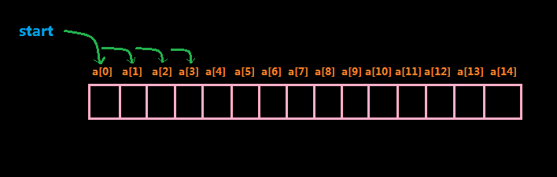
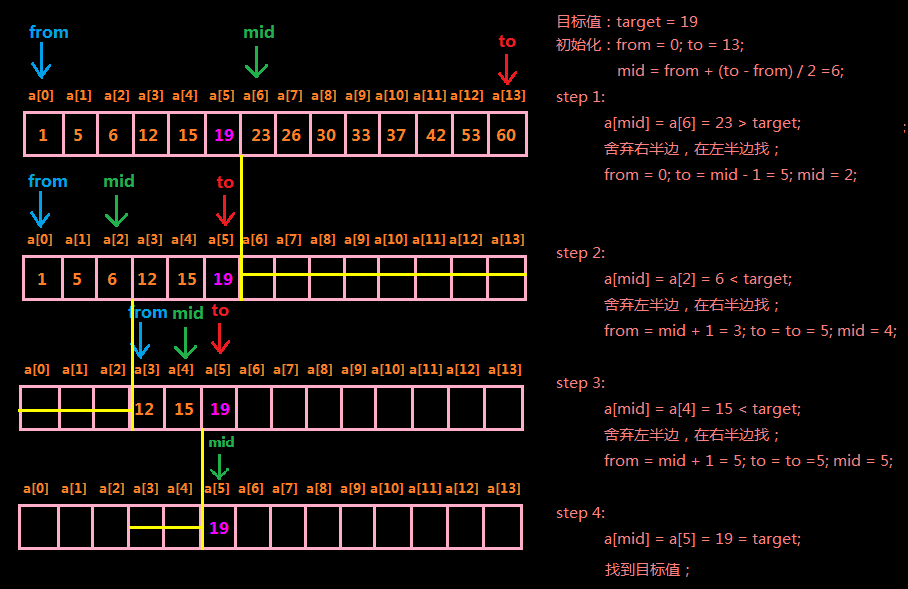

# 查找算法的Java实现

今天来整理一下查找。

# 什么是查找？

其实我真的不想解释，嘻嘻，好吧。

来个官方一点的解释吧：

> 查找(searching)是这样一个过程，即在某个项目组中寻找某一指定目标元素，或者确定该组中并不存在该目标元素。 -from 《Java软件结构与数据结构》

其实通俗点说就是看有没有。真的好通俗！

# 有哪些查找方式？

一般常见的就两个：

- 线性查找
- 二分查找

来，我们一个一个来看。这里，为了简化问题，我们以整型数组作为我们要查找的序列。

好，开始！

## 线性查找 (linear search)

从名字中的“线性”我们大概能猜出来这种查找方式是怎么回事，线性嘛！一个一个找嘛！来直接看图：



看到没，线性查找就是从数组的起始位置a[0]开始依次比较数组中的每一个值直到找到目标值，当然也有可能循环遍历了数组中所有值也没找到目标值。

下面我用代码来演示这一过程：

```
public class LinearSearchDemo {
    public static void main(String[] args) {
        int[] data = {2, 1, 4, 6, 12, 7};
        int target = 12;
        int searchIndex = search(data, target);
        if (searchIndex != -1) {
            System.out.println("found at: " + searchIndex);
        }else {
            System.out.println("not found");
        }
    }
    /*
    *@param  data   待查找的数组
    *@param  target 待查找的值
    *@return int    目标值在数组中的索引，如果没找到返回-1 
    */
    public static int search(int[] data, int target) {

        int length = data.length;

        //从头遍历数组中的各个值，如果找到目标值就返回其索引
        for (int i = 0; i < length; i++) {
            if (data[i] == target) {
                return i;
            }
        }

        //代码能走到这一步就说明上面的循环遍历结束了也没找到目标值
        //即目标值不存在于数组中
        return -1;

    }
}

输出结果：
found at: 4
```

线性查找的效率当然不是很高效，最坏情况是数组中没有我们要找的目标值，但是我们还是要遍历完整个数组才能知道。但是它的优点就是很简单，特别的简单，而且它还不要求待查找的数组是有序的。下面将要介绍的二分查找效率上要比线性查找高，但是它要求待查找的数组中的数据必须是有序的，我们接着来看。

## 二分查找( binary search)

先来个比较官方的解释：

> 二分搜索（英语：binary search），也称折半搜索（英语：half-interval search）、对数搜索（英语：logarithmic search），是一种在有序数组中查找某一特定元素的搜索算法。 搜索过程从数组的中间元素开始，如果中间元素正好是要查找的元素，则搜索过程结束；如果某一特定元素大于或者小于中间元素，则在数组大于或小于中间元素的 那一半中查找，而且跟开始一样从中间元素开始比较。如果在某一步骤数组为空，则代表找不到。这种搜索算法每一次比较都使搜索范围缩小一半。 - from [维基百科](https://zh.wikipedia.org/wiki/%E4%BA%8C%E5%88%86%E6%90%9C%E7%B4%A2%E7%AE%97%E6%B3%95)

以上介绍参考自维基百科（PS：非常建议大家多上Google，多上Wikipedia，相信我，你会爱上它们的，哈哈~）

好，看完比较正式的解释如果不太理解，没关系，拿图来说话：



二分法首先考察中间元素a[mid]，如果该值是我们要找的值，那好极了，直接找到了；如果不是的话，由于我们已经知道数组是排好序的（二分法要求待查找的数组是有序的，本例假设是升序的，降序其实是一样的），那就看目标值target和a[mid]的关系是怎样的：如果a[mid] > target则说明目标值target如果存在的话一定在a[mid]的左侧，因为左侧都比a[mid]小；如果a[mid] < target则说明目标值如果存在的话一定在a[mid]的右侧，因为右侧都比a[mid]大。

因为a[mid]处在数组的中间位置，所以它的左侧或者右侧都是数组的一半，这样每一次我们通过a[mid]和target的比较就可以排除掉一半的数据。最后只有两种情况，要么我们找到了目标值，要么我们排除了所有数据没有找到目标值。

由此看来，在处理已排序数据的查找工作时，二分查找法显然效率高于线性查找法。这种优势在数据量越大的时候越明显。

比如说，现在有序数组中含有100万个数据，我们要求查找特定元素。如果使用线性查找法，我们必须对这一100万个数据依次考察以确定出目标元素是不是存在，最好的情况是目标元素在数组的第一个位置a[0]，这样只要一次就查找到目标元素了，最坏情况是目标元素在数组的最后a[999999]，这样我们就得比较100万次才能知道目标元素到底在不在，平均下来看的话也需要50万次比较。而如果使用二分查找法，我们大约做20次比较就可以知道目标元素是不是存在于数组中了。

50万 VS 20！

是不是很惊悚？为了达到目的我们可以使用不同的算法，但是这些算法之间的差异真的很大！ 在数据量越大的时候二分法的优势越明显。

以下是我用Java代码实现的，有递归的和非递归两种方式。代码注释都写的很清楚，相信大家对照着上面我的介绍应该可以看得懂哈~

```
//二分查找：在有序数组中查找某一特定元素的搜索算法
public class BinarySearch {
    public static void main(String[] args) {
        int[] data = {1, 5, 6, 12, 15, 19, 23, 26, 30, 33, 37, 42, 53, 60};
        int target = 19;
        int index = binarySearch2(data, 0, data.length - 1, target);
        if (index > -1) {
            System.out.println("found ：" + index);
        }else {
            System.out.println("not found");
        }
    }

    /** 
     * 递归方法实现二分查找
     * @param data   已排序数组(这里假设是从小到大排序) 
     * @param from   起始位置 
     * @param to     终止位置 
     * @param target 要查找的值
     * @return 要查找的值在数组中的位置，如果没找到则返回-1
     */  
    private static int binarySearch1(int[] data, int from, int to, int target) {
        if (from <= to) {
            int mid = from + (to - from) / 2;//中间位置，为了防止溢出使用这种方式求中间位置
            if (data[mid] < target) {//中间的值比目标值小，则在左半边继续查找
                return binarySearch1(data, mid + 1, to, target);
            }else if(data[mid] > target){//中间的值比目标值大，则在右半边继续查找
                return binarySearch1(data, from, mid - 1, target);    
            }else {//找到了，把找到的情况放在最后是因为多数情况下中间值不是大于就是小于，这样做可以节省操作
                return mid;
            }
        }
        return -1;
    }

    /** 
     * 非递归方法实现二分查找
     * @param data   已排序数组(这里假设是从小到大排序) 
     * @param from   起始位置 
     * @param to     终止位置 
     * @param target 要查找的值
     * @return 要查找的值在数组中的位置，如果没找到则返回-1
     */  
    private static int binarySearch2(int[] data, int from, int to, int target) {
        while(from <= to) {
            int mid = from + (to - from) / 2;
            if (data[mid] < target) {
                from = mid + 1;                
            }else if(data[mid] > target) {
                to = mid - 1;
            }else {//找到了，把找到的情况放在最后是因为多数情况下中间值不是大于就是小于，这样做可以节省操作
                return mid;
            }
        }
        return -1;
    }
}

打印结果：
found: 5
```

到这里，文章差不多要结束了，最后我们再想一个问题，就是既然二分查找法效率这么高，甩线性查找法好多条街，那为什么还要线性查找法呢？

其实，线性查找法也不是一无是处，它最大的优点就是简单，特别简单，傻瓜式的。你不是让我找东西吗，好啊，那我就把我兜里所有的东西一个一个拿出来看看有没有，是不是很傻瓜式哈~

还有一点就是二分法本身也有局限性，那就是二分法必须要求待查数组是已排序的，比如我给你一个很大的数组，但是这个数组并没有排序，那你如果想用二分查找法的话还必须先给数组排序，然后再查找。这样就会造成除查找之外的额外成本（排序），至于这个额外成本是不是可承受的，就要看设计者自己权衡了，搞不好还不如人家线性查找快呢，嘿嘿~

好了，谢谢观看~

http://www.jianshu.com/p/b07c69a91535