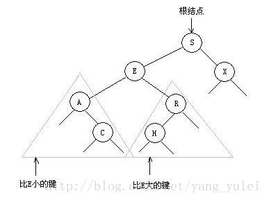
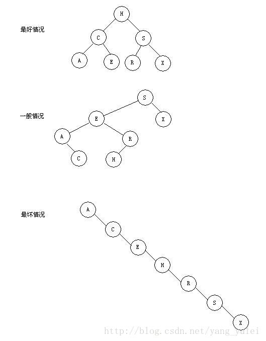
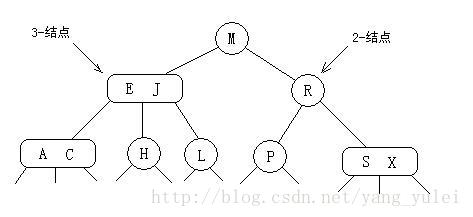
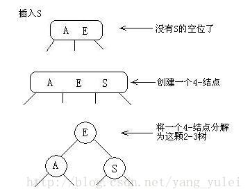
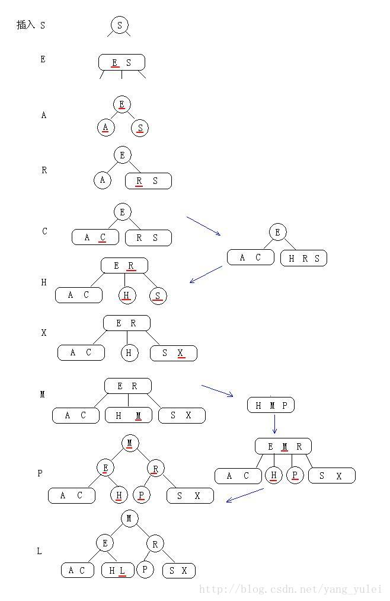
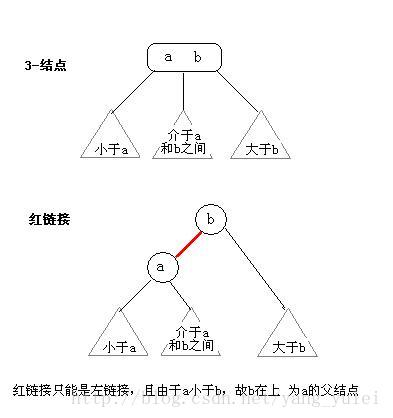
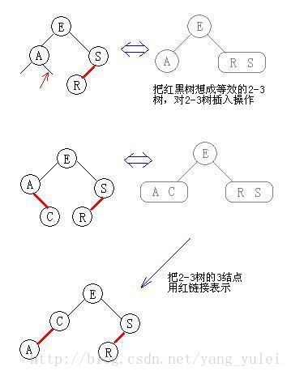
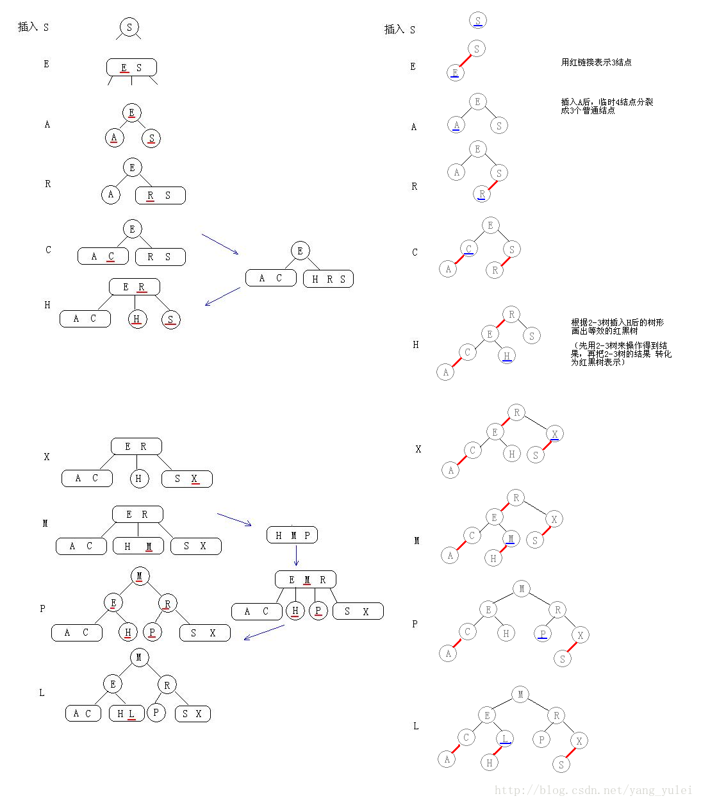

# [查找（一）史上最简单清晰的红黑树讲解](http://blog.csdn.net/yang_yulei/article/details/26066409)

## 查找（一）

我们使用**符号表**这个词来描述一张抽象的表格，我们会将信息（值）存储在其中，然后按照指定的键来搜索并获取这些信息。键和值的具体意义取决于不同的应用。

符号表中可能会保存很多键和很多信息，因此实现一张高效的符号表也是一项很有挑战性的任务。

我们会用三种经典的数据类型来实现高效的符号表：**二叉查找数**、**红黑树**、**散列表**。

## 二分查找

我们使用有序数组存储键，经典的二分查找能够根据数组的索引大大减少每次查找所需的比较次数。

在查找时，我们先将被查找的键和子数组的中间键比较。如果被查找的键小于中间键，我们就在左子数组中继续查找，如果大于我们就在右子数组中继续查找，否则中间键就是我们要找的键。

 

一般情况下二分查找都比顺序查找快的多，它也是众多实际应用程序的最佳选择。对于一个静态表（不允许插入）来说，将其在初始化时就排序是值得的。

 

当然，二分查找也不适合很多应用。现代应用需要同时能够支持高效的查找和插入两种操作的符号表实现。也就是说，我们需要在构造庞大的符号表的同时能够任意插入（也许还有删除）键值对，同时也要能够完成查找操作。

 

要支持高效的插入操作，我们似乎需要一种链式结构。当单链接的链表是无法使用二分查找的，因为二分查找的高效来自于能够快速通过索引取得任何子数组的中间元素。为了将二分查找的效率和链表的灵活性结合起来，我们需要更加复杂的[数据结构](http://lib.csdn.net/base/datastructure)。

能够同时拥有两者的就是**二叉查找树**。

 

## 二叉查找树

一颗二叉查找树（**BST**）是一颗二叉树，其中每个节点都含有一个可比较的键（以及相关联的值）且每个结点的键都大于其左子树中的任意结点的键而小于右子树的任意结点的键。

 

一颗二叉查找树代表了一组键（及其相应的值）的集合，而同一个集合可以用多颗不同的二叉查找树表示。

如果我们将一颗二叉查找树的所有键**投影**到一条直线上，保证一个结点的左子树中的键出现在它的右边，右子树中的键出现在它的右边，那么我们一定可以得到一条有序的键列。

 

**查找**

在二叉查找树中查找一个键的递归[算法](http://lib.csdn.net/base/datastructure)：

如果树是空的，则查找未命中。如果被查找的键和根结点的键相等，查找命中。否则我们就在适当的子树中继续查找。如果被查找的键较小就选择左子树，较大就选择右子树。

在二叉查找树中，随着我们不断向下查找，当前结点所表示的子树的大小也在减小（理想情况下是减半）

 

**插入**

查找代码几乎和二分查找的一样简单，这种**简洁性**是二叉查找树的重要特性之一。而二叉查找树的另一个更重要的特性就是插入的实现难度和查找差不多。

当查找一个不存在于树中的结点并结束于一条空链接时，我们需要做的就是将链接指向一个含有被查找的键的新结点。如果被查找的键小于根结点的键，我们会继续在左子树中插入该键，否则在右子树中插入该键。

 

**分析**

使用二叉查找树的算法的运行时间取决于树的形状，而树的形状又取决于键被插入的先后顺序。

在最好的情况下，一颗含有N个结点的树是完全平衡的，每条空链接和根结点的距离都为~lgN。在最坏的情况下，搜索路径上可能有N个结点。但在一般情况下树的形状和最好情况更接近。

我们假设键的插入顺序是随机的。对这个模型的分析而言，二叉查找树和快速排序几乎就是“双胞胎”。树的根结点就是快速排序中的第一个切分元素（左侧的键都比它小，右侧的键都比它大），而这对于所有的子树同样适用，这和快速排序中对于子数组的递归排序完全对应。

【在由N个随机键构造的二叉查找树中，查找命中平均所需的比较次数为~2lgN。 N越大这个公式越准确】

 

## 平衡查找树

在一颗含有N个结点的树中，我们希望树高为~lgN【就是 log2(N) 】，这样我们就能保证所有查找都能在~lgN此比较内结束，就和二分查找一样。不幸的是，在动态插入中保证树的完美平衡的代价太高了。我们放松对完美平衡的要求，使符号表API中所有操作均能够在对数时间内完成。

 定理：**一棵含有n个节点的红黑树的高度至多为log2(n+1)向上取整数**.

树高有待质疑

### 2-3查找树

为了保证查找树的平衡性，我们需要一些灵活性，因此在这里我们允许树中的一个结点保存多个键。

**2-结点**：含有一个键(及值)和两条链接，左链接指向的2-3树中的键都小于该结点，右链接指向的2-3树中的键都大于该结点。

**3-结点**：含有两个键(及值)和三条链接，左链接指向的2-3树中的键都小于该结点，中链接指向的2-3树中的键都位于该结点的两个键之间，右链接指向的2-3树中的键都大于该结点。

（2-3指的是2叉-3叉的意思）

一颗完美平衡的2-3查找树中的所有空链接到根结点的距离都是相同的。

 

**查找**

要判断一个键是否在树中，我们先将它和根结点中的键比较。如果它和其中的任何一个相等，查找命中。否则我们就根据比较的结果找到指向相应区间的链接，并在其指向的子树中递归地继续查找。如果这是个空链接，查找未命中。

 

**插入**

要在2-3树中插入一个新结点，我们可以和二叉查找树一样先进行一次未命中的查找，然后把新结点挂在树的底部。但这样的话树无法保持完美平衡性。我们使用2-3树的主要原因就在于它能够在插入之后继续保持平衡。

如果未命中的查找结束于一个2-结点，我们只要把这个2-结点替换为一个3-结点，将要插入的键保存在其中即可。如果未命中的查找结束于一个3-结点，事情就要麻烦一些。

 

**热身**：

先考虑最简单的例子：只有一个3-结点的树，向其插入一个新键。

这棵树唯一的结点中已经没有可插入的空间了。我们又不能把新键插在其空结点上（破坏了完美平衡）。为了将新键插入，我们先临时将新键存入该结点中，使之成为一个4-结点。创建一个4-结点很方便，因为很容易将它转换为一颗由3个2-结点组成的2-3树（如图所示），这棵树既是一颗含有3个结点的二叉查找树，同时也是一颗完美平衡的2-3树，其中所有空链接到根结点的距离都相等。

 

**向一个父结点为2-结点的3-结点中插入新键**

假设未命中的查找结束于一个3-结点，而它的父结点是一个2-结点。在这种情况下我们需要在维持树的完美平衡的前提下为新键腾出空间。

我们先像刚才一样构造一个临时的4-结点并将其分解，但此时我们不会为中键创建一个新结点，而是将其移动至原来的父结点中。（如图所示）

这次转换也并不影响（完美平衡的）2-3树的主要性质。树仍然是有序的，因为中键被移动到父结点中去了，树仍然是完美平衡的，插入后所有的空链接到根结点的距离仍然相同。

 

**向一个父结点为3-结点的3-结点中插入新键**

假设未命中的查找结束于一个3-结点，而它的父结点是一个3-结点。

我们再次和刚才一样构造一个临时的4-结点并分解它，然后将它的中键插入它的父结点中。但父结点也是一个3-结点，因此我们再用这个中键构造一个新的临时4-结点，然后在这个结点上进行相同的变换，即分解这个父结点并将它的中键插入到它的父结点中去。

我们就这样一直向上不断分解临时的4-结点并将中键插入更高的父结点，直至遇到一个2-结点并将它替换为一个不需要继续分解的3-结点，或者是到达3-结点的根。

**总结**：

**先找插入结点，若结点有空(即2-结点)，则直接插入。如结点没空(即3-结点)，则插入使其临时容纳这个元素，然后分裂此结点，把中间元素移到其父结点中。对父结点亦如此处理。**（中键一直往上移，直到找到空位，在此过程中没有空位就先搞个临时的，再分裂。）

 

 

★2-3树插入算法的根本在于这些变换都是局部的：除了相关的结点和链接之外不必修改或者检查树的其他部分。每次变换中，变更的链接数量不会超过一个很小的常数。所有局部变换都不会影响整棵树的有序性和平衡性。

 

**{你确定理解了2-3树的插入过程了吗？ 如果你理解了，那么你也就基本理解了红黑树的插入}**

 

**构造**

和标准的二叉查找树由上向下生长不同，2-3树的生长是由下向上的。

**优点**

2-3树在最坏情况下仍有较好的性能。每个操作中处理每个结点的时间都不会超过一个很小的常数，且这两个操作都只会访问一条路径上的结点，所以任何查找或者插入的成本都肯定不会超过对数级别。

完美平衡的2-3树要平展的多。例如，含有10亿个结点的一颗2-3树的高度仅在19到30之间。我们最多只需要访问30个结点就能在10亿个键中进行任意查找和插入操作。

 

**缺点**

我们需要维护两种不同类型的结点，查找和插入操作的实现需要大量的代码，而且它们所产生的额外开销可能会使算法比标准的二叉查找树更慢。

平衡一棵树的初衷是为了消除最坏情况，但我们希望这种保障所需的代码能够越少越好。

 

### 红黑二叉查找树

　　**红黑树的定义：**红黑树是一种自平衡二叉查找树，是在计算机科学中用到的一种数据结构，典型的用途是实现关联数组。它是在1972年由鲁道夫·贝尔发明的，称之为"对称二叉B树"，它现代的名字是在 Leo J. Guibas 和 Robert Sedgewick 于1978年写的一篇论文中获得的。**它是复杂的，但它的操作有着良好的最坏情况运行时间，并且在实践中是高效的: 它可以在O(logn)时间内做查找，插入和删除，这里的n是树中元素的数目。**

　　红黑树和AVL树一样都对插入时间、删除时间和查找时间提供了最好可能的最坏情况担保。这不只是使它们在时间敏感的应用如实时应用（real time application）中有价值，而且使它们有在提供最坏情况担保的其他数据结构中作为建造板块的价值；例如，在计算几何中使用的很多数据结构都可以基于红黑树。此外，红黑树还是2-3-4树的一种等同，它们的思想是一样的，只不过红黑树是2-3-4树用二叉树的形式表示的。

　　**红黑树的性质：**

　　红黑树是每个节点都带有颜色属性的二叉查找树，颜色为红色或黑色。在二叉查找树强制的一般要求以外，对于任何有效的红黑树我们增加了如下的额外要求:

　　性质1. 节点是红色或黑色。

　　性质2. 根是黑色。

　　性质3. 所有叶子都是黑色（叶子是NIL节点）。

　　性质4. 每个红色节点必须有两个黑色的子节点。(从每个叶子到根的所有路径上不能有两个连续的红色节点。)

　　性质5. 从任一节点到其每个叶子的所有简单路径都包含相同数目的黑色节点。

　　下面是一个具体的红黑树的图例：

【前言：本文所讨论的红黑树之目的在于使读者能更简单清晰地了解红黑树的构造，使读者能在纸上清晰快速地画出红黑树，而不是为了写出红黑树的实现代码。

若是要在代码级理解红黑树，则势必需要记住其复杂的插入和旋转的各种情况，我认为那只有助于增加大家对红黑树的恐惧，实际面试和工作中几乎不会遇到需要自己动手实现红黑树的情况(很多语言的标准库中就有红黑树的实现)。  若对于红黑树的C代码实现有兴趣的，可移步至July的博客。】

 

（**理解红黑树一句话就够了**：红黑树就是用红链接表示3-结点的2-3树。那么红黑树的插入、构造就可转化为2-3树的问题，即：在脑中用2-3树来操作，得到结果，再把结果中的3-结点转化为红链接即可。而2-3树的插入，前面已有详细图文，实际也很简单：有空则插，没空硬插，再分裂。  这样，我们就不用记那么复杂且让人头疼的红黑树插入旋转的各种情况了。只要清楚2-3树的插入方式即可。  下面图文详细演示。）

 

**红黑树的本质**：

红黑树是对2-3查找树的改进，它能用一种统一的方式完成所有变换。

 

替换3-结点

★红黑树背后的思想是用标准的二叉查找树（完全由2-结点构成）和一些额外的信息（替换3-结点）来表示2-3树。

我们将树中的链接分为两种类型：红链接将两个2-结点连接起来构成一个3-结点，黑链接则是2-3树中的普通链接。确切地说，我们将3-结点表示为由一条**左斜**的红色链接相连的两个2-结点。

这种表示法的一个优点是，我们无需修改就可以直接使用标准二叉查找树的get()方法。对于任意的2-3树，只要对结点进行转换，我们都可以立即派生出一颗对应的二叉查找树。我们将用这种方式表示2-3树的二叉查找树称为红黑树。

**红黑树的另一种定义**是满足下列条件的二叉查找树：

⑴红链接均为左链接。

⑵没有任何一个结点同时和两条红链接相连。

⑶该树是完美黑色平衡的，即任意空链接到根结点的路径上的黑链接数量相同。

 

如果我们将一颗红黑树中的红链接画平，那么所有的空链接到根结点的距离都将是相同的。如果我们将由红链接相连的结点合并，得到的就是一颗2-3树。

相反，如果将一颗2-3树中的3-结点画作由红色左链接相连的两个2-结点，那么不会存在能够和两条红链接相连的结点，且树必然是完美平衡的。

 

无论我们用何种方式去定义它们，红黑树都既是二叉查找树，也是2-3树。

（2-3树的深度很小，平衡性好，效率高，但是其有两种不同的结点，实际代码实现比较复杂。而红黑树用红链接表示2-3树中另类的3-结点，统一了树中的结点类型，使代码实现简单化，又不破坏其高效性。）

 

**颜色表示**：

因为每个结点都只会有一条指向自己的链接（从它的父结点指向它），我们将链接的颜色保存在表示结点的Node数据类型的布尔变量color中（若指向它的链接是红色的，那么该变量为true，黑色则为false）。

当我们提到一个结点颜色时，我们指的是指向该结点的链接的颜色。

 

**旋转**

在我们实现的某些操作中可能会出现红色右链接或者两条连续的红链接，但在操作完成前这些情况都会被小心地旋转并修复。

（我们在这里不讨论旋转的几种情况，把红黑树看做2-3树，自然可以得到正确的旋转后结果）

 

**插入**

在插入时我们可以使用旋转操作帮助我们保证2-3树和红黑树之间的一一对应关系，因为旋转操作可以保持红黑树的两个重要性质：有序性和完美平衡性。

 

**热身**：

****

**向2-结点中插入新键**

（向红黑树中插入操作时，想想2-3树的插入操作。红黑树与2-3树在本质上是相同的，只是它们对3结点的表示不同。

向一个只含有一个2-结点的2-3树中插入新键后，2-结点变为3-结点。我们再把这个3-结点转化为红结点即可）

**向一颗双键树（即一个3-结点）中插入新键**

（向红黑树中插入操作时，想想2-3树的插入操作。你把红黑树当做2-3树来处理插入，一切都变得简单了）

（向2-3树中的一个3-结点插入新键，这个3结点临时成为4-结点，然后分裂成3个2结点）

**★一颗红黑树的构造全过程**

### 平衡二叉树（AVL树）

定义：平衡二叉树(Balance Binary Tree)又称AVL树。它或者是一颗空树，或者是具有下列性质的二叉树：它的左子树和右子树都是平衡二叉树，且左子树和右子树的深度之差的绝对值不超过1。

若将二叉树上结点的平衡因子BF(BalanceFactor)定义为该结点的左子树深度减去它的右子树深度，则**平衡因子的绝对值大于1**。

 

其旋转操作 用2-3树的分裂来类比想象。

[下半部分——散列表、B树、B+树、Trie树。](http://blog.csdn.net/yang_yulei/article/details/26104921)